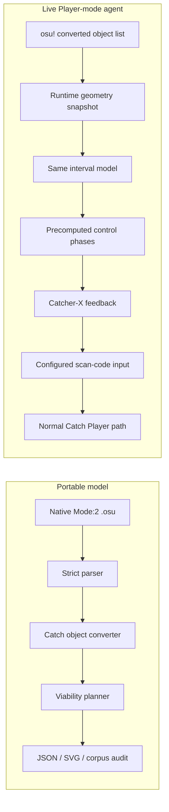
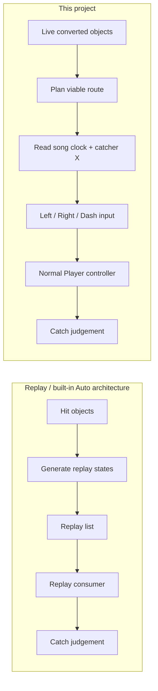
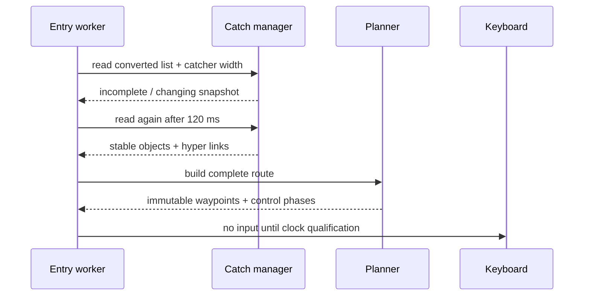
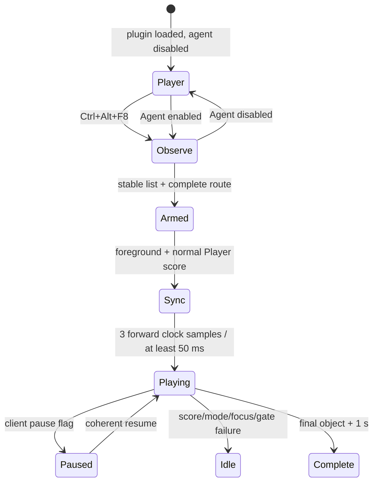

# Catching Rain Without a Replay: Building a Live osu!catch Agent from Obfuscated IL

> *The fruit falls in two dimensions. The proof lives in one.*

## Abstract

osu!catch looks like a simple horizontal control problem: fruit descends, a catcher moves left and
right, and a dash key makes it move faster. The difficulty is hidden in the conversion layer. A
native `Mode: 2` beatmap contains circles, sliders, and spinners; the ruleset turns those into
fruits, droplets, tiny droplets, bananas, and hyperdash links. The live client then judges strict
collision inequalities against a catcher whose width depends on difficulty and mods, while
ordinary movement and hyperdash use different dynamics.

This investigation reconstructed that pipeline for one fingerprinted x86 osu!stable build. It
produced two independent implementations:

- a portable .NET 8 parser, object converter, path solver, corpus tool, and SVG renderer; and
- a hash-locked .NET Framework 4 plugin that reads the client's authoritative converted object
  list, computes a complete viable trajectory before play, and drives the configured Catch keys
  through normal Player input.

The live agent does not call the built-in Auto generator and does not create replay frames. It
enters the default CLR AppDomain through an `AppDomainManager`, validates every private metadata
anchor it uses, waits for a normal Catch Player score, qualifies the internal song clock, and sends
only changed Win32 scan-code states. A small no-activate overlay lets the player switch between
manual and Agent control.

The most useful result was not a perfect score claim. It was a model: every mandatory catch
becomes an interval, ordinary movement expands intervals linearly in time, and the complete map
becomes a one-dimensional viability tube. Feasibility is solved first. Smoothness, style, and
controlled variation are allowed only inside the proven tube. On the expanded development corpus,
all 29 native Catch difficulties and four route styles passed. In the live client, the frozen
baseline caught all `1,525/1,525` required objects on one dense difficulty and completed the
hardest test with `1,278/1,280` fruits plus `107/107` tiny droplets.

## 1. Scope, target, and research boundary

The runtime work is intentionally narrow. Private metadata tokens and obfuscated type layouts are
valid only for this executable:

| Property | Value |
|---|---|
| Product | osu!stable |
| File version | `1.3.3.8` |
| Runtime | CLR v4 |
| Architecture | PE32 / x86 managed |
| Executable SHA-256 | `6e182c10d1813209d12753dbc70b3a5bba00fef4ecf64bc42051870e6dfe4b7d` |
| Native ruleset | Catch, `Mode: 2` |

The repository does not distribute the executable, its dependencies, a complete decompiler tree,
installed beatmaps, logs, replays, configuration files, or account data. It contains original
source, compact reverse-engineering findings, synthetic test data, and binaries built from that
source.

The live experiment is a local research prototype, not an official plugin API. It has no HTTP,
Bancho, login, score-submission, or replay-upload implementation. It also does not patch the game
executable or rewrite score objects. Those facts describe the plugin, not a promise about every
behavior of the unmodified client around it. The intended operating context is controlled local
research.

## 2. The result in one diagram

The portable and live paths share the mathematical planner but obtain objects from different
authorities:



The portable converter is an executable specification and an independent oracle. The runtime
agent deliberately trusts the game's converted objects during play because that list already
contains the effects that matter most: slider conversion, tiny-droplet randomization, active
catcher width, mods, and actual hyper targets.

> **Engineering judgement.** Reimplementing conversion was valuable because it made the rules
> understandable and testable. Reading runtime conversion was valuable because it removed an
> unnecessary disagreement boundary from live control. The strongest design used both, but gave
> them different jobs.

## 3. Managed obfuscation: names were noise, shapes were evidence

### 3.1 Why IDA was not the primary decompiler

The target is managed CLR code. IDA remains useful for navigation, metadata cross-references, and
keeping a stable database, but native-looking disassembly is a poor first representation for
managed IL. ILSpy-style decompilation and reflection probes preserve the structures that matter:

- metadata tokens;
- field and method signatures;
- inheritance relationships;
- enum types and constants;
- list element types;
- exception and branch structure; and
- calls into `Microsoft.Xna.Framework` value types.

The client is obfuscated. Many semantic names are unavailable or intentionally meaningless, and a
single type may contain a mixture of fields whose roles are not obvious from spelling. That did
not erase the metadata graph. A field still has a declaring type and field type. A method still
has a parameter list and return type. A Catch manager still owns an object manager, a catcher
sprite, and a floating catcher width.

The workflow was therefore slice-oriented:

1. fingerprint the executable;
2. locate a behavioral anchor by constants, field shapes, or a known public type;
3. decompile only the surrounding hierarchy;
4. assign a semantic role from data flow;
5. record the metadata token;
6. assert its shape in a reflection-only probe; and
7. validate the resulting model against synthetic and live behavior.

Trying to rename the whole assembly would have produced a large, fragile mythology. Recovering a
small closed slice produced testable claims.

### 3.2 The runtime anchors

The active Catch slice is compact:

| Recovered role | Metadata token |
|---|---:|
| Current beatmap getter | `0x06002c63` |
| Beatmap path getter | `0x06001bf0` |
| Current score | `0x040013c3` |
| Player pause flag | `0x0400136a` |
| Current Player | `0x0400136d` |
| Player ruleset manager | `0x040013a4` |
| Replay mode / replay score | `0x04002a7c` / `0x04002a7f` |
| Internal song clock | `0x04002358` |
| Catch manager type | `0x020001ba` |
| Converted object list | `0x040017fb` |
| Catcher sprite / width | `0x040006df` / `0x040006e0` |
| Fruit base type | `0x0200052c` |
| Fruit caught flag | `0x04001745` |
| Fruit hyper target | `0x04001747` |
| Hit-object time / position | `0x04002523` / `0x0400252c` |
| Catcher position | `0x04002cf6` |
| Binding getter | `0x06002c4f` |

Tokens are identities only inside the exact assembly fingerprint. The plugin never assumes that a
future update preserves them. Startup resolves each token and checks static/instance shape,
declaring type, field type, method parameters, and inheritance before input is possible.

Reduced to its intent, the probe asks questions such as:

```csharp
Require(currentPlayer.IsStatic, "current Player");
Require(ruleset.DeclaringType == currentPlayer.FieldType,
    "Player ruleset manager");
Require(fruit.IsAssignableFrom(tiny), "tiny droplet hierarchy");
Require(objectPosition.FieldType == catcherPosition.FieldType,
    "shared Vector2 position type");
```

This is more than a checksum and less than a compatibility layer. The checksum identifies the
known binary; structural assertions catch mistakes in our own token map.

## 4. Auto and agency are different architectures

osu!'s built-in Auto behavior is useful as an oracle, but it is not the endpoint of this project.
A generated replay answers a representational question: which state should a replay consumer see
at each timestamp? A Player-mode agent has a different responsibility. It must act while the score
already exists, while focus can change, while the clock can pause or reset, and while the real
catcher may not be exactly where the nominal route predicted.



The runtime gate rejects replay mode, a replay-backed score, Auto, Relax, Relax2, and Cinema. The
agent resolves the user's three current Catch bindings and sends ordinary keyboard transitions.
The game may later record those Player inputs into its normal replay representation; that does not
turn the input source into a replay.

## 5. Native Catch beatmaps: the source grammar

Native Catch maps use `Mode: 2`. The portable parser needs only a disciplined subset of the text
format:

| Section | Relevant fields |
|---|---|
| header | `osu file format vN` |
| `[General]` | `Mode` |
| `[Metadata]` | artist, title, creator, difficulty |
| `[Difficulty]` | `CircleSize`, `OverallDifficulty`, `SliderMultiplier`, `SliderTickRate` |
| `[TimingPoints]` | offset, beat length, inherited flag |
| `[HitObjects]` | position, time, type, sound, slider path/repeat/length, spinner end |

The relevant object bits are familiar:

$$
\operatorname{circle}(t) \iff (t \mathbin{\&} 1) \ne 0,
$$

$$
\operatorname{slider}(t) \iff (t \mathbin{\&} 2) \ne 0,
$$

$$
\operatorname{spinner}(t) \iff (t \mathbin{\&} 8) \ne 0.
$$

The parser rejects a non-native mode, malformed timing points, non-positive slider length,
invalid repeats, unknown curve types, and unsupported objects. That strictness is deliberate. The
output is not merely displayed; it can become the input to a physical controller. An ambiguous
map should fail before any key can move.

## 6. Slider geometry before Catch semantics

A slider path is independent of the ruleset that consumes it. The implementation supports the
four native curve forms:

- linear polylines;
- piecewise Bezier paths, including repeated-point segment breaks;
- perfect circular arcs when three points define a valid circle; and
- Catmull-Rom splines using fixed subdivision per span.

All curves are flattened to a polyline, measured by cumulative arc length, and then trimmed or
extended to the declared pixel length. Position is sampled by distance along that polyline rather
than by raw curve parameter. This distinction matters because Bezier parameter space is not arc
length space.

For a progress value `u` and cumulative path lengths `L_i`, the sampler finds the segment where

$$
L_i \le uL_{total} \le L_{i+1}
$$

and linearly interpolates inside that segment. Slider repeats alternate direction. If `s` is the
span progress,

$$
p(s)=
\begin{cases}
\operatorname{frac}(s), & \lfloor s \rfloor \text{ even},\\
1-\operatorname{frac}(s), & \lfloor s \rfloor \text{ odd}.
\end{cases}
$$

The synthetic test map includes linear, Bezier, perfect, and Catmull sliders so a curve regression
cannot hide behind the common case.

## 7. Timing points and slider event conversion

At a slider start, the converter resolves the most recent positive uninherited beat length `B` and
the active inherited velocity multiplier

$$
SV=\operatorname{clamp}\left(\frac{100}{-B_i},0.1,10\right)
$$

for a negative inherited beat length `B_i`. A new uninherited timing point resets `SV` to one.

With slider multiplier `SM`, the scoring distance is

$$
D_s=100\,SM\,SV,
$$

and slider velocity is

$$
v=\frac{D_s}{B}\quad \text{pixels/ms}.
$$

For declared path length `L` and repeat count `R`, the converted end time is

$$
t_{end}=t_0+\left\lfloor\frac{LR}{v}\right\rfloor.
$$

Tick distance depends on file format. Version 8 and later use the inherited scoring distance;
older maps retain the earlier base formula:

$$
D_{tick}=
\begin{cases}
100\,SM/\text{TickRate}, & \text{format}<8,\\
D_s/\text{TickRate}, & \text{format}\ge8.
\end{cases}
$$

The Catch conversion creates:

- a fruit at the slider head;
- droplets at slider ticks;
- fruits at repeats;
- tiny droplets in sufficiently wide event gaps; and
- a separate fruit at the true slider tail.

The final slider event is pulled back by 36 ms for event spacing, but it only bounds tiny-droplet
generation. The tail fruit remains at the true end time. That small asymmetry is exactly the kind
of detail that a visually plausible converter can miss.

## 8. Tiny droplets, bananas, and deterministic randomness

Tiny droplets are generated only when the gap between adjacent slider events exceeds 80 ms. The
gap is repeatedly halved until the step is at most 100 ms:

```csharp
var step = (float)gap;
while (step > 100)
    step /= 2;

for (var time = previous + step; time < current; time += step)
    AddTinyDroplet((int)time, pathX + random.Next(-20, 20));
```

Spinners become bananas sampled at a similarly halved cadence, with random X positions across the
512-pixel playfield. A legacy subtractive generator seeded with `1337` mirrors the deterministic
sequence expected by the converter. Apparently cosmetic random calls still consume shared random
state: droplet rotation and banana visual state advance the generator even though the portable
planner does not render those values.

> **Our interpretation.** Deterministic random streams are state machines, not bags of random
> numbers. Ignoring an apparently visual draw shifts every later gameplay-relevant draw. The safe
> unit of emulation is the stream, including consumed values, rather than only the values we keep.

Bananas are counted and rendered by the portable tooling, but they are not hard constraints in the
viability route. Their randomized placement makes “catch every banana” a different optimization
problem from preserving the required fruit combo.

## 9. Catcher geometry and the real collision interval

The Catcher width recovered by the portable model is

$$
w=106.75\left(1-0.7\frac{CS'-5}{5}\right),
$$

where Easy first halves CircleSize and Hard Rock applies

$$
CS'=\min(10,1.3\,CS).
$$

The runtime manager exposes the already-active width directly, so live planning does not need to
recompute mod geometry.

The judgement code uses a half-width with a ten-percent edge inset:

```text
halfWidth = 0.5 * w
edgeInset = 0.1 * w
```

For fruit position `x_f` and catcher center `x_c`, both strict inequalities must hold:

$$
x_c-0.5w+0.1w < x_f,
$$

$$
x_c+0.5w-0.1w > x_f.
$$

Equivalently,

$$
|x_c-x_f|<0.4w.
$$

The physical collision radius is therefore `r = 0.4w`. The planner initially shrinks that radius
by a safety margin `m` and clips the resulting catcher-center window to the playfield:

$$
I_i=[\max(0,x_i-r+m),\ \min(512,x_i+r-m)].
$$

Objects sharing a timestamp are not independent choices. Their windows are intersected into one
constraint. If the intersection is empty, no horizontal controller can catch all of them at that
time.

## 10. Hyperdash links are reachability annotations

Ordinary movement has a map-time dash limit of approximately one pixel per millisecond. The
portable converter examines consecutive combo-relevant fruits and droplets. If the available
time, after a small frame allowance, cannot cover the required distance with ordinary movement,
the source receives a hyper target.

In reduced form:

```csharp
var available = next.Time - current.Time - 1000.0 / 240.0;
var required = Math.Abs(next.X - current.X) - residualMargin;

if (available < required)
    current.HyperDashTargetId = next.Id;
```

Direction and residual catcher margin affect `required`. The portable rule is an independent
reconstruction; the live agent reads the client's actual target reference from every converted
fruit object.

At runtime, catching a hyper source causes stable to derive a multiplier from actual catcher X,
target X, current clock, target time, and a one-frame arrival lead. The planner does not write that
multiplier. It places the route at the source, holds the correct direction, and lets the original
Catch movement code create and consume the boost.

The arrival lead is usable time, not decorative slack. Stable reaches the target centre at

$$
t_a=t_{target}-1000/60,
$$

then clears the exceptional multiplier after crossing the centre. The planner may therefore use
ordinary movement between `t_a` and the target timestamp, provided the target-time position remains
inside the object's catch window. This distinction became essential when a hyper target was
followed by another fruit that was unreachable from the centre at `t_target`, but reachable after
departing during that final frame.

## 11. Why the live agent consumes converted runtime objects

The in-process snapshot walks the Catch manager's object manager and keeps every object derived
from the fruit base type. For each source object it reads:

- start time;
- `Vector2.X` position;
- concrete kind by inheritance;
- caught flag for post-play telemetry; and
- hyper target reference, translated to a stable local ID.

It also reads the manager's actual catcher width and current catcher X. Before planning, the object
list must remain unchanged for 120 ms. This avoids arming against the half-constructed list visible
during ruleset initialization.

The signature used for stability includes object time, quantized X, kind, and hyper target. A
stable count alone would be insufficient: references can be linked after list allocation.



This architecture also explains why the portable converter remains valuable. If runtime and
portable counts, positions, or hyper links disagree, the difference is diagnostic evidence about
conversion—not something the live controller should conceal with a map-specific exception.

## 12. The map as a one-dimensional viability tube

Let `I_i` be the allowed catcher-center interval at time `t_i`. For an ordinary transition with
maximum dash speed `v_d = 1 px/ms`, the set of predecessor positions that can reach a later viable
set `B_{i+1}` is

$$
B_i=I_i\cap\left(B_{i+1}\oplus[-v_d\Delta t_i,v_d\Delta t_i]\right),
$$

where `\oplus` denotes interval expansion and

$$
\Delta t_i=t_{i+1}-t_i.
$$

The backward pass begins at the final interval and computes every viable predecessor set. A
forward pass then intersects those sets with positions reachable from the initial catcher center
`x_0 = 256`:

$$
R_0=B_0\cap\{256\},
$$

$$
R_i=B_i\cap\left(R_{i-1}\oplus[-v_d\Delta t_{i-1},v_d\Delta t_{i-1}]\right).
$$

If any interval is empty, the route is infeasible under the current hard constraints and safety
margin. The failure is structural; smoothing cannot repair it.

Hyper edges change the recurrence. Once a valid source is caught, ordinary predecessor distance
does not limit its target in the same way. The target constraint is pinned to the actual target
center, and the source's complete object window becomes its predecessor set. This separates the
question “can we catch the source?” from “can ordinary dash cover an intentionally impossible
gap?”

The resulting tube is small enough to solve in linear time. Every operation is interval
intersection, expansion, or clamping.

## 13. Selecting a route without spending the proof

The first feasible trajectory is greedy but safe. At each timestamp it intersects:

- the backward viability set;
- the forward reachable set; and
- the speed-limited interval around the previous chosen point.

It then clamps the object's preferred X into that intersection. A later smoothing pass repeatedly
visits waypoints in both directions. A simplified objective is

$$
J(x_i)=
\alpha(x_i-p_i)^2+
\beta(x_i-s_i)^2+
\gamma(x_i-256)^2,
$$

where `p_i` is the object-centered preference and `s_i` is a time-weighted interpolation of the
neighboring route. The unconstrained minimizer is projected back into the locally allowed
interval. Feasibility is never exchanged for a lower objective.

Four styles alter weights and placement of movement slack:

| Style | Route character |
|---|---|
| Smooth | strongest neighbor interpolation |
| Centered | stronger pull toward object and playfield centers |
| Lively | asymmetric slack and larger projected wander |
| Last Moment | delays ordinary movement into available slack |

The stable live baseline adds a local safety preference. One extreme transition may force the
global margin down to `1.5 px`, but most objects still have far more room. During smoothing, the
planner first tries the intersection inset to a preferred `9 px` local clearance. If that local
window is unreachable, it falls back to the globally proven tube.

This distinction was decisive on the hardest development map: only three of 1,387 constraints
remained below 8 px clearance. A global minimum should protect the bottleneck, not punish every
easy fruit before and after it.

## 14. Finding the largest globally feasible safety margin

The UI safety value is a floor. Before play, the runtime builds a route at that floor, then searches
upward for the largest globally feasible margin, capped at 10 px. The search is quantized to
quarter-pixel steps:

```csharp
var best = Build(objects, width, safetyFloor);
var low = safetyFloor;
var high = Math.Min(10.0, width * 0.4 - 0.5);

for (var i = 0; i < 7 && high - low >= 0.20; i++)
{
    var candidate = Math.Floor(((low + high) * 0.5) * 4.0) / 4.0;
    try { best = Build(objects, width, candidate); low = candidate; }
    catch (InvalidOperationException) { high = candidate; }
}
```

Feasibility is monotone: if a margin is feasible, a smaller margin is also feasible. That makes a
binary search appropriate. On the expanded 29-map corpus, 28 difficulties reached `9.75 px`; the
remaining dense map settled at `9.25 px`.

## 15. Turning waypoints into physical control phases

Waypoints specify where the catcher should be at object times. The keyboard still needs a schedule
of idle, walk, dash, and hyper states between them.

For ordinary displacement `d` over duration `T`, walking alone is enough when

$$
d\le v_wT,\qquad v_w=0.5\ \text{px/ms}.
$$

Otherwise write the duration as walk plus dash:

$$
d=v_w(T-T_d)+v_dT_d,
$$

which gives

$$
T_d=\frac{d-v_wT}{v_d-v_w}=2d-T
$$

for `v_d = 1`. The remaining walk time is split around the dash according to path style. If
walking alone is enough, idle slack is placed before and after one continuous walk segment.

This representation replaced an early controller that attempted to synthesize low average speed
with millisecond-scale pulse-width modulation. That version generated tens of thousands of
left/right state changes and visibly shook around the reference path. A few long phases are both
closer to the recovered movement model and kinder to the input queue.

Hyper segments are represented as directional dash intent ending at the target centre
approximately one 60 Hz frame before the target timestamp. The remaining frame is compiled as an
ordinary movement phase from the centre to the selected object-time waypoint. When no following
constraint needs that head start, the phase naturally collapses to idle.

## 16. Entering the process without patching the executable

The target uses CLR v4, which supports a process-selected `AppDomainManager`. The launcher sets four
environment variables only for the child process:

```text
APPDOMAIN_MANAGER_ASM=LocalCatchAgent.Loader, Version=1.0.0.0, ...
APPDOMAIN_MANAGER_TYPE=LocalCatchAgent.Loader.LocalCatchAgentDomainManager
CATCH_AGENT_PLUGIN=<absolute plugin path>
CATCH_AGENT_LOG=<absolute log path>
```

The CLR loads a small bootstrap into the default AppDomain. That bootstrap loads the main plugin
and calls `LocalCatchAgent.Plugin.Entry.Start()`:

```csharp
public override void InitializeNewDomain(AppDomainSetup setup)
{
    base.InitializeNewDomain(setup);
    if (!AppDomain.CurrentDomain.IsDefaultAppDomain()) return;
    if (Interlocked.Exchange(ref started, 1) != 0) return;

    var plugin = Assembly.LoadFrom(pluginPath);
    plugin.GetType("LocalCatchAgent.Plugin.Entry", true)
          .GetMethod("Start", BindingFlags.Public | BindingFlags.Static)
          .Invoke(null, null);
}
```

No executable bytes are patched. A normal shortcut launch has none of these child environment
variables and remains plugin-free.

The loader is copied both beside `osu!.exe` and into the plugin directory. The root copy is needed
for CLR discovery. The staged copy lets the launcher restore and hash-check it before every start,
which makes uninstalling another experiment less likely to leave a stale bootstrap behind.

## 17. The live state machine

The entry worker polls lightweight global state and delegates gameplay to `LiveAgent`. Input is
possible only when all gates agree:

- the executable fingerprint and metadata shapes match;
- global game state is Play;
- active ruleset is Catch;
- the score is not replay-backed;
- forbidden automation mods are absent;
- the osu! window owns foreground focus;
- Left, Right, and Dash bindings are valid and distinct; and
- the converted list and catcher width are stable.



The complete route is built before the first input transition. Planning does not run in the
per-clock control path. During play the agent performs binary searches over immutable waypoints
and phases, reads actual catcher X, chooses a three-key state, and emits only differences.

## 18. The false zero in the song clock

The first live build appeared to inject correctly and still sent no useful input. The log exposed
an unexpected lifecycle:

```text
-1020 ms -> 0 ms -> -1020 ms
```

During Catch construction, stable briefly exposes a convincing zero before returning to the true
pre-roll clock. Treating the first zero as gameplay caused one early key transition; treating the
subsequent negative value as a seek then aborted the session. Skipping the intro made the symptom
more obvious but was not the root cause—the same false zero occurred without a manual skip.

The fix was qualification rather than another timestamp exception. The controller requires at
least three genuinely forward samples over at least 50 ms. A backward jump greater than 25 ms or a
forward jump greater than 500 ms resets qualification and releases tracked keys.

> **Engineering judgement.** A clock value is not a clock lifecycle. Real-time integrations need
> evidence that time is advancing coherently before they attach irreversible behavior to a
> plausible timestamp.

## 19. Closed-loop control around a precomputed route

At each trusted song-clock value, the agent reads actual catcher X once. It obtains:

- the reference position at `clock + 1.5 ms`;
- the next mandatory waypoint;
- the nominal control phase; and
- the remaining time and physical clearance.

The active deadband is bounded by local clearance:

$$
\delta=\min(\delta_{UI},\max(0.5,0.35c)),
$$

where `c` is the smaller distance from the waypoint to either side of its collision window. A
wide easy fruit can tolerate the configured 4 px default. A tight simultaneous constraint forces
the controller to become more precise.

During an idle nominal phase, feedback intervenes only when the required average speed exceeds
`0.42 px/ms`; dash is selected above `0.58 px/ms`. During a moving phase, a catcher ahead of the
reference releases direction instead of immediately reversing. Small reversals were the source of
the earlier visible shake.

Final approach ignores aesthetic preference. If the catcher is outside the deadband, direction is
chosen from target error and dash is enabled when required speed exceeds `0.46 px/ms`.

The controller still cannot manufacture a frame. A long scheduler or render stall can consume
multiple object windows before the next input decision. This is why the viability proof and the
runtime evidence are stated separately.

## 20. The chained-hyper reversal bug

The most instructive live miss occurred at a fruit that was both the target of one hyperdash and
the source of the next. The first pre-arm rule saw an outgoing target and reversed direction 12 ms
before the source judgement. That is harmless under ordinary movement. Under residual hyper speed
it moved the catcher 40–60 px and missed the very fruit required to create the next hyper.

The stable fix is one boolean condition:

```csharp
if (next.DepartsByHyperDash
    && !next.ArrivedByHyperDash
    && nextIndex + 1 < plan.Waypoints.Count
    && clock >= next.Time - 12.0)
{
    SetDirection(nextOutgoingTarget.X - actualX);
    dash = true;
}
```

A chained source holds the incoming direction through collision. On the next controller sample it
becomes the previous waypoint; the outgoing target becomes `next` and supplies the new direction.

This is a compact example of why control modes matter. “Press toward the next target early” sounds
reasonable until velocity is stateful and inherited from a previous event.

### 20.1 The frame after arrival was not idle

An expanded corpus exposed the complementary mistake. Two dense sequences were rejected as
mathematically infeasible even with zero safety margin. Both had the same shape: a long hyperdash
landed at an extreme target, followed 200 ms later by a fruit on the opposite side. Forcing the
catcher to remain exactly at the target centre until the target timestamp discarded the arrival
lead and made the next ordinary edge a fraction of a pixel too long.

Let `tau = 1000/60` and let `I_t` be the target's collision interval. Once the hyper path reaches
`x_t` at `t_t-tau`, the legal target-time set is

$$
I_t^{post}=I_t\cap[x_t-v_d\tau,\ x_t+v_d\tau].
$$

The planner now propagates any constraints in that short post-arrival interval, intersects the
result with future backward viability, and reconstructs a path that passes through the exact
centre at arrival before departing. Tiny droplets before arrival remain constrained to the linear
hyper segment; post-arrival objects use ordinary speed bounds.

This is not a special case for either timestamp. The same rule raised the expanded runtime corpus
to 29 maps, 116 deterministic style builds, 112,432 constraints, and 18,872 hyper links with no
window or speed violation. The tightest complete route retained 9.25 px measured clearance.

## 21. Crossing the real keyboard boundary

The agent resolves bindings `FruitsLeft`, `FruitsRight`, and `FruitsDash` through the client's own
binding getter. Virtual keys are converted to scan codes with `MapVirtualKeyW`; extended prefixes
set the corresponding flag. Input is delivered with `SendInput` using scan-code packets.

Only changed states are sent:

```csharp
if (pressed[i] && !desired[i]) inputs.Add(KeyUp(keys[i]));
if (!pressed[i] && desired[i]) inputs.Add(KeyDown(keys[i]));
SendInput(inputs);
```

Key-up transitions are emitted before key-down transitions in the same decision. Every tracked
key is released when the agent is disabled, the score changes, focus is lost, a runtime gate
fails, pause begins, or an exception escapes the tick. The process temporarily requests 1 ms timer
resolution while a candidate or session exists and restores it when idle.

Writing catcher coordinates would have been simpler and less interesting. It would also have
bypassed the recovered movement model, input bindings, edge clamping, and Player input path—the
very system this experiment was meant to understand.

## 22. A control surface that does not steal control

The overlay is an owned, transparent, no-activate WinForms window. It follows the game window but
does not become the foreground keyboard target. Global controls are accepted only while osu! owns
focus and both Control and Alt are held:

| Shortcut | Action |
|---|---|
| `Ctrl+Alt+F8` | switch Player / Agent control |
| `Ctrl+Alt+F7` | show or hide the settings panel |
| `Ctrl+Alt+Up/Down` | select a setting row |
| `Ctrl+Alt+Left/Right` | adjust selected value |
| `Ctrl+Alt+Enter` | toggle or advance selected value |

The rows expose enabled state, path style, safety floor, wander, tracking deadband, whether tiny
droplets are hard constraints, projected fatigue, and repeatable variation. Defaults are Smooth,
`1 px` safety floor, `3 px` wander, `4 px` deadband, hard tiny droplets, fatigue off, and repeatable
variation.

The “fatigue” option is not a timing mistake generator. It increases route preference pressure
later in the map but still projects the chosen path into the viability tube. The architecture
keeps character subordinate to feasibility.

## 23. Failure archaeology: why the rollback mattered

The final baseline is deliberately not the most complicated version produced during the
investigation. Several later experiments added frame-edge quantization, typed dynamic accessors,
turnaround heuristics, and much larger simulation scaffolding. Their offline tests grew stronger
while live behavior on the hardest map grew worse.

The sequence was revealing:

1. **Initial build:** injected successfully but misread the false zero and stopped before play.
2. **First closed loop:** moved, but millisecond PWM produced visible shaking and more than 26,000
   state transitions in one observation.
3. **Low-chatter phases:** reduced oscillation and caught `1,221/1,245` fruits plus every droplet on
   a dense map.
4. **Adaptive safety:** reached `1,525/1,525` required objects on another difficulty.
5. **Local safety + chained-hyper guard:** completed the hardest test at `1,278/1,280` fruits and
   `107/107` tiny droplets.
6. **Post-baseline complexity:** passed extensive synthetic simulations but repeatedly diverged or
   stopped in the live client.

The project was therefore rolled back by reconstructing the exact local patch stream at the fifth
point, not by guessing which lines “looked old.” That provenance is recorded in
[`BASELINE.md`](BASELINE.md).

> **Our interpretation.** A bigger oracle is not automatically a better model. If a simulator
> becomes more detailed while live error increases, the right response is not another exception.
> Freeze the last measured baseline, isolate the failed direction, and ask which assumption the
> new detail made less true.

## 24. Verification as a ladder

No single test proves the whole system. The repository uses progressively more authoritative
boundaries.

### 24.1 Portable self-test

`CatchPlanner self-test` verifies:

- deterministic legacy random output and bounds;
- linear, Bezier, perfect, and Catmull paths;
- parser rejection and conversion on a synthetic native map;
- catcher width for a known CircleSize;
- fruit, droplet, tiny-droplet, and banana generation;
- zero predicted mandatory misses; and
- an impossible ordinary jump that becomes feasible only with a hyper link.

### 24.2 Portable corpus

`CatchPlanner corpus` discovers native Mode 2 files, parses and converts each one, solves a route,
and reports raw objects, converted objects, hyper links, and predicted tiny misses. Beatmaps remain
outside the repository.

### 24.3 .NET Framework planner test

The exact source compiled into the runtime plugin is also compiled into a small x86 test host. Its
stable result is:

```text
CATCH NET40 PLANNER: PASS
objects=8, constraints=8, phases=20, hyper=1
```

This catches accidental divergence between the readable .NET 8 model and the source that can
actually run in the old client process.

### 24.4 Cross-model runtime corpus

`RuntimePlannerValidation` converts each local map with the portable model, maps those objects into
the runtime planner's data types, and builds all four route styles twice with a fixed seed. It
checks deterministic waypoint equality, object-window containment, and ordinary speed bounds.

The frozen development corpus result is:

```text
RUNTIME CATCH CORPUS: PASS
maps=29, style-builds=116,
aggregate-constraints=112432,
aggregate-hyper-links=18872
```

It also measures actual local clearance. Every measured constraint retained at least 9.25 px;
28 of the 29 difficulties reached the 9.75 px search cap.

### 24.5 Reflection-only metadata probe

The metadata probe loads the executable without starting the game, validates the SHA-256, resolves
every Catch anchor, and checks the expected type graph. It does not write process state.

### 24.6 Live observation

The final boundary is the client itself. The plugin reads each object's internal caught flag after
play and reports due/caught counts by fruit, droplet, and tiny droplet. Miss telemetry records time,
object X, hyper role, observed catcher X, and planned X. This turned “it feels inaccurate” into a
specific chained-hyper reversal and turned “the DLL froze” into a distinction between process
responsiveness, song-clock lifecycle, and failed gameplay.

The frozen baseline observations were:

| Live case | Result |
|---|---|
| Dense full-catch case | fruits `1259/1259`, tiny `266/266`, total `1525/1525` |
| Hardest completion case | fruits `1278/1280`, tiny `107/107`, path completed |

These are measured cases, not a universal FC guarantee.

## 25. Packaging without packaging the target

The publishable runtime consists of two original assemblies:

| File | Purpose |
|---|---|
| `LocalCatchAgent.Loader.dll` | minimal default-AppDomain bootstrap |
| `LocalCatchAgent.Plugin.dll` | runtime planner, controller, telemetry, and overlay |

Build products include a planner test and metadata probe, but only the loader, plugin, and runtime
checksums are intended as core artifacts. The `.gitignore` excludes full decompiler output, local
research notes, logs, maps, replays, game binaries, and archived failed experiments.

The complete clean-checkout path is documented in
[`docs/INSTALLATION_AND_USAGE.md`](docs/INSTALLATION_AND_USAGE.md). In condensed form:

```bash
catch/scripts/verify-corpus.sh /path/to/osu/Songs /path/to/osu/osu!.exe
```

Then, with osu! closed:

```powershell
powershell.exe -NoProfile -ExecutionPolicy Bypass `
  -File .\catch\InProcess\scripts\install.ps1 `
  -OsuDirectory 'C:\Games\osu!'
```

Double-click `Launch osu! with Catch Agent.bat`. The installed shortcut starts with Player control;
`Ctrl+Alt+F8` enables the Agent. Starting `osu!.exe` normally remains the plugin-free path.

## 26. Limitations

The limits are concrete:

- Runtime tokens support exactly one executable fingerprint.
- The portable converter accepts native Mode 2, not standard-to-Catch conversion.
- The live baseline uses reflection in its control path; later typed-accessor experiments were
  deliberately not retained after their live regression.
- The planner proves object-time interval feasibility under recovered map-time speed bounds. It
  does not prove the Windows scheduler will present every needed frame.
- Focus loss stops the current score rather than silently sending keys elsewhere.
- An unflagged song-clock freeze after gameplay begins stops the baseline session.
- Bananas are not hard route constraints.
- Tiny droplets can be made soft through the UI, but the default keeps them hard.
- Offline evidence covers a local 29-difficulty corpus; live evidence covers selected full runs,
  not every mapping
  style or client update.
- The hardest measured run still missed two fruits.

The absence of map-title, timestamp, or object-ID exceptions is intentional. If a new map fails,
the useful output is a violated model assumption or an execution trace—not a special case keyed to
that map.

## 27. What the investigation changed our understanding of

The Catch ruleset is a particularly clean example of a broader reverse-engineering pattern.

First, the text format is only the beginning. Sliders become a timed event stream; that stream is
expanded again into tiny droplets; spinners consume deterministic random state; and the runtime
manager adds geometry and hyper links. “Parsing the map” and “reconstructing the ruleset” are
different achievements.

Second, a global proof can be simpler than a local heuristic. Once every catch is an interval,
backward viability and forward reachability are linear-time operations. The sophisticated-looking
part—smooth, lively movement—belongs after feasibility and can be safely projected.

Third, replay correctness and agency are orthogonal. The decisive evidence for a live agent was
not a replay list that looked right. It was a normal Player score, coherent clock lifecycle,
resolved user bindings, real catcher feedback, and changed scan-code states crossing the keyboard
boundary.

Finally, rollback is an engineering tool, not a defeat. The most complex controller was not the
best live controller. Preserving measured baselines made that visible and gave the project a stable
point from which future experiments can proceed without rewriting history.

The fruit still falls in two dimensions. The reliable part of the solution remains a sequence of
one-dimensional intervals—and a controller disciplined enough not to leave them.

## Further material

- [Catch module overview](README.md)
- [Installation and operation manual](docs/INSTALLATION_AND_USAGE.md)
- [Active baseline provenance](BASELINE.md)
- [Runtime reverse-engineering index](reverse/README.md)
- [Recovered runtime dynamics](reverse/analysis/stable-runtime-dynamics.md)
- [Portable converter](CatchPlanner/CatchObjectConverter.cs)
- [Portable viability planner](CatchPlanner/ViabilityPlanner.cs)
- [Live runtime planner](InProcess/Plugin/RuntimeCatchPlanner.cs)
- [Live Player-mode agent](InProcess/Plugin/LiveAgent.cs)
