# osu!catch reverse engineering

This module studies native `Mode:2` beatmaps and the corresponding osu!stable runtime. Its live
experiment is a Player-mode agent, not a wrapper around the built-in Auto replay generator. The
agent reads osu!'s converted Catch objects and actual catcher geometry, computes a globally viable
trajectory, then drives the user's configured Left, Right, and Dash keys through ordinary Win32
scan-code input.

> **Active baseline:** the live source and default DLLs are restored to the 2026-07-14 23:57 SGT
> snapshot. It retained the measured `1525/1525` result on *The End* and was the first version to
> complete TAG IV with only two missed fruits (`1278/1280`, all `107/107` tiny droplets caught).
> Later controller experiments remain under `catch/experiments/` but are not built or launched.

The central abstraction is a one-dimensional viability tube. Every required fruit or droplet
defines an interval in which the catcher centre may be placed. Those intervals are propagated
backward and forward under stable's walk, dash, and hyperdash dynamics. Style variation is allowed
only after feasibility has been proved, and every variation is projected back into the tube.

No map title, object number, or fixed timestamp appears in the planner. Hyper targets are linked
from the runtime object graph and pinned to their actual centres. The controller pre-arms an
outgoing hyper direction for 12 ms only at a non-chained source; a source that is also the target
of an incoming hyper keeps that incoming direction through collision. This small structural guard
is the change that recovered the accepted TAG IV behavior without introducing map-specific logic.

## Layout

- [`CatchPlanner/`](CatchPlanner/) — portable .NET 8 parser, stable-style object converter,
  viability planner, JSON/SVG output, and synthetic tests.
- [`InProcess/`](InProcess/) — .NET Framework 4 AppDomainManager loader, live Player-input agent,
  overlay, deterministic test host, and installation scripts.
- [`RuntimePlannerValidation/`](RuntimePlannerValidation/) — cross-checks the net40 runtime planner
  against locally owned native Catch maps across mods, styles, and clock cadences.
- [`reverse/`](reverse/) — target fingerprint, managed metadata anchors, and distilled analysis.
- [`scripts/verify-corpus.sh`](scripts/verify-corpus.sh) — one-command synthetic, net40, four-style
  corpus, artifact, and optional metadata verification.

## Fast checks

From the repository root:

```bash
dotnet run --project catch/CatchPlanner -- self-test
catch/InProcess/scripts/build-net40.sh
catch/artifacts/inprocess/net40/LocalCatchAgent.PlannerTest.exe
catch/scripts/verify-corpus.sh /path/to/osu/Songs /path/to/osu/osu!.exe
```

The restored net40 test is intentionally compact. It checks deterministic planning, playfield
containment, movement bounds, and retained hyper links on a synthetic route; its expected summary
is `objects=7, constraints=7, phases=20, hyper=1`.

The accompanying local corpus check covers eight native Catch difficulties and all four path
styles. At restoration time it completed 32 builds, 35,168 aggregate constraints, and 6,180
hyper links. The exact provenance and rollback boundary are recorded in
[`BASELINE.md`](BASELINE.md).

## Runtime architecture

```mermaid
flowchart LR
    R[Runtime converted Catch objects] --> W[Object catch windows]
    W --> B[Backward viability]
    B --> F[Forward reachability]
    F --> P[Feasible trajectory]
    P --> H[Pin runtime hyper targets]
    H --> S[Smooth path inside tube]
    S --> C[Low-chatter song-clock controller]
    C --> K[Configured scan-code input]
    K --> G[Normal Catch Player path]
```



The live agent deliberately consumes the game's runtime object list rather than trusting a second
disk conversion during play. That list already reflects slider conversion, randomised tiny
droplets, active catcher width, hyper targets, and applicable mods. The portable converter remains
an independent executable model and corpus oracle.

## Generalization contract

For every non-hyper transition from waypoint `i` to `i+1`, the planner proves

$$
|x_{i+1}-x_i| \le v_d(t_{i+1}-t_i), \qquad v_d=1\ \text{px/ms}.
$$

For a runtime-linked hyper transition, the successor is fixed to the target fruit centre,

$$
x_{i+1}=x_{\mathrm{target}},
$$

and stable's hyperdash supplies the exceptional movement between those constraints. The baseline
does not pretend that its 12 ms input pre-arm is a second globally proven motion segment. Instead,
it protects collision headroom at hyper sources, observes the real catcher position, and disables
early reversal when the source is itself an incoming hyper target.

What this contract can guarantee is model feasibility: all planned hard catches are inside their
collision intervals and all planned ordinary movements obey the recovered speed model. A Windows
input queue, a stalled game frame, or a changed client build remains an execution boundary. The
baseline controller therefore observes actual catcher position while following the precomputed
route, but it deliberately does not claim a universal 100% FC guarantee.

## Supported target

The in-process experiment accepts exactly one managed x86 osu!stable executable:

| Property | Value |
|---|---|
| Product version | `1.3.3.8` |
| CLR | v4, PE32 / x86 |
| SHA-256 | `6e182c10d1813209d12753dbc70b3a5bba00fef4ecf64bc42051870e6dfe4b7d` |
| Ruleset | native Catch, `Mode: 2` |

The hash lock is intentional. Runtime metadata tokens belong to this exact obfuscated assembly;
an update may preserve visible behavior while moving every private type and field.

Start with the [reverse-engineering index](reverse/README.md) and the research article
[Catching Rain Without a Replay](BLOG.md). Read the complete
[installation and usage manual](docs/INSTALLATION_AND_USAGE.md) before copying files into a game
directory.
