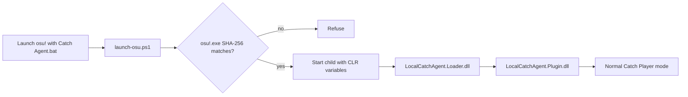

# Installing and Operating the osu!catch Research Agent

This manual covers the complete path from a clean repository checkout to a controlled local Catch
Player-mode session. It includes target verification, source builds, standalone map inspection,
full corpus checks, installation, controls, log interpretation, troubleshooting, updates, and
removal.

LocalCatchAgent is a version-locked research prototype, not an official osu! plugin API. Read the
supported-target and behavior sections before copying files into a game directory.

## 1. What the system contains

The active runtime consists of two original .NET Framework 4 assemblies:

| File | Purpose |
|---|---|
| `LocalCatchAgent.Loader.dll` | minimal CLR v4 `AppDomainManager` bootstrap |
| `LocalCatchAgent.Plugin.dll` | runtime planner, Player-input controller, telemetry, and overlay |

The launcher supplies CLR variables only to the child osu! process:



Installation does not patch `osu!.exe` and does not edit `osu!.cfg`. Starting `osu!.exe` through
an ordinary shortcut has no AppDomain-manager environment and remains the plugin-free path.

The repository also contains a .NET 8 command-line parser, object converter, viability planner,
JSON/SVG exporter, and corpus tool. Those components are useful for research and verification but
are not required to launch the in-process plugin.

## 2. Behavior boundary

The runtime plugin:

- starts with the user in control when launched through the installed batch file;
- runs only in normal Catch Player mode;
- rejects replay-backed play, Auto, Relax, Relax2, and Cinema;
- reads the client's converted Catch objects, catcher width, catcher X, and internal song clock;
- computes the full route before sending input;
- resolves the current Left, Right, and Dash bindings from osu!;
- emits ordinary Win32 scan-code down/up events;
- releases tracked keys when control or runtime gates fail; and
- exposes Player/Agent selection and route settings through a no-activate overlay.

It does not:

- patch the game executable;
- edit user configuration or account settings;
- implement HTTP, Bancho, login, score submission, or replay upload;
- create a built-in Auto list or replay-frame list;
- write catcher coordinates or judgement state; or
- block networking or alter the original client's surrounding network behavior.

The intended context is controlled local research. The plugin's lack of submission code is not a
statement about every action the unmodified client or a remote service might take. Do not use
automated play for public leaderboard submission.

## 3. Supported target

The current runtime supports exactly:

```text
Product:      osu!stable
File version: 1.3.3.8
Runtime:      CLR v4
Architecture: PE32 / x86 managed
Beatmap mode: native Mode:2
SHA-256:      6e182c10d1813209d12753dbc70b3a5bba00fef4ecf64bc42051870e6dfe4b7d
```

The executable hash is the compatibility contract. A displayed version alone is insufficient:
two builds can report the same version while carrying different private metadata tables. The
installer, launcher, plugin, and metadata probe all refuse an unknown hash.

Do not remove the hash check to “try” another client. Supporting a new binary requires resolving
and validating a new metadata slice.

The portable parser accepts native Mode 2 maps. Standard-to-Catch conversion and osu!lazer are
outside the current model.

## 4. Prerequisites

### 4.1 Required for installation and use

- Windows capable of running the supported x86 osu!stable client;
- Windows PowerShell 5.1 or newer;
- the exact supported `osu!.exe`, obtained independently;
- a checkout of this repository; and
- three distinct Catch bindings configured for Left, Right, and Dash.

### 4.2 Required for source builds and full verification

- WSL with access to the Windows filesystem;
- .NET 8 SDK;
- Windows .NET Framework 4 x86 compiler at
  `/mnt/c/Windows/Microsoft.NET/Framework/v4.0.30319/csc.exe`, or an explicit `CSC_NET40` path;
- `bash`, `git`, `rg`, `sha256sum`, `wslpath`, and `powershell.exe` available from WSL; and
- locally owned native Catch beatmaps for corpus validation.

Check the important tools from WSL:

```bash
dotnet --version
git --version
rg --version
test -x /mnt/c/Windows/Microsoft.NET/Framework/v4.0.30319/csc.exe
```

The final command is silent on success. Set `CSC_NET40` if the framework compiler is elsewhere.

## 5. Get the repository

From Windows PowerShell:

```powershell
Set-Location 'C:\Research'
git clone https://github.com/N0zoM1z0/osu-reverse-engineering.git
Set-Location '.\osu-reverse-engineering'
```

Or from WSL:

```bash
mkdir -p ~/coding
cd ~/coding
git clone https://github.com/N0zoM1z0/osu-reverse-engineering.git
cd osu-reverse-engineering
```

All remaining WSL commands assume the repository root as the current directory.

## 6. Verify the packaged artifacts

The publishable runtime directory is:

```text
catch/artifacts/inprocess/net40/
```

Verify it without rebuilding:

```bash
cd catch/artifacts/inprocess/net40
sha256sum -c SHA256SUMS
cd ../../../..
```

The active baseline recorded at publication is:

```text
b7919182b396e7c6129bbcc86bf8762c33a18f82c96ac61e4febed595c1cc213  LocalCatchAgent.Loader.dll
0769bf8b43bfb726c54f7624acd06f1b6db1f34422d80aa4e9a5b49ac0c53d49  LocalCatchAgent.Plugin.dll
```

.NET Framework PE timestamps can change binary hashes after a source rebuild. After rebuilding,
the generated `SHA256SUMS` is the authoritative checksum for that build. Baseline behavior is
identified by source provenance in [`../BASELINE.md`](../BASELINE.md), not by timestamp alone.

## 7. Build from source

Build the .NET Framework runtime, planner test, and metadata probe:

```bash
catch/InProcess/scripts/build-net40.sh
```

The default outputs are:

```text
catch/artifacts/inprocess/net40/LocalCatchAgent.Loader.dll
catch/artifacts/inprocess/net40/LocalCatchAgent.Plugin.dll
catch/artifacts/inprocess/net40/LocalCatchAgent.PlannerTest.exe
catch/artifacts/inprocess/net40/LocalCatchAgent.MetadataProbe.exe
catch/artifacts/inprocess/net40/SHA256SUMS
```

Use another framework compiler when needed:

```bash
CSC_NET40=/path/to/csc.exe catch/InProcess/scripts/build-net40.sh
```

Run the exact runtime-planner test:

```bash
catch/artifacts/inprocess/net40/LocalCatchAgent.PlannerTest.exe
```

Expected summary:

```text
CATCH NET40 PLANNER: PASS
objects=8, constraints=8, phases=20, hyper=1
```

## 8. Use the portable Catch planner

The .NET 8 tool accepts five commands.

### 8.1 Run synthetic tests

```bash
dotnet run --project catch/CatchPlanner -- self-test
```

Expected final line:

```text
CATCH SELF-TEST: PASS
```

### 8.2 Summarize conversion

```bash
dotnet run --project catch/CatchPlanner -- \
  analyze '/path/to/map.osu'
```

The report includes raw circles/sliders/spinners, curve kinds, converted fruits/droplets/tiny
droplets/bananas, catcher width, collision radius, and hyperdash links.

### 8.3 Inspect a time range

```bash
dotnet run --project catch/CatchPlanner -- \
  dump '/path/to/map.osu' --from 30000 --to 36000
```

This is useful when live telemetry identifies a miss time. Each row includes converted object ID,
time, X, kind, source line, and hyper target.

### 8.4 Build and render a route

```bash
dotnet run --project catch/CatchPlanner -- \
  plan '/path/to/map.osu' \
  --safety 1.0 \
  --svg /tmp/catch-plan.svg
```

Add `--json` for the complete machine-readable model. Add `--tiny-soft` to remove tiny droplets
from hard viability constraints while retaining them in conversion and audit output.

The SVG shows object windows, backward/forward viable regions, the selected route, and control
phases. Open it with any modern browser.

### 8.5 Validate a Songs directory

```bash
dotnet run --project catch/CatchPlanner -- \
  corpus '/path/to/osu!/Songs'
```

Only native Mode 2 files are selected. No beatmap is copied or modified.

## 9. Run the complete verification chain

The one-command verification script runs:

1. portable self-tests;
2. .NET Framework build;
3. exact runtime-planner test;
4. four-style cross-model corpus validation;
5. optional reflection-only metadata validation; and
6. artifact checksum verification.

Without a target executable:

```bash
catch/scripts/verify-corpus.sh '/path/to/osu!/Songs'
```

With the supported executable:

```bash
catch/scripts/verify-corpus.sh \
  '/path/to/osu!/Songs' \
  '/path/to/osu!/osu!.exe'
```

Expected final line:

```text
CATCH VERIFICATION: PASS
```

The current publication corpus contained 29 native Catch difficulties. It produced 116 style
builds, 112,432 aggregate constraints, and 18,872 hyper links. The tightest map retained 9.25 px
global clearance. Those maps are local test inputs and are not part of the repository.

## 10. Run the metadata probe separately

The probe resolves the private runtime anchors against the target assembly without starting the
game:

```bash
catch/artifacts/inprocess/net40/LocalCatchAgent.MetadataProbe.exe \
  "$(wslpath -w '/path/to/osu!/osu!.exe')"
```

It verifies the executable fingerprint, metadata tokens, declaring types, static/instance shape,
and the fields needed for the Catch manager, runtime object list, object state, catcher geometry,
song clock, and configured key bindings. A failed probe is a compatibility failure, not something
to bypass by guessing a nearby token.

## 11. Install the runtime files

Close osu! normally before installing. From a PowerShell prompt opened at the repository root:

```powershell
powershell.exe -NoProfile -ExecutionPolicy Bypass `
  -File .\catch\InProcess\scripts\install.ps1 `
  -OsuDirectory 'C:\Games\osu!'
```

If artifacts were built into a non-default directory, provide it explicitly:

```powershell
powershell.exe -NoProfile -ExecutionPolicy Bypass `
  -File .\catch\InProcess\scripts\install.ps1 `
  -OsuDirectory 'C:\Games\osu!' `
  -ArtifactDirectory 'C:\work\osu-reverse-engineering\catch\artifacts\inprocess\net40'
```

The installer verifies `osu!.exe`, refuses to run while osu! is open, and installs:

```text
C:\Games\osu!\
|-- Launch osu! with Catch Agent.bat
|-- LocalCatchAgent.Loader.dll
`-- LocalCatchAgent\
    |-- LocalCatchAgent.Loader.dll
    |-- LocalCatchAgent.Plugin.dll
    `-- launch-osu.ps1
```

It does not patch `osu!.exe`. The root loader exists because the CLR must locate the configured
AppDomainManager assembly before application code starts. The second loader copy is the staged
source used by the launcher to restore and hash-check that root copy on every plugin launch.

## 12. Choose how osu! starts

### 12.1 Plugin launch, initially disabled

Double-click:

```text
Launch osu! with Catch Agent.bat
```

The plugin and overlay load, but the control row starts at `PLAYER / SELF`. This is the safest
ordinary launch path because loading the experiment does not imply surrendering control.

### 12.2 Plugin launch, initially enabled

For a deliberate agent-first launch, run:

```powershell
powershell.exe -NoProfile -ExecutionPolicy Bypass `
  -File 'C:\Games\osu!\LocalCatchAgent\launch-osu.ps1' `
  -OsuPath 'C:\Games\osu!\osu!.exe' `
  -Enabled
```

### 12.3 Completely plugin-free launch

Start `osu!.exe` directly through the original shortcut or executable. The AppDomainManager
variables exist only in the child environment created by the launcher, so a direct launch does
not load LocalCatchAgent.

Only one osu! process may exist during launch. The script refuses to terminate or replace an
already-running instance.

## 13. Use the in-game overlay

The overlay is a click-through, non-activating companion window owned by the osu! process. It is
visible only while that process is in the foreground.

| Shortcut | Action |
|---|---|
| `Ctrl+Alt+F8` | Toggle between Agent control and Player/self control |
| `Ctrl+Alt+F7` | Expand or collapse the settings panel |
| `Ctrl+Alt+Up/Down` | Select a settings row |
| `Ctrl+Alt+Left/Right` | Change the selected value |
| `Ctrl+Alt+Enter` | Toggle or advance the selected value |

The eight settings rows are:

| Row | Default | Meaning |
|---|---|---|
| Control | Player/self | Whether the agent may send Catch input |
| Path geometry | Smooth | Preference used after hard viability is established |
| Safety floor | 1 px | Minimum global collision-window inset requested from the planner |
| Waypoint wander | 3 px | Bounded style displacement, projected back into the viable tube |
| Tracking deadband | 4 px | Error band in which the controller avoids unnecessary reversals |
| Tiny droplets | Hard/required | Whether tiny droplets participate in hard route constraints |
| Fatigue | Off | Progress-dependent bounded drift, still projected into feasibility |
| Variation | Repeatable | Stable seed per map and runtime object sequence |

Changing the path style applies that style's defaults. `CENTERED`, `SMOOTH`, `LIVELY`, and
`LAST MOMENT` alter preferences; they do not replace the movement and collision constraints.

## 14. Normal operating sequence

1. Launch through the Catch batch file.
2. Confirm that the overlay says `YOU PLAY` if you want to navigate normally.
3. Select a native Catch difficulty and enter normal Player mode. Do not select Auto, Cinema,
   Relax, or Relax2; the agent rejects replay/automation paths.
4. Configure the path style while still before gameplay.
5. Press `Ctrl+Alt+F8` to arm the agent.
6. Restart the map if the overlay reports that the candidate was prepared after gameplay began.
7. Keep osu! in the foreground. Focus loss releases keys and stops the current session.
8. At the result screen, inspect the log's `observed-caught` counts if the route needs diagnosis.

The runtime waits for the converted object list to remain unchanged for 120 ms before planning.
It then qualifies the song clock with forward samples instead of treating the client's transient
pre-roll zero as proof that gameplay has started.

## 15. Read the runtime log

The launcher prints the log location. With the default layout it is:

```text
C:\Games\osu!\LocalCatchAgent\LocalCatchAgent.log
```

A healthy session contains lines with this progression:

```text
target=... sha256=6e182c10...
live Catch targets validated
ready; ... architecture=normal Catch Player input + runtime viability planner
live Catch plan prepared from stable runtime list
live Catch agent armed in normal Player mode
first real Catch key transition sent through SendInput
live Catch agent stopped: ... observed-caught=F ... D ... T ...
```

The preparation line records the actual runtime catcher width, collision radius, chosen global
safety margin, converted object counts, hyper links, control phases, and resolved bindings. The
stop line records input transitions, correction count, maximum observed tracking error, and the
game's own caught flags for due fruits, droplets, and tiny droplets. Up to 40 misses receive an
object/time/position diagnostic line.

## 16. Troubleshooting

### The installer or launcher reports a fingerprint mismatch

The executable is not the supported build. Confirm the SHA-256 directly:

```powershell
Get-FileHash 'C:\Games\osu!\osu!.exe' -Algorithm SHA256
```

Do not edit the expected hash alone. A different managed build may assign the same token to an
unrelated member. Port the anchors, update the probe, and repeat the reverse-engineering checks.

### The installer says osu! is running

Close it normally and verify that no `osu!` process remains. Installation updates files that the
CLR may already have loaded, so hot replacement is intentionally rejected.

### There is no overlay

First confirm that the batch launcher, not `osu!.exe`, was used. Then inspect the log for loader,
fingerprint, or overlay errors. The overlay hides when osu! is minimized or not foreground; this
is expected.

### The overlay stays in Player mode

That is the default. Use `Ctrl+Alt+F8`, or launch the PowerShell script with `-Enabled` when the
choice is intentional.

### The overlay says it is waiting for Catch Player mode

Check all of the following:

- the selected beatmap is native `Mode: 2`;
- gameplay was entered through the normal Player path;
- Auto, Cinema, Relax, and Relax2 are not selected;
- no replay is being watched; and
- the current score and Catch manager have finished initializing.

### Planning repeatedly says the object list is incomplete

The live planner consumes the game's converted list, not a partially parsed disk map. At map
entry, object count, last object time, or the object signature may still change. Wait briefly. If
it never stabilizes, retain the log and run the metadata probe against the executable.

### The candidate was prepared after gameplay started

The planner deliberately refuses a late attach because it cannot prove a route from an unknown
mid-map catcher state. Restart the difficulty. Skipping an intro is safe only after the agent has
already armed and qualified the clock.

### The overlay remains in SYNC

The clock must move forward consistently. A pause, loading transition, or transient zero leaves
the session untrusted. Resume or restart normally; do not force the state in a debugger.

### The agent stops in the middle of a map

Look for the explicit reason in `live Catch agent stopped`. Common intentional boundaries are
foreground loss, a score or manager replacement, a backward/stalled song clock, leaving Catch,
or disabling the Agent row. The runtime releases every held binding when it stops.

### Movement visibly shakes

Increase the tracking deadband, reduce waypoint wander, disable fatigue, or select `CENTERED`.
The accepted baseline intentionally favors a low-chatter phase controller. Very small deadbands
can turn harmless frame-scale error into unnecessary left/right corrections.

### A key appears held after an abnormal termination

Bring osu! to the foreground and release the configured Catch bindings physically. Normal gates,
focus loss, toggle-off, and plugin shutdown send key-up events; a process crash cannot execute
cleanup code.

### PowerShell refuses to run the script

Use the documented `-ExecutionPolicy Bypass` for that one process. No machine-wide execution
policy change is required.

## 17. Update or rebuild

1. Close osu!.
2. Rebuild with `catch/InProcess/scripts/build-net40.sh`.
3. Run the complete verification chain.
4. Re-run `install.ps1` with the same `-OsuDirectory`.

The build writes PE timestamps, so DLL hashes may change despite identical source behavior. The
source commit, target fingerprint, tests, and current `SHA256SUMS` together define a release.

## 18. Uninstall

Close osu!, then run:

```powershell
powershell.exe -NoProfile -ExecutionPolicy Bypass `
  -File .\catch\InProcess\scripts\uninstall.ps1 `
  -OsuDirectory 'C:\Games\osu!'
```

This removes the Catch loader, plugin directory, and dedicated launcher. It does not remove or
modify `osu!.exe`, beatmaps, configuration, or unrelated files. A direct osu! launch is also
plugin-free even before uninstallation.

## 19. Suggested reading order

For a technical audit, read:

1. [`../BLOG.md`](../BLOG.md) for the complete research narrative and mathematics;
2. [`../reverse/analysis/stable-runtime-dynamics.md`](../reverse/analysis/stable-runtime-dynamics.md)
   for the recovered client semantics;
3. [`../CatchPlanner/`](../CatchPlanner/) for the independent Mode 2 parser and converter;
4. [`../InProcess/Plugin/RuntimeCatchPlanner.cs`](../InProcess/Plugin/RuntimeCatchPlanner.cs) for
   the net40 viability implementation; and
5. [`../InProcess/Plugin/LiveAgent.cs`](../InProcess/Plugin/LiveAgent.cs) for runtime acquisition,
   clock qualification, feedback, and scan-code input.

The active rollback boundary and measured live results are recorded in
[`../BASELINE.md`](../BASELINE.md).
