# Clockwork Fingers: Reconstructing a Live osu!mania Agent from Opaque IL

> *The replay was the oracle. The keyboard was the proof.*

## Abstract

This article presents the reconstruction of a live osu!mania agent for one precisely fingerprinted
osu!stable build. The investigation began with a narrower question: how does the built-in mania
Auto mod encode taps, chords, and long notes? Recovering that algorithm produced an exact
replay-frame model, but it also exposed an architectural distinction that shaped the rest of the
work.
Auto generates a replay and lets the replay consumer play it. A live agent must instead remain in
normal Player mode, follow the gameplay clock, and make the ordinary input system observe real key
state transitions.

The final system is an x86 .NET Framework 4 plugin loaded into the default CLR AppDomain. It is
locked to one executable SHA-256, validates every obfuscated runtime target by metadata shape and
critical IL, parses native Mode 3 beatmaps independently, prepares a physically feasible key
timeline, and emits scan-code `SendInput` events one gameplay tick at a time. An owned WinForms
overlay keeps control with the player. A stochastic timing model adds correlated error, early rush
bursts, density-sensitive 200/100 mixtures, frame cadence, fatigue, and finger trouble while a
constraint projection prevents those effects from degenerating into accidental misses.

The work is interesting less because it automates columns than because it crosses several semantic
boundaries cleanly: obfuscated IL to recovered behavior, replay state to physical key state,
statistical variation to legal per-lane schedules, and an opaque game process to a testable research
artifact.

## 1. Research question and boundary

The target was the legacy managed osu!stable client, not osu!lazer. Every runtime claim in this
article is bound to the following executable:

| Property | Locked value |
|---|---|
| Product | osu!stable |
| File version | `1.3.3.8` |
| Managed runtime | CLR v4 |
| PE architecture | x86 / PE32 |
| SHA-256 | `6e182c10d1813209d12753dbc70b3a5bba00fef4ecf64bc42051870e6dfe4b7d` |

The experiment has three deliberately separate outputs:

1. a readable .NET 8 implementation of the native beatmap and Auto-frame semantics;
2. a .NET Framework 4 in-process Player-mode agent;
3. curated reverse-engineering evidence and reproducible probes.

No osu! executable, extracted asset, complete decompiler tree, account data, local configuration,
score, replay, or private beatmap collection is part of the repository. The runtime plugin contains
no Bancho or HTTP integration. Its research target is local gameplay behavior, and its metadata
contract refuses unknown binaries rather than guessing.

That boundary matters technically. A metadata token is only an index in one module, and an opaque
method name is only a label emitted by an obfuscator. Neither is a stable API.

## 2. The result in one diagram

The final architecture keeps the recovered Auto model as a reference oracle, not as the live input
source:

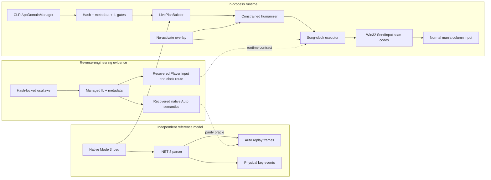

The decisive property is the last solid path. The game is in normal Player mode; no Auto replay
list is supplied to gameplay. Planning may know the map in advance, just as a robot can know a
trajectory in advance, but execution is still a sequence of physical key-down and key-up events
scheduled against the live gameplay clock.

> **Engineering judgement.** Replay parity was indispensable, but replay injection was the wrong
> endpoint. It proves understanding of the game's representation; it does not prove that an agent
> can act through the player's input boundary.

## 3. Reverse engineering managed code after names stop helping

### 3.1 Why IDA alone was not the main instrument

The executable is a managed PE, so native disassembly exposes the CLR host and stubs more readily
than the application semantics. IDA remains useful for module layout, process inspection, and
native interop, but ILSpy/dnSpy-style analysis is the productive layer for application control flow:

- metadata tokens preserve exact member identity inside the module;
- IL exposes enum constants, field access, virtual dispatch, and constructor shapes;
- cross-references survive even when source names do not;
- decompilation accelerates reading, while raw IL settles ambiguous cases.

The repository pins the command-line decompiler and keeps its output private:

```bash
dotnet tool install --global ilspycmd --version 9.1.0.7988

./reverse/scripts/decompile-osu.sh \
  '/mnt/c/Games/osu!/osu!.exe' \
  reverse/decompiled/osu-rebuilt
```

`decompile-osu.sh` refuses to overwrite an existing output tree and disables update checks. The
generated project is an analysis index, not publishable source.

### 3.2 Semantic triangulation

Obfuscation did not erase constants, inheritance, or data flow. The analysis therefore treated a
semantic label as a hypothesis that needed confirmation from independent directions.

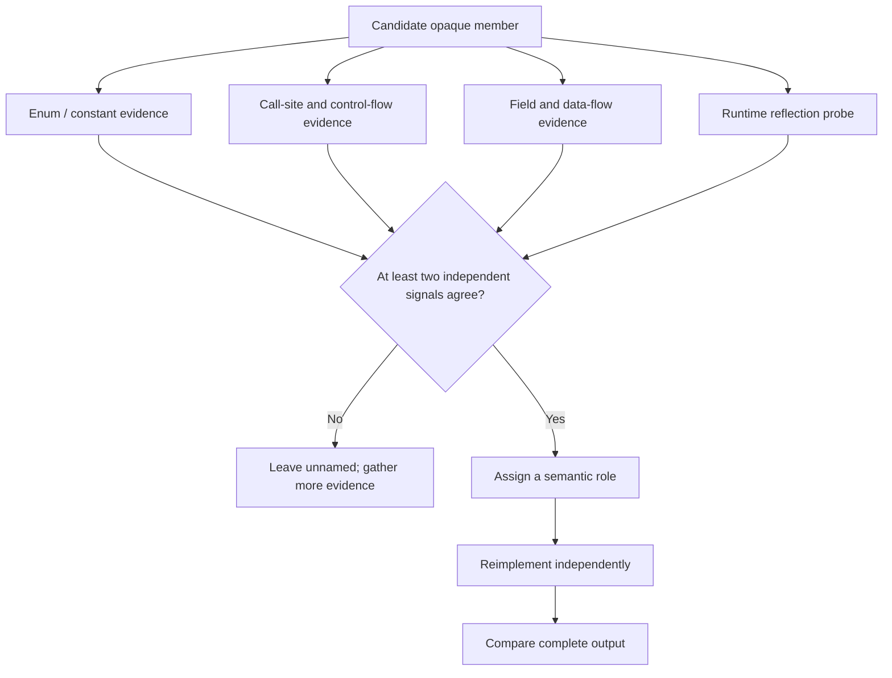

Several anchors survived intact:

- `osu_common.PlayModes.OsuMania = 3`;
- `osu_common.Mods.Autoplay = 0x800`;
- Player's central ruleset switch;
- common virtual methods overridden by each ruleset;
- replay-frame constructor and field shapes;
- powers of two returned by mania column objects;
- the normal Player recorder writing aggregate lane state.

The mania gameplay component was identified first from Player's `OsuMania` branch, then from its
Auto-generation override, and finally from its use of column masks. The replay-frame `x` field was
not assumed to mean a coordinate simply because other rulesets use it that way. In mania, the
producer wrote powers of two and the normal recorder later wrote the same aggregate state. That
cross-check established `x` as a key bitmask.

| Recovered role | Evidence that established it |
|---|---|
| mania gameplay component | Constructed in the Mode 3 branch; overrides the common Auto generator |
| mania hit object | Carries object time, end time, lane and hold state through the object manager |
| mania column | Polls two configured keys; returns `2^columnIndex` as its state mask |
| replay frame | Constructor and consumers agree on time, `x`, `y`, and button-state fields |
| gameplay song clock | Drives judgement and replay recording; monotonically advances during play |
| current score | Session identity referenced by Player and eligibility predicates |

> **Research principle.** Names are hints. Constants are anchors. Data flow is evidence. Exact
> output parity is the verdict.

### 3.3 Why global renaming was avoided

Aggressively renaming an obfuscated tree creates a subtle form of confirmation bias: an early,
plausible guess spreads into every later reading. This investigation maintained a compact semantic
map instead. A role received a name only after at least two independent references agreed, and
critical runtime members were later validated structurally.

That discipline paid off when distinguishing two superficially similar paths:

- Auto constructs input-looking state inside replay frames;
- Player polls keyboard-looking state from mania columns.

Both eventually reach judgement logic. Only the second is the normal player input boundary.

## 4. Native mania beatmaps: the compact contract that drives everything

An `.osu` file is an INI-like text document with ordered sections. A general parser may care about
all of them, but the agent's scheduling core needs a deliberately small subset:

| Section | Relevant field | Meaning in this project |
|---|---|---|
| file header | `osu file format vN` | format marker retained for diagnostics |
| `[General]` | `Mode: 3` | native mania requirement |
| `[Difficulty]` | `CircleSize` | integer key count |
| `[Difficulty]` | `OverallDifficulty` | base judgement-window parameter |
| `[HitObjects]` | object records | lane, start time, type, and optional LN end time |

`[TimingPoints]` is musically important, but object timestamps are already absolute beatmap
milliseconds. BPM integration is therefore unnecessary for locating notes. This is a useful
example of resisting accidental complexity: scroll behavior and rhythmic interpretation do not
change the stored hit time.

### 4.1 Hit-object grammar

A tap record has the form:

```text
x,y,time,type,hitSound,hitSample
```

A long-note record adds an end time before the sample data:

```text
x,y,time,type,hitSound,endTime:hitSample
```

The relevant type bits are:

```math
\operatorname{tap}(t) = ((t \mathbin{\&} 1) \ne 0)
```

```math
\operatorname{hold}(t) = ((t \mathbin{\&} 128) \ne 0)
```

For `K` keys and horizontal coordinate `x`, native mania maps the object to a zero-based lane by:

```math
\operatorname{lane}(x,K)
= \operatorname{clamp}\!\left(
\left\lfloor\frac{xK}{512}\right\rfloor,
0,
K-1
\right)
```

The explicit clamp handles the right boundary defensively. For 4K, the ranges are `[0,127]`,
`[128,255]`, `[256,383]`, and `[384,511]`.

The in-process parser rejects ambiguity instead of trying to repair it silently:

```csharp
int x = ParseInt(path, lineNumber, fields[0], "x");
int start = ParseInt(path, lineNumber, fields[2], "time");
int type = ParseInt(path, lineNumber, fields[3], "type");
bool hold = (type & 128) != 0;
bool tap = (type & 1) != 0;
if (!hold && !tap)
    throw Error(path, lineNumber, "Unsupported mania HitObject type=" + type + ".");

int end = start;
if (hold)
{
    if (fields.Length < 6)
        throw Error(path, lineNumber, "Long note has no endTime field.");
    string endText = fields[5].Split(':')[0];
    end = ParseInt(path, lineNumber, endText, "endTime");
    if (end <= start)
        throw Error(path, lineNumber, "Long note endTime must be greater than startTime.");
}
```

Source: [`LivePlanBuilder.cs`](InProcess/Plugin/LivePlanBuilder.cs).

## 5. Recovering the built-in mania Auto algorithm

### 5.1 Replay frames are aggregate state, not isolated actions

The native Auto generator begins with a neutral replay frame `(time=0, mask=0)`. Lane `n` occupies
bit `n`:

```math
b_n = 1 \ll n
```

If `M(t)` is the aggregate key mask at time `t`, a down transition sets the bit and an up transition
clears it:

```math
M_{\text{down}} = M \mathbin{|} b_n,
\qquad
M_{\text{up}} = M \mathbin{\&} \neg b_n
```

The recovered timing rules are compact:

| Object | Down | Up |
|---|---:|---:|
| tap | `startTime` | `startTime + 1` |
| long note | `startTime` | `endTime - 1` |

Simultaneous changes merge into one frame. When a long note is inserted, its bit is propagated
through every existing frame strictly inside the hold interval. This propagation is the detail
most likely to be missed by an implementation that treats each note as an isolated pair of frames.

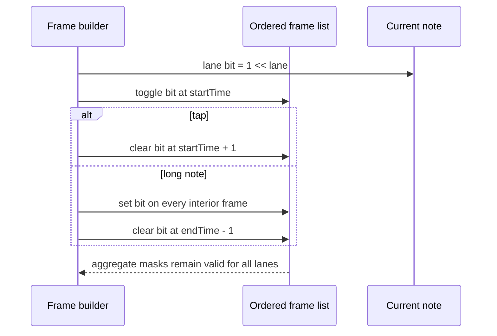

### 5.2 The readable implementation

The independent .NET 8 reference is intentionally close to the recovered behavior:

```csharp
public static IReadOnlyList<ReplayFrame> Build(ManiaBeatmap beatmap)
{
    var frames = new List<ReplayFrame> { new(0, 0) };

    foreach (ManiaHitObject hitObject in beatmap.HitObjects)
    {
        int bit = 1 << hitObject.Lane;
        ToggleAt(frames, hitObject.StartTime, bit);

        if (hitObject.IsHold)
        {
            for (int index = 0; index < frames.Count; index++)
            {
                ReplayFrame frame = frames[index];
                if (frame.Time > hitObject.StartTime && frame.Time < hitObject.EndTime)
                    frames[index] = frame with { KeyMask = Toggle(frame.KeyMask, bit) };
            }
            ToggleAt(frames, hitObject.EndTime - 1, -bit);
        }
        else
        {
            ToggleAt(frames, hitObject.StartTime + 1, -bit);
        }
    }

    return frames;
}
```

Source: [`ReplayFrames.cs`](ManiaAuto/ReplayFrames.cs).

`ToggleAt` performs a binary search for the last frame at or before the target. It mutates an exact
time match or inserts a copy of the previous mask before changing one bit. Copying the previous mask
is what preserves every unrelated lane.

### 5.3 Full-output parity, not visual plausibility

Two implementations were kept independent:

- [`ManiaAuto/ReplayFrames.cs`](ManiaAuto/ReplayFrames.cs), compiled for .NET 8;
- [`NativeFrameBuilder.cs`](InProcess/Plugin/NativeFrameBuilder.cs), compiled for .NET Framework 4.

The parity harness exports every `(time, mask)` pair from both implementations, normalizes the
transport representation, hashes the complete output, and performs a byte-for-byte comparison.
The development corpus passed 13 of 13 native Mode 3 maps.

A plausible first chord proves almost nothing. Full parity forces the implementation through
same-time toggles, overlapping lanes, long-note propagation, and insertion-order edge cases.

## 6. Why Auto parity was not the final agent

The original Auto path generates replay frames and hands them to the replay consumer. Gameplay
behaves correctly, but the causal chain is still replay-driven:

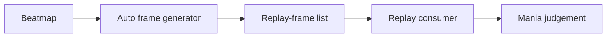

The desired agent has a different causal chain:

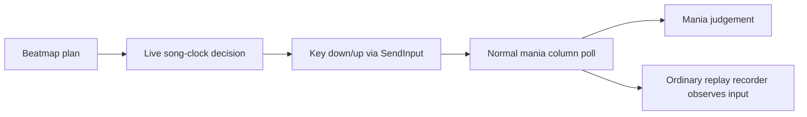

The last arrow is a useful sanity check. If replay data appears during a live session, it is the
normal recorder observing player input after the fact. It is not the source being consumed.

The one-millisecond Auto tap also reveals why a literal replay translation is insufficient. A
replay consumer sees every timestamped transition. A physical key poll can miss a down/up pair if
both arrive between two gameplay updates. The live planner therefore defaults to an 8 ms tap and
shortens it only when the next object on the same lane requires space.

## 7. Entering the process through CLR v4

### 7.1 Default-AppDomain bootstrap

The launcher supplies CLR AppDomain-manager variables only to the child process:

```text
APPDOMAIN_MANAGER_ASM=LocalManiaAuto.Loader, Version=1.0.0.0, Culture=neutral, PublicKeyToken=null
APPDOMAIN_MANAGER_TYPE=LocalManiaAuto.Loader.LocalManiaAutoDomainManager
MANIA_AUTO_PLUGIN=C:\Games\osu!\LocalManiaAuto\LocalManiaAuto.Plugin.dll
```

CLR v4 instantiates the loader before normal managed startup. The loader acts only in the default
AppDomain, uses an atomic one-shot guard, loads the plugin from a stable subdirectory, and invokes a
small public entry point:

```csharp
if (!AppDomain.CurrentDomain.IsDefaultAppDomain())
    return;
if (Interlocked.Exchange(ref started, 1) != 0)
    return;

string pluginPath = Environment.GetEnvironmentVariable("MANIA_AUTO_PLUGIN");
if (String.IsNullOrEmpty(pluginPath))
{
    pluginPath = Path.Combine(
        AppDomain.CurrentDomain.BaseDirectory,
        "LocalManiaAuto",
        "LocalManiaAuto.Plugin.dll");
}

pluginPath = Path.GetFullPath(pluginPath);
if (!File.Exists(pluginPath))
{
    Log("plugin missing: " + pluginPath);
    return;
}

Assembly plugin = Assembly.LoadFrom(pluginPath);
Type entryType = plugin.GetType("LocalManiaAuto.Plugin.Entry", true, false);
MethodInfo start = entryType.GetMethod(
    "Start",
    BindingFlags.Public | BindingFlags.Static,
    null,
    Type.EmptyTypes,
    null);
if (start == null)
    throw new MissingMethodException(entryType.FullName, "Start()");

start.Invoke(null, null);
```

Source: [`LocalManiaAutoDomainManager.cs`](InProcess/Loader/LocalManiaAutoDomainManager.cs).

Bootstrap exceptions are logged and swallowed. A research plugin failing to load must not prevent
the original application from starting.

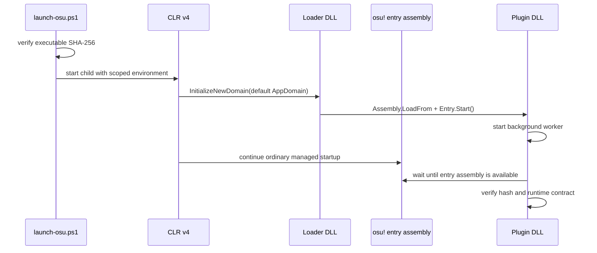

### 7.2 Why the loader is separate

Keeping the loader minimal reduces the amount of code that executes during fragile process startup.
The loader knows only how to locate and invoke the plugin. All target-specific tokens, UI code,
planning, statistics, and input logic live in the replaceable plugin assembly.

The separation also handles an operational quirk: osu! may clean unfamiliar DLLs from its root.
Installation keeps a durable loader copy under `LocalManiaAuto\`; the launcher restores the root
copy immediately before process creation and verifies that the two loader hashes match.

## 8. Metadata tokens are assertions, not APIs

The obfuscated names change the ergonomics of runtime access, but they do not justify blind token
resolution. The active plugin uses a layered contract:

1. verify the entire executable SHA-256;
2. resolve each known metadata token from the manifest module;
3. validate static/instance shape, field type, return type, and declaring type;
4. validate critical IL where a small method carries a safety property;
5. refuse the session before input on any mismatch.

The main recovered targets are:

| Token | Required shape | Recovered purpose |
|---|---|---|
| `0x04000CC6` | static `osu_common.Mods` | selected mods gate |
| `0x06002232` | static `osu_common.PlayModes ()` | current ruleset |
| `0x04002C6D` | static `osu.OsuModes` | global Player/Editor mode |
| `0x04002A7C` | static `bool` | replay-mode flag |
| `0x04002A7F` | static score reference | replay source |
| `0x040013C3` | static score reference | current score/session identity |
| `0x06002C63` | static beatmap getter | current beatmap object |
| `0x06001BF0` | instance `string ()` | native `.osu` path |
| `0x04002358` | static `int` | gameplay song clock in milliseconds |
| `0x06002B5A` | instance `void ()` | clear score-validity flag |
| `0x04001990` | instance `bool` | score validity field |

The entry point refuses an unknown build before it resolves a game field:

```csharp
string gamePath = game.Location;
string sha256 = ComputeSha256(gamePath);
if (!String.Equals(sha256, SupportedSha256, StringComparison.OrdinalIgnoreCase))
{
    Log("unsupported osu! build; refusing to resolve or mutate game fields");
    return;
}

Module module = game.ManifestModule;
FieldInfo selectedMods = module.ResolveField(SelectedModsFieldToken);
MethodInfo currentPlayMode = module.ResolveMethod(CurrentPlayModeMethodToken) as MethodInfo;
ValidateTargets(selectedMods, currentPlayMode);
agent = new LiveAgent(game, Log);
```

Source: [`Entry.cs`](InProcess/Plugin/Entry.cs).

The score invalidator is especially small. In the locked target its IL is:

```text
02 16 7D 90 19 00 04 2A
ldarg.0; ldc.i4.0; stfld 0x04001990; ret
```

The plugin verifies that body, invokes it on the candidate score, and reads the field back before
arming. This is stronger than trusting a remembered token: the token, method shape, field identity,
and runtime effect must all agree.

> **Engineering judgement.** Hash locking may look conservative, but silent compatibility is the
> dangerous option. In obfuscated software, a clean refusal is a feature.

## 9. Building a physical event plan

The live planner converts each object into a down/up pair. For a tap at `s` with configured pulse
width `p`, and for a long note ending at `e`:

```math
(d,u)_{\text{tap}} = (s, s+p)
```

```math
(d,u)_{\text{LN}} = (s, e-1)
```

The next same-lane down at `n` imposes `u < n`. Releases are therefore clipped when necessary:

```math
u' = \max\!\left(d+1,\ \min(u,n-1)\right)
```

The implementation preserves original/reference times alongside realized times because later
humanization and catch-up logic need to distinguish deliberate timing displacement from a scheduler
delay.

```csharp
if (hitObject.IsHold)
{
    releaseTime = hitObject.EndTime - 1;
    if (nextStart <= releaseTime)
    {
        releaseTime = nextStart - 1;
        warnings.Add("lane " + (lane + 1) + ": LN at source line "
            + hitObject.SourceLine + " overlaps the next object; release moved to "
            + releaseTime + "ms.");
    }
}
else
{
    releaseTime = hitObject.StartTime + tapMilliseconds;
    if (nextStart <= releaseTime)
        releaseTime = nextStart - 1;
}

releaseTime = Math.Max(hitObject.StartTime + 1, releaseTime);
```

Source: [`LivePlanBuilder.cs`](InProcess/Plugin/LivePlanBuilder.cs).

Two objects at exactly the same time on one physical lane are rejected. Different lanes at the
same time are batched and sent together.

## 10. The live Player-mode state machine

Loading the plugin does not imply control. The default state is `PLAYER / SELF`; the player must
enable the agent. A score moves through explicit candidate and armed states:

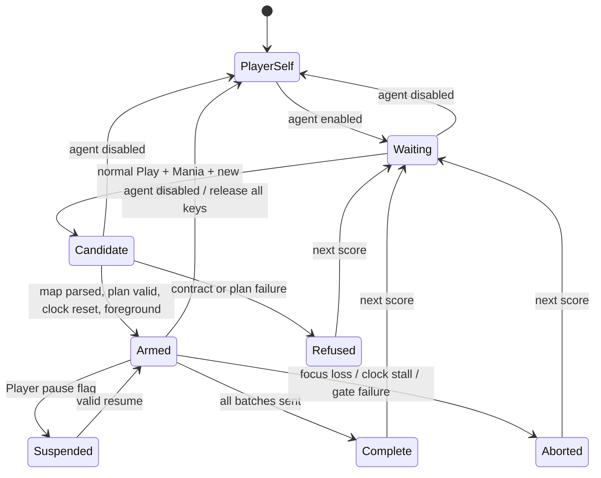

The runtime gates require:

- global mode `Play`;
- ruleset `OsuMania`;
- no Auto, Cinema, Relax, or Relax2 mod;
- a current Player score;
- replay-mode flag false;
- replay-source score null;
- osu! as the foreground process.

Candidate preparation obtains the current beatmap path through the validated runtime members,
parses it, humanizes the plan, resolves the configured key layout, and performs the score-validity
check. It does not emit input yet.

Arming waits for a plausible song-clock reset. This avoids attaching a newly prepared plan to a
clock already beyond the first object. Once armed, the score object itself becomes the session
identity; replacement of that object terminates the old session.

## 11. Tick execution: a plan is not a replay

The worker sleeps 20 ms while idle and 1 ms while timing is critical. Each critical tick reads the
game's own millisecond song clock. DT and HT need no external rate conversion because judgement and
the agent observe the same clock.

Conceptually, for event batch `i` at planned time `t_i`, launcher offset `o`, and current clock `c`:

```math
\operatorname{due}(i,c) \iff t_i + o \le c
```

All currently due transitions are emitted in a single pass. Input is stateful: the executor tracks
which lanes it believes are physically held and only changes necessary states.

```csharp
while (nextBatch < sessionPlan.Batches.Count)
{
    LiveTransitionBatch batch = sessionPlan.Batches[nextBatch];
    int due = checked(batch.Time + offsetMilliseconds);
    if (clock < due)
        break;

    int lateness = clock - due;
    if (lateness > maximumLatenessMilliseconds)
    {
        CatchUpToClock(clock, lateness);
        continue;
    }

    int sent = InjectBatch(batch);
    batchesSent++;
    transitionsSent += sent;
    maximumObservedLateness = Math.Max(maximumObservedLateness, lateness);
    nextBatch++;

    if (!firstBatchLogged)
    {
        firstBatchLogged = true;
        log("first real key transition sent through SendInput: song-clock="
            + clock + "ms, due=" + due + "ms, late=" + lateness + "ms");
    }
}
```

Source: [`LiveAgent.cs`](InProcess/Plugin/LiveAgent.cs).

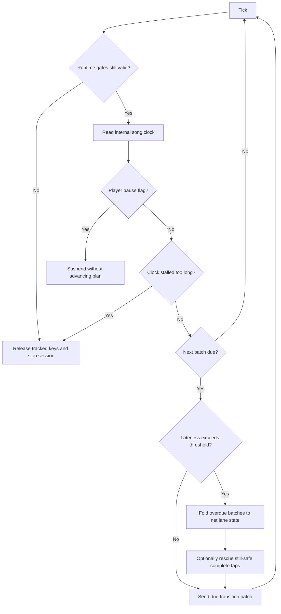

### 11.1 Catch-up without key-state explosions

Thread scheduling and game stalls can make several transitions overdue. Naively replaying all of
them late can produce a burst of contradictory down/up events. The catch-up routine instead folds
overdue batches into the lane state that should exist at the current clock, then sends only the
physical difference.

A fully elapsed tap is rescued only if all of the following hold:

- its press remains inside the recovered 100 judgement window;
- a short rescue pulse still fits before the next same-lane down;
- the state is not an ambiguous or expired long note;
- the rescue does not contradict the folded target state.

This policy intentionally prefers a collapsed expired note over a destructive late key-state
sequence. Real-time systems need a definition of damage containment, not merely a retry loop.

### 11.2 Pause, focus, and clock stalls

Pause is not equivalent to a stalled worker. The validated Player pause flag suspends the session
and allows a controlled resume. By contrast, an unexplained clock stall beyond the configured
threshold terminates the session and releases all keys. Losing foreground focus does the same.

Every exit path converges on key cleanup:

- control switched back to Player/self;
- score or mode changed;
- replay/automation source appeared;
- foreground was lost;
- clock moved backwards unexpectedly or stalled;
- any tick exception occurred;
- plugin shutdown began.

The invariant is simple and important:

```math
\text{inactive session} \Longrightarrow
\forall \ell,\ \operatorname{physicalDown}[\ell] = \mathrm{false}
```

## 12. Crossing the keyboard boundary

The agent uses Win32 `SendInput` with scan codes. Scan codes are preferable to character semantics
because mania bindings are physical keys, not text. Each event carries `KEYEVENTF_SCANCODE`, adds
`KEYEVENTF_KEYUP` for releases, and adds `KEYEVENTF_EXTENDEDKEY` when the mapped key requires it.

```csharp
private static NativeInput CreateKeyboardInput(LiveKeySpec key, bool keyUp)
{
    uint mappedScanCode = MapVirtualKeyW(key.VirtualKey, MapVkToScanCodeEx);
    if (mappedScanCode == 0)
        mappedScanCode = MapVirtualKeyW(key.VirtualKey, MapVkToScanCode);
    if (mappedScanCode == 0)
    {
        throw new Win32Exception(
            "Could not map " + key.Name + " (VK 0x" + key.VirtualKey.ToString("X2")
                + ") to a scan code.");
    }

    byte prefix = (byte)((mappedScanCode >> 8) & 0xFF);
    uint flags = KeyEventScanCode;
    if (keyUp)
        flags |= KeyEventKeyUp;
    if (prefix == 0xE0 || prefix == 0xE1)
        flags |= KeyEventExtendedKey;

    NativeInput result = new NativeInput();
    result.Type = InputKeyboard;
    result.Union.Keyboard.VirtualKey = 0;
    result.Union.Keyboard.ScanCode = (ushort)(mappedScanCode & 0xFF);
    result.Union.Keyboard.Flags = flags;
    result.Union.Keyboard.Time = 0;
    result.Union.Keyboard.ExtraInfo = InjectionMarker;
    return result;
}
```

Source: [`LiveAgent.cs`](InProcess/Plugin/LiveAgent.cs).

The native structure layout is explicitly x86. The metadata probe asserts `sizeof(INPUT) == 28`
before treating the build as valid. `SendInput` is called once per same-time batch, and a partial
return is treated as a failure rather than silently accepted.

Default layouts cover 1K through 9K. The planner requires exactly one unique configured key per
lane and does not read the player's configuration; installation documentation therefore makes key
alignment an explicit operator responsibility.

## 13. A control surface that does not steal control

Mutating osu!'s internal sprite hierarchy would create another large obfuscated dependency. The
chosen UI is an owned, borderless WinForms window created inside the process on its own STA thread.
It follows the game client rectangle, hides when the game is not foreground, and never activates.

```csharp
protected override bool ShowWithoutActivation
{
    get { return true; }
}

protected override CreateParams CreateParams
{
    get
    {
        CreateParams parameters = base.CreateParams;
        parameters.ExStyle |= ExtendedStyleToolWindow
            | ExtendedStyleTransparent
            | ExtendedStyleNoActivate;
        return parameters;
    }
}
```

Source: [`AgentOverlay.cs`](InProcess/Plugin/AgentOverlay.cs).

The overlay is presentation-only. The worker polls hotkeys while osu! owns foreground focus:

| Gesture | Effect |
|---|---|
| `Ctrl+Alt+F7` | expand or collapse settings |
| `Ctrl+Alt+F8` | switch between `PLAYER / SELF` and `AGENT` |
| `Ctrl+Alt+Up/Down` | move through setting rows |
| `Ctrl+Alt+Left/Right` | decrease or increase the selected value |
| `Ctrl+Alt+Enter` | advance/toggle the selected value |

The panel exposes twelve rows: control, style, base UR, timing bias, rush bursts, 200 mix, 100 mix,
dense boost, frame cadence, fatigue, finger trouble, and variation seed policy.

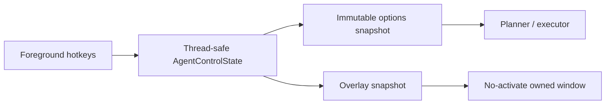

This architecture keeps control semantics independent from rendering. If the overlay fails, the
agent can be disabled by the same worker hotkey; if the worker fails, its exception path disables
control and releases keys.

## 14. Human timing is a stochastic process, not uniform jitter

Independent uniform offsets look synthetic and behave badly. They have no temporal memory, no
chord structure, and no relationship to density or physical feasibility. The humanizer instead
generates a latent timing process, adds structured effects, standardizes the core population to a
requested unstable rate, deliberately samples low-grade tails, quantizes to an input cadence, and
finally projects the result into legal lane constraints.

```mermaid
flowchart LR
    N["Paired notes"] --> DEN["Density and jack features"]
    DEN --> AR["Correlated AR(1) core"]
    AR --> GRP["Chord sharing + lane bias + roll"]
    GRP --> RUSH["Persistent early bursts"]
    RUSH --> STD["Normalize to target UR and bias"]
    STD --> TAIL["Controlled 200 / 100 bands"]
    TAIL --> FAT["Fatigue + jam + sticky release"]
    FAT --> FRAME["Frame-cadence quantization"]
    FRAME --> SAFE["Per-lane feasibility projection"]
    SAFE --> PLAN["Re-batched live plan"]
```

### 14.1 Core timing and unstable rate

Let `e_i` be the realized press error in milliseconds relative to the original note time. The
project uses population standard deviation, matching the common osu! unstable-rate convention:

```math
\mu_e = \frac{1}{N}\sum_{i=1}^{N}e_i
```

```math
\sigma_e =
\sqrt{\frac{1}{N}\sum_{i=1}^{N}(e_i-\mu_e)^2}
```

```math
UR = 10\sigma_e
```

Raw structured errors `r_i` are standardized before tail injection. Given requested base unstable
rate `U` and timing bias `b`:

```math
e_i^{\text{core}}
= b + \frac{U}{10}\frac{r_i-\mu_r}{\sigma_r}
```

This is more stable than choosing a Gaussian standard deviation and hoping the finite map realizes
the requested UR. The generated core population is calibrated directly.

### 14.2 Temporal correlation with an AR(1) process

Human timing drifts. Nearby groups should share more error than groups separated by a long break.
For inter-group interval `\Delta t_i` and correlation time constant `\tau`:

```math
\rho_i = \exp\!\left(-\frac{\Delta t_i}{\tau}\right)
```

```math
a_i = \rho_i a_{i-1} + \sqrt{1-\rho_i^2}\,z_i,
\qquad z_i \sim \mathcal{N}(0,1)
```

The construction preserves unit stationary variance while allowing correlation to decay naturally
with time. Notes in the same chord share most of the group error, with smaller lane-specific noise
and a directional chord roll layered on top.

The implementation's group term is deliberately mixed rather than pure AR state:

```csharp
double rho = Math.Exp(-delta / parameters.CorrelationMilliseconds);
arState = rho * arState
    + Math.Sqrt(Math.Max(0.0, 1.0 - rho * rho)) * NextGaussian(random);

double groupError = arState * 0.78
    + NextGaussian(random) * 0.24
    + rushShift;
```

Source: [`Humanizer.cs`](InProcess/Plugin/Humanizer.cs).

### 14.3 Early rush is a regime, not a coin flip per note

An early hit in isolation can be ordinary variance. Rushing becomes recognizable when it persists
through a short phrase. The model therefore starts a rush regime probabilistically at a note group,
then keeps it active for three to seven groups. Its negative shift decays across the run:

```math
r_k = -A\left(0.72 + 0.28\frac{k}{7}\right),
\qquad k \in \{1,\ldots,7\}
```

The start probability accounts for the expected occupancy of an active run, so bursts remain
possible without turning every group into a new burst. For requested rush fraction `q`, the
per-group start chance is derived from an expected five-group run and corrected for time already
occupied by a burst:

```math
p_{\text{start}}
= \min\!\left(0.65,\frac{q}{5\max(0.05,1-q)}\right)
```

Sampling happens per time group rather than per note, so a four-note chord does not receive four
independent chances to start rushing. A separate global timing setting controls the overall mean;
`RUSH BURSTS` controls local correlated episodes.

### 14.4 Density and jack pressure

For each note, the model counts notes in a one-second window centered on its original time. The
stream feature is:

```math
d_{\text{stream}}
= \operatorname{clamp}_{[0,1]}\!\left(\frac{N_{\pm500\text{ms}}-5}{15}\right)
```

For a same-lane interval `\Delta t_{\text{lane}}`, the jack feature is:

```math
d_{\text{jack}}
= \operatorname{clamp}_{[0,1]}\!\left(\frac{140-\Delta t_{\text{lane}}}{110}\right)
```

The final density is the stronger of the two:

```math
d = \max(d_{\text{stream}}, d_{\text{jack}})
```

Using `max` expresses a practical judgement: a sparse-looking section can still be difficult for
one finger, and a dense chord stream can be difficult even without repeated lanes.

### 14.5 Controlled 200 and 100 mixtures

Let `q_{100}` and `q_{200}` be user base probabilities, and let `B` be dense boost expressed as a
ratio. The per-note probabilities are:

```math
p_{100} = \min\!\left(0.35,\ q_{100}(1+2Bd)\right)
```

```math
p_{200} = \min\!\left(0.45,\ q_{200}(1+Bd)\right)
```

If their sum exceeds `0.65`, both are scaled proportionally to preserve their ratio:

```math
(p_{100},p_{200}) \leftarrow
\frac{0.65}{p_{100}+p_{200}}(p_{100},p_{200})
```

The stronger multiplier for 100s reflects the intended behavior: dense passages should produce a
visible but controlled increase in poor hits, while 200s remain the more common mild error.

```csharp
double dense = options.DenseBoostPercent / 100.0 * note.Density;
double probability100 = options.Grade100Permille / 1000.0
    * (1.0 + dense * 2.0);
double probability200 = options.Grade200Permille / 1000.0
    * (1.0 + dense);
probability100 = Math.Min(0.35, probability100);
probability200 = Math.Min(0.45, probability200);

double total = probability100 + probability200;
if (total > 0.65)
{
    probability100 *= 0.65 / total;
    probability200 *= 0.65 / total;
}
```

Source: [`Humanizer.cs`](InProcess/Plugin/Humanizer.cs).

The chosen grade is not produced by letting an unbounded Gaussian wander into a tail. Its offset is
sampled safely inside that grade's exact judgement band. This gives the UI meaningful control over
outcomes and prevents a requested 100 from accidentally becoming a 50.

## 15. Recovered mania judgement windows

For OverallDifficulty `OD`, define:

```math
d = \operatorname{clamp}(10-OD,0,10)
```

The locked stable build computes these maximum absolute errors before mod adjustment:

```math
\begin{aligned}
w_{320} &= 16,\\
w_{300} &= 34 + 3d,\\
w_{200} &= 67 + 3d,\\
w_{100} &= 97 + 3d,\\
w_{50}  &= 121 + 3d.
\end{aligned}
```

The comparisons are inclusive. At OD 8 the windows are `16 / 40 / 73 / 103 / 127 ms`.

Each base window `w` is transformed in this order, then truncated to an integer:

```math
w' =
\begin{cases}
w/1.4 & \text{if HR},\\
1.4w & \text{if EZ},\\
w & \text{otherwise},
\end{cases}
```

followed by:

```math
w'' =
\begin{cases}
1.5w' & \text{if DT},\\
0.75w' & \text{if HT},\\
w' & \text{otherwise}.
\end{cases}
```

These multipliers describe the observed internal clock behavior of this exact stable binary. They
must not be projected onto another client without re-analysis.

The judgement predictor is straightforward:

```csharp
if (absoluteOffset <= windows.Grade320) return 320;
if (absoluteOffset <= windows.Grade300) return 300;
if (absoluteOffset <= windows.Grade200) return 200;
if (absoluteOffset <= windows.Grade100) return 100;
if (absoluteOffset <= windows.Grade50) return 50;
return 0;
```

Long notes also depend on hold/release behavior, so press-grade statistics are not presented as a
complete prediction of final LN scoring.

## 16. Frame cadence, fatigue, and finger trouble

### 16.1 Input cadence

Real input often clusters near update boundaries. For frame period `P`, moving phase `\phi+w`, and
desired time `t`, the model chooses the nearest forward frame by:

```math
Q(t) = (\phi+w)
+ P\left\lceil\frac{t-(\phi+w)-P/2}{P}\right\rceil
```

Cadence can be native/unquantized, 240 Hz, 120 Hz, or 60 Hz. Phase wander is correlated, and a rare
hitch adds one period. Quantization is applied before the final safety projection because cadence
is an effect to preserve where feasible, not an excuse to violate a lane schedule.

### 16.2 Fatigue

Fatigue is modeled as a slowly varying late drift rather than a linear penalty from the first note.
It becomes visible over sustained play and interacts with density. The distinction is perceptual:
a fixed positive bias feels like calibration error, while gradual drift reads as loss of precision.

### 16.3 Jammed presses and sticky releases

`FINGER TROUBLE` introduces two sparse event types:

- a jam delays a press;
- a sticky finger delays a release.

They are applied asymmetrically because a late down and a late up have different physical
consequences. The feasibility solver still owns the final decision. A colorful failure model is not
allowed to break `down < up < nextDown` or leave a key held.

## 17. The no-miss constraint as an interval problem

Randomness alone is easy. Randomness inside physical and judgement constraints is the real design
problem.

Let note `i` on a lane have original press time `s_i`, realized press `d_i`, release `u_i`, next
press `d_{i+1}`, maximum safe displacement `W_i`, and safety guard `g`. The safe press interval is:

```math
s_i-(W_i-g) \le d_i \le s_i+(W_i-g)
```

The lane-order constraints are:

```math
d_i + 1 \le u_i \le d_{i+1}-1
```

The guard accounts for frame cadence:

```math
g = \max\!\left(4,\left\lceil0.55P\right\rceil\right)
```

where `P=0` in native cadence mode. The implementation uses the 100 window as the outer safe hit
region; no style intentionally targets 50 or miss.

The solver performs two passes per lane:

1. a backward pass determines the latest legal down time given the next note;
2. a forward pass clamps each down after the previous note and then clamps its release between its
   own down and the next down.

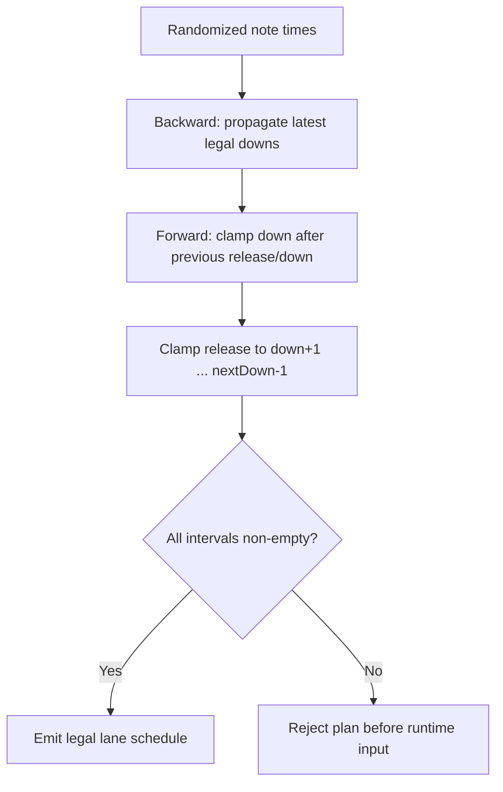

For each press, the lower and upper feasible bounds can be summarized as:

```math
L_i = \max\!\left(s_i-W_i+g,\ d_{i-1}+2\right)
```

```math
U_i = \min\!\left(s_i+W_i-g,\ U_{i+1}-2\right)
```

An empty interval `L_i > U_i` is a plan failure, not an invitation to improvise during gameplay.

> **Our interpretation.** The humanizer is best understood as constrained stochastic scheduling.
> The probability model proposes character; the interval solver decides what can physically exist.
> Treating those as separate stages made the system both more expressive and more reliable.

## 18. User-controlled profiles

Four profiles provide useful starting points, while every parameter remains adjustable:

| Profile | Base UR | Bias | Rush | 200 | 100 | Dense boost | Cadence | Fatigue | Trouble | Variation |
|---|---:|---:|---:|---:|---:|---:|---|---|---:|---|
| CLEAN | 0 | 0 ms | 0% | 0% | 0% | 0% | native | off | 0% | repeatable |
| HUMAN | 65 | -4 ms | 20% | 1.0% | 0.2% | 125% | 240 Hz | off | 1% | fresh |
| TIRED | 90 | -2 ms | 15% | 2.5% | 0.7% | 150% | 120 Hz | on | 3% | fresh |
| CHAOS | 120 | -5 ms | 30% | 6.0% | 2.0% | 200% | 60 Hz | on | 7% | fresh |

The labels describe behavior rather than ranking quality. `CLEAN` is a deterministic diagnostic
baseline. `HUMAN` is the restrained default. `TIRED` emphasizes drift and intermittent mechanical
trouble. `CHAOS` is intentionally theatrical but remains inside the same no-intentional-miss
constraint.

Changing a profile loads its defaults. Fine-grained changes then apply to the next prepared score
timeline. `REPEATABLE` derives an FNV-1a seed from map identity, mods, and settings; `NEW EACH PLAY`
mixes fresh process entropy.

## 19. Verification strategy

The system is tested at semantic boundaries rather than only at the final GUI:

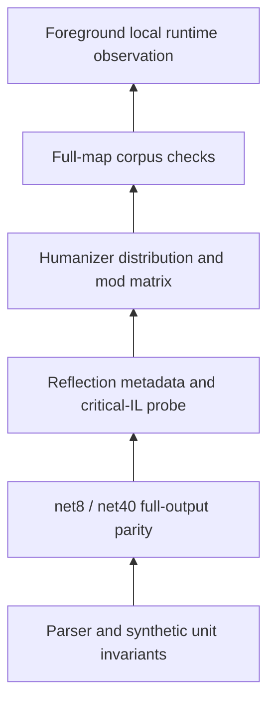

### 19.1 Reference and parity tests

- the .NET 8 project builds and passes its synthetic self-test;
- native Auto frames match the independent net40 builder on all 13 development maps;
- physical event timelines match transition-for-transition on the same maps;
- every timeline is monotonic and finishes with all lanes released.

### 19.2 Runtime contract probe

The reflection-only metadata probe verifies:

- exact target SHA-256;
- every token and member shape;
- exact score-invalidator IL;
- active plugin version `0.5.0.0`;
- presence of overlay, control, and humanizer types;
- absence of the historical `ReplayInjector` type from the active plugin;
- x86 `INPUT` size of 28 bytes;
- timer-resolution entry points.

The absence check is significant. Keeping historical source in the repository must not accidentally
put replay injection back into the production artifact.

### 19.3 Distribution tests

The synthetic humanizer harness does not merely assert that output exists. It requires:

- requested core UR 70 to realize inside `[65,75]`;
- at least one correlated rush episode in the fixed-seed corpus;
- zero predicted 50s and misses;
- dense and sparse note populations both to be represented;
- dense 100 rate to exceed three times the sparse 100 rate;
- NM, EZ, HR, DT, HT, and HR+DT window transforms to preserve the no-50/no-miss invariant.

The central calibration assertion is ordinary code, not an eyeballed graph:

```csharp
HumanizedPlanResult core = Humanizer.Apply(coreSource, coreOptions, 24680);
Assert(core.UnstableRate >= 65.0 && core.UnstableRate <= 75.0,
    "base UR calibration escaped 70 +/- 5: " + core.UnstableRate);
Assert(core.RushedNotes > 0,
    "rush model produced no correlated early notes");
Assert(core.Grade50 == 0 && core.Miss == 0,
    "core timing model escaped the miss guard");
```

Source: [`HumanizerProgram.cs`](InProcess/TestHost/HumanizerProgram.cs).

### 19.4 Full-map humanizer checks

All 13 maps were generated under all four profiles, producing 52 constrained timelines. For each
one, the harness checks transition count, batch monotonicity, legal down/up alternation, released
final state, and zero predicted 50/miss. The corpus ranged from hundreds to thousands of transitions
per map.

Thirteen maps are not a proof over every `.osu` file. They are, however, enough to expose many
structural mistakes that synthetic four-note examples conceal. The parser still rejects malformed
or physically ambiguous input instead of extending empirical confidence beyond its evidence.

## 20. Packaging the research without packaging the target

The public tree contains only the minimum reproducible artifacts:

```text
mania/
  ManiaAuto/                 readable parser and reference models
  InProcess/
    Loader/                  minimal CLR bootstrap
    Plugin/                  planner, agent, overlay, humanizer
    TestHost/                metadata, parity, and distribution probes
    scripts/                 build, install, launch, verify, uninstall
  artifacts/inprocess/       binaries built from the public source + checksums
  reverse/
    analysis/                curated findings
    scripts/                 pinned decompilation entry point
  docs/                      installation and usage manual
  BLOG.md                    this article
```

Ignored material includes the complete ILSpy output, private notes, local logs, build trees, test
executables, local beatmaps, scores, and replays. Public examples use neutral paths such as
`C:\Games\osu!` and `/mnt/c/Games/osu`.

This is more than repository hygiene. Reverse-engineering work is easiest to review when recovered
facts, original code, proprietary inputs, and local observations remain visibly distinct.

## 21. Limitations

The current result is intentionally narrow:

- only the exact locked osu!stable hash is supported;
- it is an x86 CLR v4 design, not a lazer plugin model;
- native Mode 3 maps are supported; converted rulesets are outside the parser contract;
- built-in key layouts stop at 9K, with higher counts requiring explicit configuration;
- configured keys must match osu!'s bindings because the plugin does not read `osu!.cfg`;
- the owned overlay is reliable in windowed/borderless modes, while exclusive-fullscreen
  composition depends on Windows behavior;
- foreground loss aborts the score rather than attempting a risky cross-window resume;
- an unexplained clock stall aborts because not every abnormal game state is distinguishable;
- press-grade predictions do not model every long-note release scoring detail;
- corpus parity supports the recovered model but does not turn one binary's internals into a stable
  upstream API.

## 22. What this investigation changed our understanding of

Three conclusions survived every implementation revision.

First, reverse engineering obfuscated managed code is primarily a problem of semantic invariants,
not decompiler aesthetics. Enum constants, virtual structure, metadata shapes, and
producer/consumer agreement proved more durable than reconstructed names.

Second, replay generation and agency are fundamentally different even when the resulting score
screen looks identical. The meaningful boundary is causal: did gameplay consume a prerecorded
state list, or did the normal input layer observe live key states? Recovering Auto answered the
first question; the Player-mode executor answered the second.

Third, believable imperfection is not achieved by adding larger noise. Human timing has memory,
local regimes, density dependence, and mechanical constraints. The most useful design was a
stochastic proposal followed by a deterministic feasibility projection. The former gives the
performance character; the latter keeps it playable.

The project began with a four-line Auto algorithm hidden inside opaque IL. It ended with a small
real-time system whose evidence chain can be inspected from beatmap coordinate to lane bit, from
song-clock tick to scan code, and from a requested timing style to a bounded judgement outcome.
That traceability is the satisfying part. The fingers may be clockwork, but the reasoning no longer
has to be.

## Further material

- [Installation and usage manual](docs/INSTALLATION_AND_USAGE.md)
- [Mania module overview](README.md)
- [Recovered native Auto algorithm](reverse/analysis/mania-auto.md)
- [Normal Player-input live agent](reverse/analysis/live-agent.md)
- [Recovered mania judgement windows](reverse/analysis/mania-judgement-windows.md)
- [CLR loader and historical replay proof](reverse/analysis/inprocess-loader.md)
