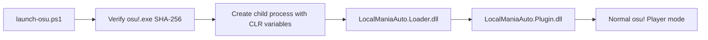

# Installing and Operating the osu!mania Research Agent

This manual covers the complete path from a clean repository checkout to a controlled local
Player-mode session. It also documents source builds, verification, UI behavior, logs,
troubleshooting, and removal.

The in-process plugin is intentionally version-locked. Read the support check before copying any
file into an osu! directory.

## 1. What is being installed

The active runtime consists of two original assemblies:

| File | Purpose |
|---|---|
| `LocalManiaAuto.Loader.dll` | minimal CLR v4 `AppDomainManager` bootstrap |
| `LocalManiaAuto.Plugin.dll` | live planner, Player-mode executor, overlay, and humanizer |

The launcher starts osu! with a child-process-only environment. CLR loads the bootstrap into the
default AppDomain; the bootstrap loads the plugin from `LocalManiaAuto\` beside the game.



Installation does not patch `osu!.exe` and does not edit `osu!.cfg`. A normal shortcut launch has
no loader environment and therefore does not activate the plugin.

The repository also contains a .NET 8 command-line reference tool. It is useful for inspecting
beatmaps and validating the recovered algorithms, but it is not required to run the in-process
plugin.

## 2. Supported target

The current plugin supports exactly this executable:

```text
Product:      osu!stable
File version: 1.3.3.8
Architecture: PE32 / x86 managed CLR v4
SHA-256:      6e182c10d1813209d12753dbc70b3a5bba00fef4ecf64bc42051870e6dfe4b7d
```

The hash is the compatibility contract. The displayed version alone is not sufficient: two files
can report the same version while carrying different metadata layouts. The installer and launcher
both refuse a mismatch.

This build targets native Mode 3 beatmaps. Converted maps and osu!lazer are outside the current
contract.

## 3. Prerequisites

### Required for installation and use

- Windows capable of running the target x86 osu!stable client;
- Windows PowerShell 5.1 or newer;
- the exact supported `osu!.exe`, obtained independently by the researcher;
- a local checkout of this repository;
- an osu!mania key layout that matches the plugin configuration.

### Required only for building or deep verification

- WSL with access to the Windows filesystem;
- .NET 8 SDK for `ManiaAuto/`;
- Windows .NET Framework 4 compiler at
  `/mnt/c/Windows/Microsoft.NET/Framework/v4.0.30319/csc.exe`, or an explicit `CSC_NET40` path;
- `git`, `bash`, `rg`, `sha256sum`, `wslpath`, and `powershell.exe` available from WSL.

Check the important tools from WSL:

```bash
dotnet --version
git --version
rg --version
test -x /mnt/c/Windows/Microsoft.NET/Framework/v4.0.30319/csc.exe
```

The last command is silent on success. A non-zero exit means the source-build script needs another
compiler path.

## 4. Get the repository

From Windows PowerShell:

```powershell
Set-Location 'C:\Research'
git clone https://github.com/N0zoM1z0/osu-reverse-engineering.git
Set-Location '.\osu-reverse-engineering\mania'
```

Or from WSL:

```bash
mkdir -p ~/coding
cd ~/coding
git clone https://github.com/N0zoM1z0/osu-reverse-engineering.git
cd osu-reverse-engineering/mania
```

The examples below use `C:\Games\osu!` as the game directory and `C:\Research` as a neutral
checkout root. Replace both with local paths as needed.

## 5. Verify the game binary first

In Windows PowerShell:

```powershell
$OsuPath = 'C:\Games\osu!\osu!.exe'
$Hash = (Get-FileHash -LiteralPath $OsuPath -Algorithm SHA256).Hash.ToLowerInvariant()
$Hash
```

Expected output:

```text
6e182c10d1813209d12753dbc70b3a5bba00fef4ecf64bc42051870e6dfe4b7d
```

Stop if it differs. Do not rename another build into place or disable the check. Supporting another
binary requires repeating the metadata and IL analysis; it is not an installation problem.

## 6. Choose an artifact path

There are two valid installation paths:

| Path | Appropriate when | What it uses |
|---|---|---|
| Prebuilt core artifacts | reviewing or running the published revision | the two committed DLLs and checksums |
| Build from source | modifying, auditing, or running all probes | locally compiled DLLs and test hosts |

### 6.1 Path A: verify the prebuilt core artifacts

The published hashes are stored in `artifacts/inprocess/net40/SHA256SUMS`:

```text
98ac7ccc4f68f7377b063961a004aa609d7d72cd5af07b6edeb0dd9cc736d490  LocalManiaAuto.Loader.dll
74667d198e1a4098813f747b19ec52f2c6025998c637d3536f361dd762b9e353  LocalManiaAuto.Plugin.dll
```

Verify in Windows PowerShell:

```powershell
Set-Location 'C:\Research\osu-reverse-engineering\mania\artifacts\inprocess\net40'
Get-FileHash -Algorithm SHA256 -LiteralPath `
  '.\LocalManiaAuto.Loader.dll', `
  '.\LocalManiaAuto.Plugin.dll'
Get-Content '.\SHA256SUMS'
```

Or from WSL:

```bash
cd artifacts/inprocess/net40
sha256sum -c SHA256SUMS
cd ../../..
```

Both files must report `OK`. These values apply to the committed artifacts. A local source rebuild
may produce different binary hashes even when the source is equivalent.

### 6.2 Path B: build from source

From the `mania/` directory in WSL:

```bash
dotnet restore ManiaAuto/ManiaAuto.csproj
dotnet build ManiaAuto/ManiaAuto.csproj -c Release
dotnet run --project ManiaAuto -- self-test

./InProcess/scripts/build-net40.sh
```

Expected final lines include:

```text
self-test: PASS (native frames, live timeline, 4K key mapping)
built net40 artifacts in: .../mania/artifacts/inprocess/net40
```

If the compiler is installed elsewhere:

```bash
CSC_NET40='/mnt/c/Windows/Microsoft.NET/Framework/v4.0.30319/csc.exe' \
  ./InProcess/scripts/build-net40.sh
```

The build produces:

```text
LocalManiaAuto.Loader.dll
LocalManiaAuto.Plugin.dll
LocalManiaAuto.TestHost.exe
LocalManiaAuto.FrameBuilderTest.exe
LocalManiaAuto.LivePlanTest.exe
LocalManiaAuto.MetadataProbe.exe
LocalManiaAuto.HumanizerTest.exe
```

Only the first two are installed. The test executables remain development artifacts.

## 7. Run the pre-install probes

This section requires a source build because the public package intentionally commits only the two
runtime DLLs.

### 7.1 Default-AppDomain loader probe

From WSL, while standing in `mania/`:

```bash
powershell.exe -NoProfile -ExecutionPolicy Bypass -File \
  "$(wslpath -w InProcess/scripts/test-loader.ps1)" \
  -ArtifactDirectory "$(wslpath -w artifacts/inprocess/net40)"
```

The probe creates a temporary managed host, applies the same AppDomain-manager environment, checks
the loader log, and removes the temporary directory. Success ends with:

```text
APPDOMAIN LOADER TEST: PASS
```

### 7.2 Target metadata and IL probe

```bash
powershell.exe -NoProfile -ExecutionPolicy Bypass -File \
  "$(wslpath -w InProcess/scripts/test-metadata.ps1)" \
  -ArtifactDirectory "$(wslpath -w artifacts/inprocess/net40)" \
  -OsuPath 'C:\Games\osu!\osu!.exe'
```

The probe is reflection-only; it does not start the game. It validates the executable hash,
metadata targets, score-invalidator IL, active plugin composition, x86 `INPUT` layout, and timer
entry points.

Representative success lines are:

```text
entry targets validated: ...
live-agent targets validated; ...
x86 SendInput layout validated: INPUT=28 bytes
METADATA PROBE: PASS
```

Do not continue after a failed metadata probe.

## 8. Install the runtime files

Close osu! normally before installation. The script does not terminate a running process.

In Windows PowerShell, from the `mania/` directory:

```powershell
Set-ExecutionPolicy -Scope Process -ExecutionPolicy Bypass
& '.\InProcess\scripts\install.ps1' -OsuDirectory 'C:\Games\osu!'
```

The installer performs four checks/actions:

1. requires `C:\Games\osu!\osu!.exe`;
2. verifies its exact SHA-256;
3. requires both runtime DLLs under `artifacts\inprocess\net40`;
4. copies the files into the following layout.

```text
C:\Games\osu!\
  osu!.exe
  LocalManiaAuto.Loader.dll
  LocalManiaAuto\
    LocalManiaAuto.Loader.dll
    LocalManiaAuto.Plugin.dll
```

The duplicate loader is intentional. The subdirectory copy is durable storage; the root copy is
where CLR resolves the AppDomain-manager assembly.

If artifacts are in another directory:

```powershell
& '.\InProcess\scripts\install.ps1' `
  -OsuDirectory 'C:\Games\osu!' `
  -ArtifactDirectory 'C:\Builds\mania-agent\net40'
```

## 9. Launch correctly

Do not use the normal osu! shortcut for a plugin session. It does not carry the scoped loader
environment.

Close any existing osu! process, then run:

```powershell
Set-Location 'C:\Research\osu-reverse-engineering\mania'
Set-ExecutionPolicy -Scope Process -ExecutionPolicy Bypass
& '.\InProcess\scripts\launch-osu.ps1' `
  -OsuPath 'C:\Games\osu!\osu!.exe'
```

The launcher refuses to continue if:

- the target hash is wrong;
- the installed loader or plugin is missing;
- osu! is already running;
- the root loader cannot be restored and hash-checked.

On success it prints the child process ID and log path. The plugin starts in `PLAYER / SELF` by
default. It is loaded and visible, but it does not prepare a score or emit gameplay input until the
user selects `AGENT`.

### 9.1 Launcher parameters

| Parameter | Default | Accepted range/format | Effect |
|---|---:|---|---|
| `-OsuPath` | `C:\Games\osu!\osu!.exe` | file path | target executable |
| `-Enabled` | `$false` | PowerShell boolean | initial Player/self or Agent control state |
| `-Keys` | empty | comma-separated keys | overrides built-in lane layout |
| `-TapMilliseconds` | `8` | `1..100` | physical pulse width for taps |
| `-OffsetMilliseconds` | `0` | `-5000..5000` | global event scheduler offset |
| `-MaximumLatenessMilliseconds` | `80` | `10..1000` | threshold for state-folding catch-up |
| `-ClockStallMilliseconds` | `250` | `100..5000` | unexplained clock-stall abort threshold |

A customized launch might be:

```powershell
& '.\InProcess\scripts\launch-osu.ps1' `
  -OsuPath 'C:\Games\osu!\osu!.exe' `
  -Enabled $false `
  -Keys 'D,F,J,K' `
  -TapMilliseconds 10 `
  -OffsetMilliseconds -2 `
  -MaximumLatenessMilliseconds 100 `
  -ClockStallMilliseconds 350
```

`-OffsetMilliseconds` belongs to the executor and shifts every event. The overlay's `TIMING`
setting belongs to the humanizer and changes the statistical center of a newly generated timeline.
They solve different problems; avoid using both as interchangeable calibration knobs.

## 10. Key layouts

The built-in layouts are:

| Keys | Left-to-right mapping |
|---:|---|
| 1K | `SPACE` |
| 2K | `F,J` |
| 3K | `F,SPACE,J` |
| 4K | `D,F,J,K` |
| 5K | `D,F,SPACE,J,K` |
| 6K | `S,D,F,J,K,L` |
| 7K | `S,D,F,SPACE,J,K,L` |
| 8K | `A,S,D,F,J,K,L,SEMICOLON` |
| 9K | `A,S,D,F,SPACE,J,K,L,SEMICOLON` |

The plugin does not read `osu!.cfg`. Its layout must match the bindings currently configured in
the game. Supply one token per lane in left-to-right order:

```powershell
-Keys 'A,S,D,F,J,K,L,SEMICOLON'
```

Accepted key forms include:

- letters `A` through `Z` and digits `0` through `9`;
- `F1` through `F24`;
- `NUMPAD0` through `NUMPAD9`;
- `SPACE`, `ENTER`, `TAB`, `BACKSPACE`;
- arrows and navigation keys;
- `LSHIFT`, `RSHIFT`, `LCTRL`, `RCTRL`, `LALT`, `RALT`;
- punctuation names such as `SEMICOLON`, `COMMA`, `PERIOD`, `SLASH`, `LBRACKET`;
- a raw virtual-key value such as `0xBA`.

Keys must be unique. The number of tokens must equal the beatmap key count. Maps above 9K require
an explicit layout.

## 11. Overlay controls

The overlay follows the osu! client window without taking keyboard or mouse focus.

| Hotkey | Action |
|---|---|
| `Ctrl+Alt+F7` | expand/collapse the setting panel |
| `Ctrl+Alt+F8` | immediate Player/self versus Agent toggle |
| `Ctrl+Alt+Up` | select previous row |
| `Ctrl+Alt+Down` | select next row |
| `Ctrl+Alt+Left` | decrease/cycle backward |
| `Ctrl+Alt+Right` | increase/cycle forward |
| `Ctrl+Alt+Enter` | increase/toggle the selected row |

Hotkeys are accepted only while osu! is the foreground process. Switching to `PLAYER / SELF`
during a score releases every key tracked by the agent and stops that session.

### 11.1 Runtime phases

| Display phase | Meaning |
|---|---|
| `IDLE` | Player controls, or Agent is waiting for a valid mania Player score |
| `ARMED` | plan is prepared; waiting for a plausible song-clock reset |
| `PLAYING` | session is consuming due batches against the live song clock |
| `PAUSED` | validated Player pause flag is set; timeline is suspended |

The detail line reports style, realized UR, predicted 200/100 counts, batch progress, current clock,
and skipped transition count when catch-up has collapsed expired events.

## 12. Every humanization control

Options are snapshotted when a score plan is prepared. Changing them during an active score does
not rewrite the already running timeline; the new values apply to the next score.

| Row | Range / choices | Step | Interpretation |
|---|---|---:|---|
| `CONTROL` | Player / Agent | toggle | who supplies gameplay keys |
| `STYLE` | CLEAN, HUMAN, TIRED, CHAOS | cycle | loads a coherent default parameter set |
| `BASE UR` | `0..200` | 5 | target core `UR`; timing sigma is approximately `UR / 10` ms |
| `TIMING` | `-30..+30 ms` | 2 ms | global humanizer mean; negative is early |
| `RUSH BURSTS` | `0..50%` | 5% | chance of correlated 3-to-7-group early regimes |
| `200 MIX` | `0.0..15.0%` | 0.5% | base probability of an explicit safe 200-band press |
| `100 MIX` | `0.0..5.0%` | 0.1% | base probability of an explicit safe 100-band press |
| `DENSE BOOST` | `0..250%` | 25% | density/jack multiplier for 200/100 probabilities |
| `FRAME CADENCE` | native, 240, 120, 60 Hz | cycle | quantizes desired input times with phase wander |
| `FATIGUE` | off/on | toggle | enables slow late drift over sustained play |
| `FINGER TROUBLE` | `0..10%` | 1% | sparse jammed presses and sticky releases |
| `VARIATION` | repeatable/new each play | toggle | deterministic or fresh random seed |

The humanizer does not expose an intentional miss control. All profiles finish with a per-lane
projection into a guarded 100 window while preserving legal down/up order.

### 12.1 Built-in profiles

| Profile | UR | Bias | Rush | 200 | 100 | Dense | Frame | Fatigue | Trouble | Seed |
|---|---:|---:|---:|---:|---:|---:|---|---|---:|---|
| CLEAN | 0 | 0 ms | 0% | 0% | 0% | 0% | native | off | 0% | repeatable |
| HUMAN | 65 | -4 ms | 20% | 1.0% | 0.2% | 125% | 240 Hz | off | 1% | fresh |
| TIRED | 90 | -2 ms | 15% | 2.5% | 0.7% | 150% | 120 Hz | on | 3% | fresh |
| CHAOS | 120 | -5 ms | 30% | 6.0% | 2.0% | 200% | 60 Hz | on | 7% | fresh |

Selecting a profile resets all rows to that profile's defaults. Adjust individual rows afterwards.

### 12.2 Practical starting points

For the first runtime check, use `CLEAN` with repeatable variation. It isolates parser, clock, key
layout, and input behavior from stochastic timing.

After the clean run is stable, use `HUMAN` unchanged. Its 65 base UR, modest early bias, 240 Hz
cadence, and low tail probabilities are designed to be visible in aggregate without dominating a
single short map.

For more dense-section 100s without increasing sparse errors as much:

```text
STYLE         HUMAN
100 MIX       0.3% to 0.6%
DENSE BOOST   175% to 250%
```

For stronger early phrases without shifting every note:

```text
TIMING        -2 ms to -4 ms
RUSH BURSTS   25% to 35%
```

For controlled mechanical imperfection, increase `FINGER TROUBLE` gradually. High values are
dramatic because they affect both presses and releases even though the safety projection remains
active.

## 13. Recommended local-play workflow

1. Verify that no osu! process is running.
2. Launch through `launch-osu.ps1` with the default `-Enabled $false`.
3. Confirm that the overlay says `PLAYER / SELF`.
4. Select a native mania map and make sure its key count matches the configured layout.
5. Avoid Auto, Cinema, Relax, Relax2, and replay/watch mode; the agent rejects those sessions.
6. Choose `CLEAN` for the first run, then toggle `AGENT` with `Ctrl+Alt+F8`.
7. Start gameplay normally and watch the phase change from `ARMED` to `PLAYING`.
8. Return to `PLAYER / SELF` before the next map whenever manual control is desired.
9. Close osu! normally when finished.

The agent marks an armed score ineligible before emitting input and verifies the field transition.
The implementation does not create or consume an Auto replay list.

## 14. Reading the log

The default log is:

```text
C:\Games\osu!\LocalManiaAuto\LocalManiaAuto.log
```

Follow it live in PowerShell:

```powershell
Get-Content -LiteralPath 'C:\Games\osu!\LocalManiaAuto\LocalManiaAuto.log' -Wait -Tail 80
```

A healthy startup contains evidence in this order:

```text
InitializeNewDomain: ... default=True
Entry.Start in AppDomain DefaultDomain
plugin started: LocalManiaAuto.Plugin ...
target=...osu!.exe, sha256=6e182c...
live-agent targets validated; tap=8ms, offset=0ms, max-late=80ms, clock-stall=250ms
ready; HUMAN, ... architecture=normal Player input (no Autoplay, no replay list)
```

A healthy score then adds:

```text
score marked local/ineligible; live plan prepared: ...
humanization prepared: ...
live agent armed in normal Player mode ... no replay frames were created or consumed
first real key transition sent through SendInput ...
```

Normal completion or deliberate disablement reports the number of batches/transitions, skipped
events, and maximum observed lateness.

Do not publish logs without review. They can contain local file paths, map names, process IDs, and
timing observations.

## 15. Troubleshooting

### `osu!.exe fingerprint differs from the analysed build`

The file is unsupported. Re-run `Get-FileHash` against the exact path passed to the script. File
version text is not a substitute for the SHA-256. There is no safe installation override.

### `Build artifacts are missing`

Confirm these files exist:

```text
mania\artifacts\inprocess\net40\LocalManiaAuto.Loader.dll
mania\artifacts\inprocess\net40\LocalManiaAuto.Plugin.dll
```

Restore the committed artifacts or run `./InProcess/scripts/build-net40.sh` from WSL.

### `osu! is already running`

Close it normally and wait for the process to exit:

```powershell
Get-Process -Name 'osu!' -ErrorAction SilentlyContinue
```

The launcher intentionally does not terminate the game.

### osu! starts, but there is no overlay

First confirm that the session was started by `launch-osu.ps1`, not by a shortcut. Then inspect
`LocalManiaAuto.log`.

- no `InitializeNewDomain`: loader environment or root loader resolution failed;
- `plugin missing`: reinstall and verify the subdirectory path;
- `unsupported osu! build`: the runtime hash check refused the target;
- `worker failure`: use the complete exception in the log;
- healthy `ready` line but invisible panel: press `Ctrl+Alt+F7`, then use windowed/borderless mode.

The launcher restores the root loader from the durable subdirectory on every run because the game
may remove unfamiliar root DLLs after startup.

### The overlay is visible, but hotkeys do nothing

osu! must own foreground focus. Press the hotkey while the game window is active. Check for another
application or keyboard utility intercepting `Ctrl+Alt+F7/F8`.

### The phase remains `IDLE`

Check all runtime gates:

- `CONTROL` is `AGENT`;
- global mode is Play, not Editor;
- ruleset is native mania;
- a current Player score exists;
- no Auto/Cinema/Relax/Relax2 mod is selected;
- the session is not a replay or watch mode;
- osu! remains foreground.

The log reports the specific refusal for automation and replay sources.

### The phase remains `ARMED`

`ARMED` means the plan exists but the song clock has not presented a plausible pre-first-note reset.
Start the score from its normal beginning. The agent refuses takeover after the first event rather
than guessing a mid-map position.

### `score refused before input`

Read the remainder of the same log line. Common causes are:

- non-native `Mode: 3` data;
- missing or non-integer `CircleSize`;
- missing/invalid `OverallDifficulty`;
- malformed long-note end time;
- two objects at the same timestamp on one lane;
- wrong number of configured keys;
- duplicate or unknown key token;
- score invalidation contract failure.

No input is emitted after this preparation failure.

### Columns do not match the notes

The plugin's left-to-right key list differs from osu!'s current mania bindings. Supply `-Keys`
explicitly. For example, a 4K layout bound to `A,S,K,L` requires:

```powershell
-Keys 'A,S,K,L'
```

Do not reverse the order; lane 1 is the leftmost column.

### Keys appear not to register

Start with `CLEAN`, verify the layout, and inspect the log for the first successful `SendInput`
transition. If the process uses unusual compatibility/elevation settings, launch and test at a
consistent integrity level. Avoid mixing an elevated game with separate unelevated external test
tools.

### The agent stops when another window is focused

This is expected. Foreground loss aborts the current score and releases keys. Restore focus and
start a new score; the stopped score is deliberately not resumed across windows.

### The game is paused

The overlay should show `PAUSED`. A normal resume returns to `PLAYING` after the clock transition is
validated. If the clock jumps backwards into an implausible position or fails to move without the
Player pause flag, the session is stopped instead.

### `clock stalled` or frequent catch-up messages

First investigate system load and game frame stability. `-MaximumLatenessMilliseconds` controls
when overdue transitions are folded to net lane state; `-ClockStallMilliseconds` controls when an
unexplained frozen clock terminates the session.

Increasing either value changes failure tolerance, not human timing. Do not use them to manufacture
late hits. The defaults are 80 ms and 250 ms respectively.

### Overlay is missing in exclusive fullscreen

Use windowed or borderless mode. The overlay is an owned WinForms surface, not an object inside
osu!'s sprite tree, so exclusive-fullscreen composition is Windows-dependent.

### A key remains down after an abnormal stop

The plugin sends release events on every known stop path. If an external failure prevents cleanup,
physically press and release the affected key once, return to `PLAYER / SELF`, close osu! normally,
and inspect the final log lines before another test.

## 16. Reference CLI

`ManiaAuto/` is an independent .NET 8 model. It can run under Linux/WSL for read-only commands.

Build once:

```bash
dotnet build ManiaAuto/ManiaAuto.csproj -c Release
```

### Inspect a beatmap

```bash
dotnet run --project ManiaAuto -- \
  inspect ManiaAuto/TestData/minimal-4k.osu --limit 12
```

The report includes format, key count, tap/LN counts, maximum chord, duration, lane populations,
and initial native Auto frames.

### Export recovered native Auto frames

```bash
dotnet run --project ManiaAuto -- \
  frames ManiaAuto/TestData/minimal-4k.osu --limit 40
```

Output columns are frame time, aggregate key mask, and binary mask.

### Export physical key transitions

```bash
dotnet run --project ManiaAuto -- \
  events ManiaAuto/TestData/minimal-4k.osu --tap-ms 8 --limit 80
```

Output columns are `time_ms`, one-based lane, `down/up`, and source line.

### Run the external foreground-input prototype

This command requires Windows and is separate from the in-process plugin:

```powershell
dotnet run --project .\ManiaAuto -- play 'C:\Maps\example.osu' `
  --keys D,F,J,K --tap-ms 8 --anchor-ms first --rate 1.0 --offset-ms 0
```

Focus osu! and press `F6` at the declared anchor. `F7`, Escape, Ctrl+C, or focus loss stops the
prototype and releases tracked keys.

The prototype uses a local stopwatch and manual anchor. The plugin uses the internal gameplay
clock, runtime score identity, in-game overlay, constrained humanizer, and live gates. The CLI is a
diagnostic reference, not a substitute for the plugin.

## 17. Full verification suite

After building both targets, run the synthetic checks:

```bash
dotnet run --project ManiaAuto -- self-test

powershell.exe -NoProfile -ExecutionPolicy Bypass -File \
  "$(wslpath -w InProcess/scripts/run-humanizer-test.ps1)" \
  -ArtifactDirectory "$(wslpath -w artifacts/inprocess/net40)"
```

To validate against a researcher-owned Songs directory:

```bash
./InProcess/scripts/verify-frame-parity.sh /mnt/c/Games/osu/Songs
./InProcess/scripts/verify-event-parity.sh /mnt/c/Games/osu/Songs
./InProcess/scripts/verify-humanizer.sh /mnt/c/Games/osu/Songs
```

The scripts search only for files containing native `Mode: 3`. They do not upload or modify maps.
Set parallelism when needed:

```bash
PARALLELISM=2 ./InProcess/scripts/verify-humanizer.sh /mnt/c/Games/osu/Songs
```

Use a non-default tap width in event parity with:

```bash
TAP_MS=10 ./InProcess/scripts/verify-event-parity.sh /mnt/c/Games/osu/Songs
```

Expected suite endings are:

```text
FULL FRAME PARITY: PASS (... maps)
FULL LIVE-EVENT PARITY: PASS (... maps, tap=8ms)
FULL HUMANIZER PROFILE VALIDATION: PASS (... maps x 4 styles)
```

## 18. Updating after a repository change

1. Close osu! normally.
2. Pull or check out the intended revision.
3. Review the diff, especially target hash, tokens, and scripts.
4. Rebuild if source changed.
5. Repeat loader and metadata probes.
6. Run `install.ps1` again; it replaces only the loader/plugin copies.
7. Launch with `PLAYER / SELF` and perform a CLEAN test first.

Do not replace a DLL while it is loaded in the game process.

## 19. Uninstall

Close osu! normally, then run from the `mania/` directory:

```powershell
Set-ExecutionPolicy -Scope Process -ExecutionPolicy Bypass
& '.\InProcess\scripts\uninstall.ps1' -OsuDirectory 'C:\Games\osu!'
```

The script removes:

```text
C:\Games\osu!\LocalManiaAuto.Loader.dll
C:\Games\osu!\LocalManiaAuto\
```

It does not modify or remove `osu!.exe` or osu! configuration.

Confirm removal:

```powershell
Test-Path -LiteralPath 'C:\Games\osu!\LocalManiaAuto.Loader.dll'
Test-Path -LiteralPath 'C:\Games\osu!\LocalManiaAuto'
```

Both commands should print `False`.

## 20. Operational limitations

- Runtime compatibility is limited to the documented executable SHA-256.
- The active implementation is x86 CLR v4 and is not an osu!lazer plugin.
- Native Mode 3 beatmaps are supported; malformed/ambiguous maps are rejected.
- Built-in layouts cover 1K through 9K.
- The plugin does not import current key bindings from configuration.
- Foreground loss terminates the score rather than resuming across applications.
- Borderless/windowed display is the reliable overlay mode.
- Timing settings apply when a new score plan is prepared.
- The no-intentional-miss constraint predicts press grades; long-note release scoring remains the
  game's final decision.

For the design rationale and recovered algorithms, continue with
[Clockwork Fingers](../BLOG.md). For compact runtime internals, see the
[in-process README](../InProcess/README.md) and [live-agent analysis](../reverse/analysis/live-agent.md).
