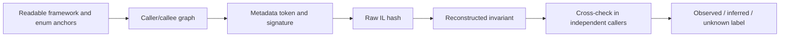
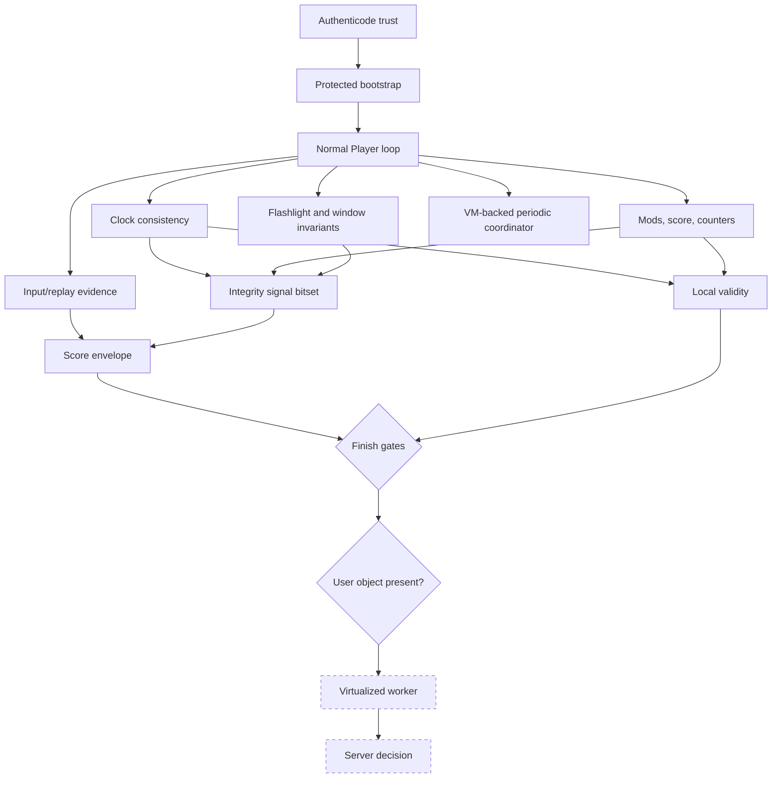
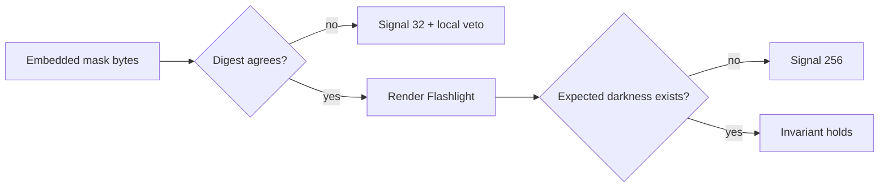
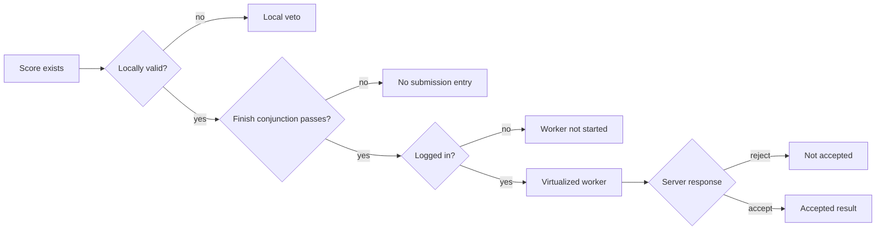

# The Score Has More Than One Clock

*Trust the executable. Distrust the timeline. Never confuse a local veto with a server verdict.*

Anti-cheat systems are often imagined as hunters: enumerate processes, scan memory, find a known
tool, pull the alarm. That picture is vivid, easy to explain, and—at least for the managed layer of
the osu!stable build examined here—mostly the wrong mental model.

What emerged from the executable was more interesting. The client turns a play into a bundle of
cross-checkable evidence. Input becomes replay frames. Score is represented more than once. Song
time is compared with application time, then application time is compared with wall time. Mods live
in two places and are expected to agree. Flashlight is checked both as a resource and as something
that must actually darken the screen. A local Boolean can veto a score, but it cannot create a
network request. Even after a request, the client does not own the final verdict.

This is a study of that machinery in one exact executable. It is not a bypass guide. No check was
disabled, no score was forged, no submission was triggered, and no public service was used as a
test oracle. The goal was to understand the architecture well enough to say what the client proves,
what it merely suggests, and where the evidence disappears behind virtualization or the server.

## A build under glass

The target was pinned before any semantic claim was made:

| Property | Value |
| --- | --- |
| Product version | `1.3.3.8` |
| Format | PE32 / x86 / CLR |
| SHA-256 | `6e182c10d1813209d12753dbc70b3a5bba00fef4ecf64bc42051870e6dfe4b7d` |
| Authenticode | valid, signed by `ppy Pty Ltd` |

That hash is not administrative decoration. Obfuscated names and metadata tokens are build-local.
A method token that is precise today can identify something unrelated in another module tomorrow.
For each important method, the research artifact records

\[
(\text{executable hash},\;\text{token},\;\text{signature},\;\operatorname{SHA256}(IL)).
\]

The resulting manifest is reproducible with a PowerShell script that reflection-loads the assembly
without executing it. It also inventories declared native imports and asks a set of negative
questions: are common debugger, Toolhelp, remote-memory, or injected-input APIs even declared?

This build-specific discipline may feel fussy until the first update lands. Then it is the
difference between reverse engineering and folklore.

## Obfuscation changed the route, not the destination

The executable is obfuscated in three distinct ways.

First, game-owned identifiers are nearly meaningless. A name such as
`#=zWQjPCUezkZ$WXRmRpbq0cfjnab5SCorhHC9a1HY=` is not a clue; its fields, callers, and behavior are.
Readable framework types—`BackgroundWorker`, `Process`, `DateTime`, `Mods`, `ReplayAction`—became
the landmarks.

Second, strings pass through a protected table. The main decoder is a 2,181-byte IL method that
loads an encrypted/compressed resource, mixes in assembly metadata, consults stack and caller
state, and caches the result. This makes “search for the error message” a weak first move.

Third, selected methods are virtualized. Their visible IL creates an argument array, selects an
opaque dispatcher key, and enters a VM. The score worker is one of those methods. Static analysis
can prove that the worker was scheduled and which visible arguments cross the wrapper; it cannot
honestly reconstruct every byte sent to the server.

The useful workflow was therefore structural:



Obfuscation slowed naming. It did not erase data flow.

## The architecture in one picture



There is no single choke point. The system is a sequence of claims:

- this executable is trusted;
- this play evolved consistently;
- this score is locally eligible;
- this client is logged in;
- this worker completed;
- this server accepted the result.

Collapsing those claims into “the score uploads” loses most of the design.

## The signed door

The startup entry validates the executable through `WinVerifyTrust` before continuing. In semantic
pseudocode, the path is pleasantly direct:

```csharp
Environment.CurrentDirectory = ExecutableDirectory;

if (!WindowsTrustAccepts(ExecutableFileName))
{
    ShowStartupFailure();
    Exit();
}

StartTheClient();
```

The updater applies the same trust wrapper to files in its staging directory. An invalid payload is
removed and reacquired, with compatibility exceptions around certificate-store failures and older
platform behavior.

The nuance matters. The wrapper is not mechanically fail-closed: selected certificate-store errors
and exceptions return success to avoid making the client unbootable. Yet a normal explicit trust
failure still blocks startup. This is a pragmatic trust policy, not a cryptographic proof detached
from deployment reality.

It is also not gameplay anti-cheat. Authenticode answers “does Windows trust this publisher and
file?” It does not answer “was this 300 hit by a person?” The two controls belong in the same
integrity story but solve different problems.

## A play writes its own witness

The normal Player update loop does more than judge hit objects. It records the state from which a
replay can later be serialized. A frame is added when the relevant button state or cursor/lane
state changes. The score object later emits frame deltas, coordinates, button state, and an end
sentinel.

Meanwhile, hit counts, combo, total score, mods, mode, pass state, time, map/player identity, and
client data live in the score object. Two checksum-producing methods cover overlapping collections
of those fields. A separate method serializes coarse periodic samples used by the result-side trace.

This is not redundant by accident. The same play now exists as several related narratives:

```text
physical/logical input changes
        ↓
replay frame stream ───────┐
                           ├── score envelope
hit-object judgements ─────┤
                           │
periodic runtime samples ──┘
```

If one narrative changes in isolation, another may stop agreeing. The strongest client-side idea
in this build is not secrecy; it is consistency.

## The score has more than one clock

The main Player method is 4,298 IL bytes and carries several unrelated responsibilities. Buried in
it is a compact timing monitor with excellent defensive leverage.

Roughly once a second, the client compares song-time progress with application-time progress. Song
time is normalized for the selected speed mod:

\[
D_t = \left|\frac{\Delta T_{song}}{r} - \Delta T_{app}\right|,
\qquad
r =
\begin{cases}
1.5 & \text{Double Time}\\
0.75 & \text{Half Time}\\
1 & \text{otherwise.}
\end{cases}
\]

When \(D_t\) remains above about 60 ms for more than five observations, the visible path reports a
timing error and invalidates the score.

The check uses deltas. A fixed offset between clocks is harmless; a sustained disagreement in rate
is not. That is exactly the geometry one would choose to detect timeline manipulation without
punishing ordinary latency.

Then the client asks a second question. Does wall time agree with application time?

\[
W_t = \left|\Delta T_{wall} - \Delta T_{app}\right|.
\]

Repeated deviations above roughly two seconds add an integrity signal. A third guard invalidates a
normal score after an update stall of around six to eight seconds, depending on branch.

Three time sources serve three purposes:

- song time knows where the map is;
- application time knows how the process is advancing;
- wall time knows how the host says time is advancing.

No one clock is treated as the whole truth. That design is simple, cheap, and surprisingly hard to
fool accidentally.

## Parallel state: mods, counters, and score

The same strategy appears outside timing.

The mods copied into the score are compared with the independently selected global mods. A mismatch
sets numeric signal `4`. Duplicated update/object counters must be non-zero and equal before the
normal finish path can proceed. Score-related values are recalculated in more than one place. A
runtime string is captured and checked later. A compact digest assembled from independent globals
is compared with another stored value.

The checks are not all equivalent. Some accumulate a signal for later serialization. Others
invalidate the score immediately. Strong composite mismatches can schedule delayed error and
termination paths. This is why the static Boolean called “valid” is not a master switch; it is one
participant in a larger state machine.

## A bitset without names

The integrity enum has no useful member names in the decompiler. Numeric values survive, and their
setter conditions allow careful analyst labels:

| Value | Recovered condition family |
| ---: | --- |
| `2` | clock/timebase disagreement |
| `4` | selected mods and score mods disagree |
| `16` | composite score/runtime/digest disagreement |
| `32` | Flashlight embedded-resource digest mismatch |
| `256` | Flashlight render/state invariant failure |
| `512` | setter recovered; direct managed source unresolved |
| `1024` | own game window reports layered alpha below 255 |
| `4096` | gated, smoothed movement-direction discontinuity |

These are descriptions, not official names. The distinction is worth defending: a reverse engineer
should not turn an obfuscated integer into a confident product term merely because a table looks
nicer with names.

The score summary snapshots the bitset into serialized text and then resets the global accumulator.
That proves the signals cross into the score envelope. It does not prove how the server weights
them, whether any one bit is decisive, or whether the same interpretation survives another build.

## Flashlight checks the asset and the effect

Flashlight contains the most tangible integrity checks in the recovered gameplay code.

When its mask resource is loaded, the client hashes the embedded bytes and compares the result with
a built-in digest. A mismatch schedules signal `32` and disables score validity. Later, missing or
unexpectedly faded mask components produce signal `256`. A render-side sample asks whether pixels
that should be dark are still bright and can produce the same signal.

This is a neat two-level defense:



Checking only the resource would miss a runtime path that never applies it. Checking only a few
pixels would miss a replaced asset that happens to satisfy the sample. Together, the checks say
something stronger: the expected material exists and appears to influence the frame.

The client also checks its own layered-window alpha through `GetLayeredWindowAttributes`. Every
twentieth guarded update, an alpha below 255 adds signal `1024`. This does not amount to a general
overlay scanner. It is a much narrower statement: the game notices when its own top-level window
is not fully opaque.

## A movement signal, carefully named

One method compares two movement vectors and computes an angular discontinuity. Rather than act on
one sample, it smooths the angle with a time-dependent exponential moving average:

\[
a_t = 0.99^{\Delta t}, \qquad
\mu_t = a_t\mu_{t-1} + (1-a_t)\theta_t.
\]

Under a guarded state, \(\mu_t>3\pi/4\) can set signal `4096`.

It is tempting to call this an “aimbot detector.” That would be a better headline and a worse
result. The method's surrounding gates are only partly transparent, and the server-side meaning of
the signal is hidden. The evidence supports “smoothed movement-direction discontinuity,” nothing
more. Precision in naming is part of the reverse engineering.

## The process-scanner trap

Searching the decompiled tree for `Process.GetProcesses()` finds two game-owned paths.

One periodically compares process names with a configured list. The callback ends in the localized
`GameBase_DetectedBackgroundApp` message, shown as a warning. The scanner pauses while gameplay is
active. No visible edge reaches score invalidation or the integrity bitset.

That is a compatibility/performance warning path.

The other path takes a process snapshot during a special guarded Player state and stores the array
globally. No ordinary managed consumer of that array was recovered. A protected or diagnostic
consumer remains possible, but a blacklist does not become real merely because it would fit the
story.

This was the most useful negative lesson in the analysis: API search discovers candidates, not
semantics. The caller and the consumer decide what a call means.

The full native-import inventory reinforces the point. The assembly declares hundreds of P/Invokes
because it bundles audio, video, graphics, input, and device code. Yet the recoverable managed layer
declares none of the common APIs for debugger checks, remote process memory, Toolhelp snapshots, or
injected-input metadata queried by the extraction script.

`SetWindowsHookExA` is present. Its caller graph belongs to keyboard input plumbing, and no visible
`LLKHF_INJECTED`/`GetMessageExtraInfo` check follows. A hook is an implementation technique, not a
verdict.

This is a bounded negative result. Dynamic imports, native dependencies, virtualized methods, and
server behavior remain outside the proof. The right sentence is:

> No general anti-debugger, remote-memory scanner, Toolhelp module scanner, or injected-input-marker
> check is visible in the recoverable managed layer of this exact build.

The shorter sentence—“there is no anti-cheat”—would be indefensible.

## The periodic coordinator behind the curtain

A static coordinator runs from the application's gameplay update path. It resets per map, dispatches
one protected stage after about ten seconds, dispatches another after about eighty seconds or two
thirds of map duration, then resets after the map ends.

The same class imports `EnumWindows`, `GetWindowThreadProcessId`, `GetClassName`, and
`GetWindowText`. Its visible callback filters candidate windows to the current process ID, checks an
encrypted class condition, reads a title, and forwards an event code and title through the VM
dispatcher.

Two details prevent overstatement:

1. the visible enumeration callback filters to the game's own process, not arbitrary foreign
   windows;
2. the dispatched stages are virtualized, so their complete collection and transport behavior is
   unknown.

“Periodic telemetry/integrity coordinator” is therefore a useful label. “Window-title ban routine”
is not established by the evidence.

## Valid is not submitted

The score invalidator is almost comically small:

```il
ldarg.0
ldc.i4.0
stfld score.valid
ret
```

It clears one Boolean. It does not create a request, log in, or talk to a server.

At finish, normal Player submission requires a conjunction of conditions: eligible play mode,
ruleset and map state, eligible mods, a still-valid score, consistent runtime state, enough elapsed
play, a score above a threshold, and duplicated counters that are non-zero and equal. Special
branches exist for replay, editor, multiplayer, and legacy score behavior.

Only after those conditions pass does the submission entry move the score into a pending state.
Then it checks whether the client user object exists and has a non-empty username. If not, the
background worker is never created.



This resolves a surprisingly persistent confusion. “The plugin did not mark the score invalid” is
not equivalent to “the score can be submitted.” It removes one local veto. The client and server
still own every later gate.

## The server-shaped hole in every client analysis

The submit worker is VM-protected, and the server is not in the executable. Static work can prove
that:

- the submission entry was or was not reached;
- the local state changed from untouched to pending;
- the login predicate allowed or skipped worker construction;
- a protected worker wrapper exists.

It cannot prove:

- the complete request schema produced inside the VM;
- current server feature weights or thresholds;
- replay re-simulation policy;
- whether one client signal is informational or decisive;
- the cause of a server rejection without observing the legitimate protocol boundary.

That hole is not an invitation to fill in the blanks with confident guesses. It is the architecture's
actual trust boundary.

## What this design gets right

The managed layer is not visibly trying to know everything about the machine. It is trying to know
whether its own story is coherent.

That is a sensible trade. Broad scanners are noisy, invasive, platform-sensitive, and easy to
misclassify during reverse engineering. Consistency signals are cheap and close to the protected
asset: the play itself. Independent clocks expose timeline disagreement. Parallel mod and score
state exposes isolated mutation. Replay and counters provide separate witnesses. Flashlight checks
that a scoring modifier still exists in both data and pixels.

The design also preserves uncertainty. Many anomalies become signals in the score envelope rather
than immediate local punishment. The client can veto obviously inconsistent runs while leaving the
server room to combine evidence. From the outside, that makes causality harder to infer—but it is a
healthier architecture than treating every unusual frame as guilt.

The weak point, from an analyst's perspective, is not the idea but observability. Obfuscated numeric
flags, virtualized stages, and server policy make it easy to overname a condition. The remedy is
discipline: keep observed mechanics, analyst interpretation, and unknown policy in separate
columns.

## Reproducing the evidence without touching a play

The repository includes a hash-locked extractor:

```powershell
.\extract-security-surface.ps1 C:\path\to\osu!.exe `
    -OutputPath .\security-target-manifest.json
```

It uses reflection-only loading and records the target, selected IL hashes, field tokens,
Authenticode identity, native-import counts, selected security-relevant imports, and negative API
queries. `-IncludeAllNativeImports` is available for a local audit; the public artifact omits the
hundreds of routine multimedia declarations.

The script does not start osu!, attach to a process, decode strings, invoke protected methods, read
an account, or perform network activity. The committed decompiler findings are distilled
pseudocode and analysis, not a proprietary source dump.

## Closing the loop

The phrase “anti-cheat mechanism” sounds singular. In this build it is plural, and the plurality is
the point.

The executable begins with publisher trust. The play then produces evidence through input, replay,
score, and periodic samples. Independent clocks and duplicated state look for disagreement.
Ruleset and rendering paths contribute narrower invariants. Signals enter the score envelope. A
local validity bit and finish conjunction decide whether submission may begin. Login decides whether
the protected worker may run. The server decides what the result means.

The most useful reverse-engineering insight was not a secret function or a dramatic process scan.
It was a change in perspective: osu!stable's visible managed integrity layer is a consistency
machine. It does not trust one clock, one counter, one representation, or one local gate—and neither
should the analysis.
