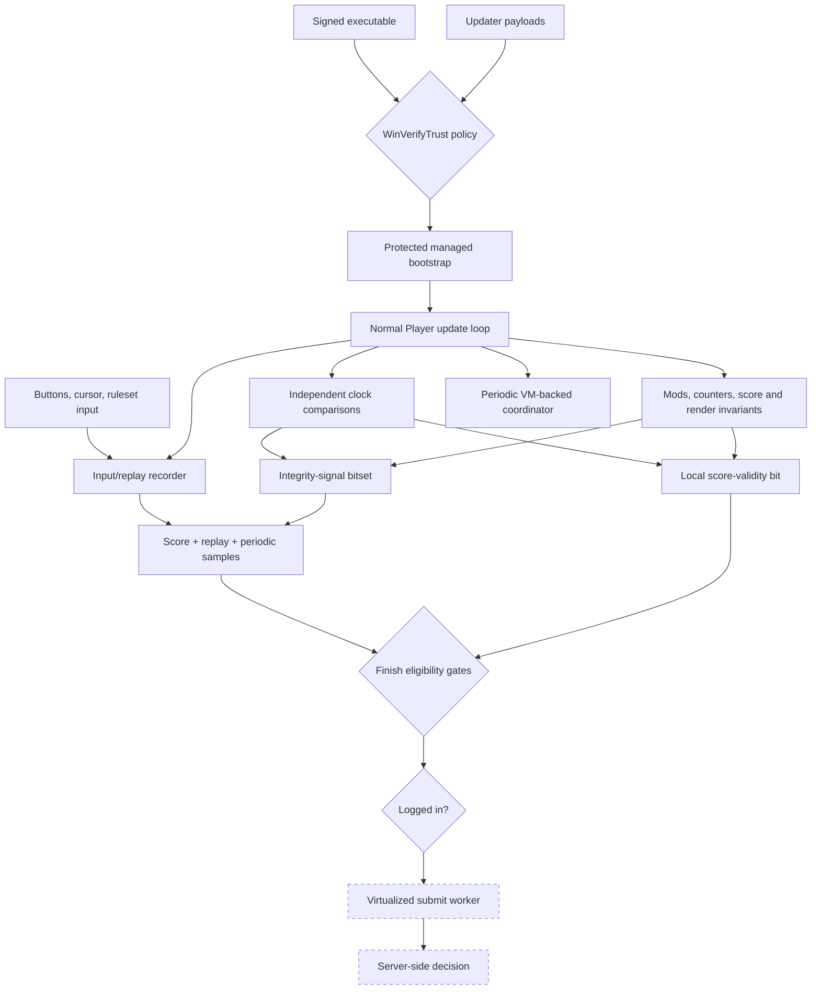
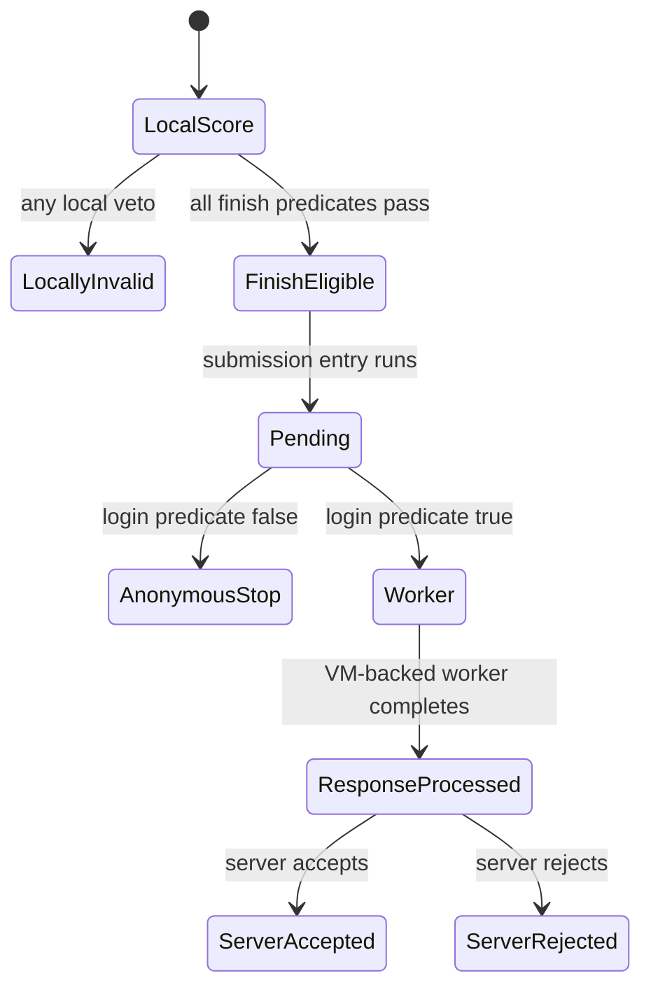

# Client integrity and anti-cheat architecture in osu!stable 1.3.3.8

## Abstract

The analysed client does not expose one function that can honestly be labelled “the anti-cheat.”
It implements a chain of partially independent controls:

1. Windows trust validation for the executable and updater payloads;
2. obfuscation, protected strings, and selected virtualized methods;
3. normal-play input and replay evidence collection;
4. redundant score, mod, clock, rendering, and movement consistency signals;
5. a mutable local score-validity gate and a separate integrity-signal bitset;
6. finish-time eligibility and login gates;
7. a virtualized submission worker and an unobserved server-side decision.

This report reconstructs that chain from one exact osu!stable executable. It describes controls and
their evidence boundaries; it does not describe how to disable, patch, forge, or evade them.

## 1. Scope and confidence language

| Property | Value |
| --- | --- |
| Product version | `1.3.3.8` |
| Architecture | PE32 / x86 / CLR |
| SHA-256 | `6e182c10d1813209d12753dbc70b3a5bba00fef4ecf64bc42051870e6dfe4b7d` |
| Authenticode | valid signature from `ppy Pty Ltd` on the inspected file |
| Managed assembly version | `0.0.0.0` |

Three labels are used throughout:

- **Observed** means ordinary managed IL, metadata, or a read-only platform property directly
  establishes the claim.
- **Inferred** means several observed relationships support the interpretation, but obfuscation or
  a virtualized boundary prevents a complete proof.
- **Unknown** means the relevant native or server-side implementation is not present in recoverable
  managed IL.

Nothing here should be generalized to another hash, osu!(lazer), or current Bancho policy without a
new analysis. The committed
[`security-target-manifest.json`](../artifacts/security-target-manifest.json) contains the complete
method identities and raw-IL hashes used below.

## 2. Methodology under obfuscation

The executable combines several kinds of protection that require different recovery strategies.

### 2.1 Stable identities instead of names

Most game-owned type and method names are identifier-obfuscated. Names such as
`#=zOzP1rPg3E8uUj1uRyHI8VvJbIxgp` carry no durable semantics, but metadata relationships still do.
The analysis therefore uses the tuple

\[
I(m) = (\text{module hash},\;\text{metadata token},\;\text{signature},\;\operatorname{SHA256}(IL_m))
\]

as the identity of a method. A token alone is only meaningful inside one module; the executable
hash and raw-IL hash prevent accidental reuse against a different build.

### 2.2 Call attribution before keyword attribution

The decompiled tree contains BASS, FFmpeg, OpenTK, Discord RPC, device support, and other bundled
code. A hit for `Process`, `GetProcAddress`, or a hook API is not automatically a game integrity
check. Every candidate was followed through callers and state consumers before being classified.

That distinction matters. One process scanner ends in a localized “background app detected”
performance warning; it does not visibly invalidate a score. Calling it anti-cheat based on the API
name alone would be a false positive.

### 2.3 Virtualization as a hard static boundary

Selected methods are tiny wrappers around a VM dispatcher. Their ordinary IL constructs an object
array and passes an opaque key to the dispatcher. Static managed analysis can establish that a
stage is scheduled and what visible arguments cross the boundary, but not faithfully reconstruct
the protected implementation.

This affects the score submission worker and parts of the periodic telemetry coordinator. The
report stops at that boundary rather than inventing a request format or server rule.

### 2.4 Read-only reproduction

The extraction script uses `ReflectionOnlyLoad`; it does not invoke any target method. It records:

- the executable fingerprint and Authenticode signer;
- selected method tokens, signatures, IL sizes, and IL hashes;
- three important field identities;
- declared native-import counts and a selected import surface;
- negative results for common debugger, process-memory, Toolhelp, and injected-input APIs.

No game process, account, score, configuration, or network connection is touched by this workflow.

## 3. Recovered architecture



The most important architectural observation is separation. A score can remain locally valid yet
never reach the worker. The worker can run yet receive a negative response. A telemetry signal can
be serialized without immediately invalidating the score. These states are related, not
interchangeable.

## 4. Reproducibility anchors

| Layer | Meaning | Token | IL bytes |
| --- | --- | ---: | ---: |
| executable trust | startup entry | `0x060023B9` | 1,202 |
| executable trust | Authenticode file validator | `0x060035AD` | 217 |
| executable trust | update-directory signature scan | `0x06000D79` | 451 |
| gameplay | Player initialization | `0x06002237` | 1,674 |
| gameplay | finish and submit gates | `0x06002267` | 815 |
| gameplay | main update and clock guards | `0x0600226B` | 4,298 |
| gameplay | input/replay recorder | `0x0600229B` | 475 |
| gameplay | finish eligibility predicates | `0x060022A1`, `0x060022A2` | 109, 123 |
| gameplay | runtime consistency aggregate | `0x060022A6` | 291 |
| gameplay | movement-vector monitor | `0x060022A9` | 283 |
| score | summary and integrity-signal serialization | `0x06002B52` | 355 |
| score | comprehensive score checksum | `0x06002B53` | 456 |
| score | invalidator | `0x06002B5A` | 8 |
| submission | submission entry | `0x06002B5C` | 90 |
| submission | virtualized worker wrapper | `0x06002B6C` | 41 |
| telemetry | periodic integrity coordinator | `0x06004867` | 263 |
| code protection | protected-string decoder | `0x060049B1` | 2,181 |

Important fields are the global current-score reference (`0x040013C3`), the score-validity Boolean
(`0x04001990`), and the unnamed static integrity-signal bitset (`0x040013F9`).

## 5. Layer one: executable and updater trust

### 5.1 Startup validation

**Observed.** The startup entry sets the working directory, passes the executable filename to a
wrapper around `WinVerifyTrust`, and terminates startup if the wrapper returns false.

Reconstructed pseudocode:

```csharp
SetWorkingDirectoryToExecutableDirectory();

if (!ValidateWindowsTrust(GetExecutableFileName()))
{
    ShowStartupError();
    Exit();
}

ContinueBootstrap();
```

The inspected file reports a valid Authenticode signature whose subject is `ppy Pty Ltd`.
Authenticode is distinct from a .NET strong name: this control asks Windows whether the file's code
signature chain is trusted.

The validator contains compatibility fallbacks. Certain certificate-store failures and exceptions
return success rather than making the client permanently unbootable. This is an observed policy
nuance, not evidence that the trust check is meaningless: the normal success path still validates
the signed file, and an explicit false result stops startup.

### 5.2 Updater payload validation

**Observed.** The updater enumerates files in its staging directory and applies the same trust
validator. Files that fail the expected policy are removed and subsequently reacquired, subject to
documented compatibility exceptions in the updater logic.

This layer protects the software supply/update path. It should not be conflated with gameplay
anti-cheat: it establishes what code Windows believes was published, not whether a play is human.

## 6. Layer two: code and string protection

### 6.1 Identifier and control-flow obfuscation

The target uses non-semantic identifiers, empty-looking enums, and methods whose decompiled shape
is noisier than the underlying IL. Metadata-token navigation and caller/callee relationships are
therefore more reliable than textual names.

### 6.2 Protected string table

**Observed.** Most game-owned strings are retrieved through a protected string wrapper. The main
decoder reads an encrypted/compressed manifest resource, derives values from assembly metadata,
consults stack-trace and calling-assembly state, and caches decoded results.

The mechanism raises the cost of static search and casual string replacement. It is best described
as code/data protection with tamper-resistance value; it is not by itself proof of a gameplay
anti-cheat verdict.

### 6.3 VM-dispatched methods

**Observed.** Several security-adjacent methods enter a common dispatcher with opaque keys. The
visible worker wrapper for score submission is only 41 IL bytes. The periodic coordinator also has
VM-backed stages.

**Unknown.** The protected worker's complete request fields, response interpretation, and any
additional native or server-driven checks cannot be recovered from those wrappers alone.

## 7. Layer three: gameplay evidence collection

### 7.1 Normal input becomes replay evidence

**Observed.** The normal Player update path samples the current ruleset input state. For standard,
Taiko, and Catch this includes button/cursor state; Mania has lane-oriented state. A new replay
frame is appended when the relevant state or position changes. The score class later serializes
frame deltas, coordinates, and button state, including an end sentinel.

This has two consequences:

1. the replay is evidence generated alongside normal play, not merely a playback feature;
2. score counters and replay history originate from different parts of the runtime, allowing later
   consistency comparisons.

### 7.2 Multiple score representations

The score object contains hit counters, combo, total score, mods, mode, player/map identifiers,
time data, pass state, and client-version-related material. Two recovered checksum-producing
methods cover overlapping but non-identical sets of fields. Another method serializes periodic
vector samples at coarse intervals, consistent with the trace later used for score-result graphs.

This is a recurring design pattern: preserve enough independent representations that one isolated
memory change is unlikely to remain self-consistent everywhere.

## 8. Layer four: runtime consistency monitors

### 8.1 Gameplay clock versus application clock

**Observed.** Approximately once per second, the Player compares map-time progress with an
independent application clock. The map delta is normalized by the active speed modifier:

\[
D_t = \left|\frac{\Delta T_{song}}{r} - \Delta T_{app}\right|
\]

where \(r=1.5\) under Double Time, \(r=0.75\) under Half Time, and \(r=1\) otherwise. Repeated
samples with \(D_t>60\text{ ms}\) increment a counter. After more than five such observations, the
visible path reports an error and invalidates the score.

The code compares deltas, not absolute timestamps. That makes the signal sensitive to sustained
rate disagreement while tolerating a fixed offset.

### 8.2 Wall clock versus application clock

A second comparison uses `DateTime.Now` against the application clock:

\[
W_t = \left|\Delta T_{wall} - \Delta T_{app}\right|.
\]

Repeated observations above roughly two seconds accumulate an integrity signal. The two-clock
design distinguishes game-time scaling from larger host scheduling or wall-time discontinuities.

### 8.3 Long update stalls

**Observed.** In normal guarded gameplay, an update gap of approximately six seconds—or eight
seconds in one special branch—causes local score invalidation. This is separate from ordinary
scheduler lateness of a few milliseconds.

### 8.4 Mod agreement

**Observed.** The Player compares the mods stored on the score with the independently selected
global mods. A mismatch adds numeric signal `4` to the integrity bitset.

### 8.5 Redundant score and counter agreement

Several paths recompute or cross-check score-related values. The visible checks include:

- a generated runtime string captured and compared later;
- duplicated object/update counters that must be non-zero and equal at finish;
- hit-object-manager counts compared with score counts;
- a compact digest over independent global values compared with a separately stored value;
- repeated score-calculation observations that must converge.

Some failures only add an integrity signal; stronger disagreement paths invalidate the score and
can schedule a delayed termination/error path. Numeric signal `16` is used by multiple members of
this composite family, so assigning it one narrow official name would be misleading.

### 8.6 Movement-vector monitor

**Observed.** A gated method compares two movement vectors. It computes an angular discontinuity
\(\theta_t\), then updates an exponential moving average:

\[
a_t = 0.99^{\Delta t}, \qquad
\mu_t = a_t\mu_{t-1} + (1-a_t)\theta_t.
\]

When \(\mu_t > 3\pi/4\) under the method's guarded state, signal `4096` can be set. The condition is
best called a **smoothed movement-direction discontinuity signal**. Calling it a universal “bot
detector” would exceed the evidence; the surrounding state gates and server interpretation remain
partly obfuscated.

### 8.7 Flashlight resource and rendering invariants

The Flashlight path contains unusually concrete checks:

- embedded Flashlight mask resources are hashed and compared with built-in digests; a mismatch
  schedules signal `32` and disables score validity;
- missing or unexpectedly faded mask components add signal `256`;
- a render-side sample checks whether pixels expected to be dark remain bright and can add the
  same signal.

These checks defend a gameplay-affecting mod by validating both its resource and visible runtime
effect. They are narrower and more defensible than a broad claim that the client hashes all assets.

### 8.8 Window opacity

**Observed.** Every twentieth guarded update, the client calls `GetLayeredWindowAttributes` for its
own window. If the reported alpha is below 255, it adds signal `1024`. This is a window-composition
invariant, not evidence of a general desktop or overlay scanner.

## 9. The integrity-signal bitset

The enum's symbolic member names are absent from the decompiler. The following labels are analyst
descriptions derived from setter conditions, not official names:

| Numeric value | Evidence-backed interpretation | Local consequence observed |
| ---: | --- | --- |
| `2` | clock/timebase disagreement family | one path also invalidates after repeated divergence |
| `4` | selected mods disagree with score mods | signal accumulation |
| `16` | composite score/runtime/digest consistency family | some paths also invalidate or terminate later |
| `32` | Flashlight embedded-resource digest mismatch | signal plus validity disable in the callback |
| `256` | Flashlight render/state invariant failure | signal accumulation |
| `512` | dedicated setter exists; direct managed source was not recovered | unknown |
| `1024` | game window reports non-opaque layered alpha | signal accumulation |
| `4096` | smoothed movement-direction discontinuity under guarded state | signal accumulation |

The score-summary serializer folds the current numeric bitset into a string field and resets the
global bitset after taking that snapshot. The exact server-side semantics of the resulting field
are unknown. In particular, a bit's presence does not prove an automatic ban, and the absence of a
visible local invalidation does not prove server acceptance.

## 10. Local validity and finish-time gates

### 10.1 The validity bit is one veto

The score invalidator is only eight IL bytes. Its complete behavior is equivalent to setting the
score's validity Boolean to false. It performs no transport action.

### 10.2 Finish eligibility is a conjunction

For a normal solo Player run, the recovered finish logic is approximately:

```text
normal Player mode
AND eligible runtime/ruleset state
AND eligible beatmap status and mods
AND score.valid
AND runtime consistency remains acceptable
AND elapsed play exceeds about 8 seconds
AND score exceeds 10,000
AND duplicated internal counters are non-zero and equal
    => enter the score-submission lifecycle
otherwise
    => invalidate locally
```

Multiplayer, replay, editor, legacy-score, and special-mode branches make the source more complex
than this summary. The important property is still clear: preserving one Boolean cannot satisfy a
conjunction of independent predicates.

## 11. Submission is a separate boundary

**Observed.** The submission entry moves an untouched score into a pending state. It creates the
background worker only if the client user object exists and its username is non-empty. Anonymous
play therefore does not start the worker, regardless of local score validity.



The worker is VM-dispatched. Static IL proves the login gate and worker scheduling boundary, but
not the complete network payload or acceptance policy. The server owns the last decision. A client
state transition to “response processed” is still not proof of leaderboard acceptance.

The detailed gate analysis remains in
[Score validity is not submission](../../taiko/reverse/analysis/submission-path.md).

## 12. Periodic telemetry and window inspection

### 12.1 Scheduler shape

**Observed.** A coordinator is called from the application's update loop while gameplay is active.
For each map it advances through three states:

1. after roughly 10 seconds, dispatch a first VM-backed stage;
2. after roughly 80 seconds or two-thirds of map duration, dispatch a second stage;
3. after map duration, reset its state.

The timing proves staged collection. It does not reveal the protected stage bodies.

### 12.2 Same-process window enumeration

The same coordinator declares `EnumWindows`, `GetWindowThreadProcessId`, `GetClassName`, and
`GetWindowText`. Its visible callback filters windows to the current process, checks an encrypted
class-name condition, reads a matching title, and forwards an event code plus that title through a
VM-backed dispatcher.

This is narrower than “scan every foreign window.” The callback explicitly filters by the game's
own process ID. The final purpose and server handling are **inferred/unknown**, so the responsible
label is **periodic telemetry/integrity coordinator**, not a proven ban routine.

## 13. Process observation: two different mechanisms

### 13.1 Background-app compatibility warning

One component periodically enumerates processes and compares their names with a configured list.
Its callback displays the localized `GameBase_DetectedBackgroundApp` warning. The scanner sleeps
between passes and pauses while gameplay is active.

**Observed conclusion:** this visible path is a performance/compatibility warning. No call from its
callback to the score invalidator or integrity bitset was recovered.

### 13.2 Guarded process snapshot

A nested Player callback calls `Process.GetProcesses()` and stores the resulting array in a global
field. It is scheduled only under a special guarded Player state. No ordinary managed consumer of
the array was recovered in the decompiled tree.

Possible VM-backed or diagnostic consumption cannot be ruled out, but neither can a blacklist be
claimed. The only defensible statement is that a process snapshot is collected in that path.

## 14. Native API inventory and negative findings

The assembly declares hundreds of native imports because it bundles audio, video, graphics, input,
and device libraries. Attribution matters more than raw count. Security-relevant visible imports
include:

| API | Visible role |
| --- | --- |
| `WinVerifyTrust` | executable/updater trust validation |
| `QueryPerformanceCounter/Frequency` | high-resolution timing |
| `GetLayeredWindowAttributes` | own-window opacity signal |
| `EnumWindows`, `GetWindowThreadProcessId`, `GetClassName`, `GetWindowText` | same-process window telemetry callback |
| `SetWindowsHookExA` | low-level keyboard input plumbing |

The metadata inventory found no declared import for:

- `IsDebuggerPresent` or `CheckRemoteDebuggerPresent`;
- `NtQueryInformationProcess`;
- `ReadProcessMemory`, `WriteProcessMemory`, or `VirtualQuery`;
- `CreateToolhelp32Snapshot`, `Process32First`, or `Process32Next`;
- `GetMessageExtraInfo`.

Decompiler-source searches also found no game-owned use of `Process.Modules`, a module-walking
`MainModule` path, or the low-level hook flags commonly used to label injected keyboard/mouse
events. `SetWindowsHookExA` is present, but its recovered caller graph belongs to input handling; an
API name alone does not make it anti-cheat.

These are bounded negative findings. Imports can be resolved dynamically, selected methods are
virtualized, native dependencies are outside the managed IL, and the server is outside the client.
The result is therefore:

> No general anti-debugger, remote-memory scanner, Toolhelp module scanner, or injected-input-marker
> check is visible in the recoverable managed layer of this exact build.

It is not “proof that osu! has no other anti-cheat.”

## 15. What the architecture appears designed to detect

The following is an **inference** from the combined controls, not an official threat model.

| Threat class | Visible defensive idea |
| --- | --- |
| modified or untrusted update payload | Windows signature validation |
| trivial static inspection/tampering | identifiers, protected strings, VM-dispatched methods |
| song-clock or speed manipulation | normalized song clock versus independent application clock |
| host-time discontinuity | wall clock versus application clock |
| isolated mod/score mutation | independent mod state and redundant score representations |
| disabled Flashlight effect | resource digest and render-state checks |
| altered game-window opacity | layered-window alpha check |
| anomalous movement discontinuity | gated exponentially smoothed vector signal |
| non-normal play lifecycle | finish predicates and local validity veto |
| fabricated final result | replay frames, checksums, periodic samples, counters, and server review |

The design is signal-oriented rather than visibly scanner-oriented. It makes gameplay state
self-consistency expensive to fake by measuring the same run through several partially independent
channels. That is a more accurate characterization of this managed layer than “it searches for
cheat.exe.”

## 16. What cannot be concluded

Static analysis of this executable does **not** establish:

- the current server's feature weights, thresholds, ban rules, or replay re-simulation policy;
- whether numeric signals are interpreted identically across server versions;
- every field produced inside the virtualized submission worker;
- every behavior of native dependencies;
- the absence of dynamically resolved APIs;
- the behavior of a different osu!stable hash or osu!(lazer);
- that any one observed client signal independently causes enforcement.

Those unknowns are not defects in the report; they are the correct boundary of the available
evidence.

## 17. Responsible validation model

A legitimate continuation of this research should preserve the same boundary:

- pin and fingerprint the executable before interpreting tokens;
- prefer static metadata and local synthetic inputs;
- if runtime observation is necessary, read only minimal scalar state and use a local/mock endpoint;
- never call the submission entry point, forge a score envelope, suppress a check, or use a public
  leaderboard as a test oracle;
- report server-side acceptance problems through ordinary client diagnostics or official support.

This keeps the interesting engineering questions—trust boundaries, redundant state, timing
invariants, and protected dispatch—separate from bypass engineering.

## 18. Conclusion

For this pinned build, osu!stable's visible anti-cheat architecture is best understood as a
pipeline of trust and consistency evidence. Windows establishes publisher trust. The managed
runtime records input and score evidence while comparing independent clocks, mods, counters,
digests, rendering state, window state, and selected movement behavior. Local validity and finish
predicates decide whether submission may begin. A login gate controls whether the protected worker
runs. The server remains the final and deliberately opaque authority.

The practical lesson is simple: “valid score,” “submission attempted,” and “server accepted” are
three different statements. Good reverse engineering keeps them different.
