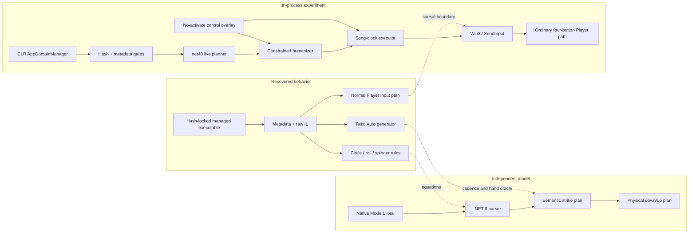
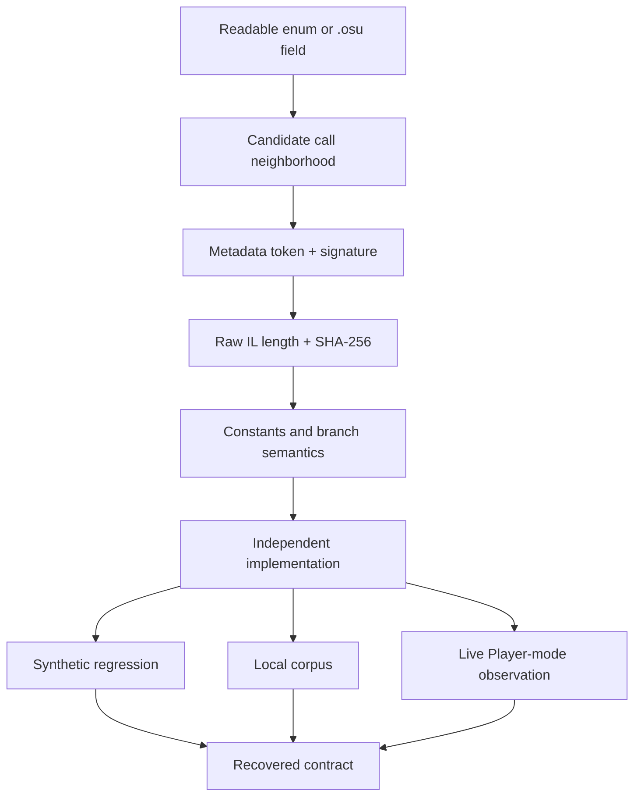
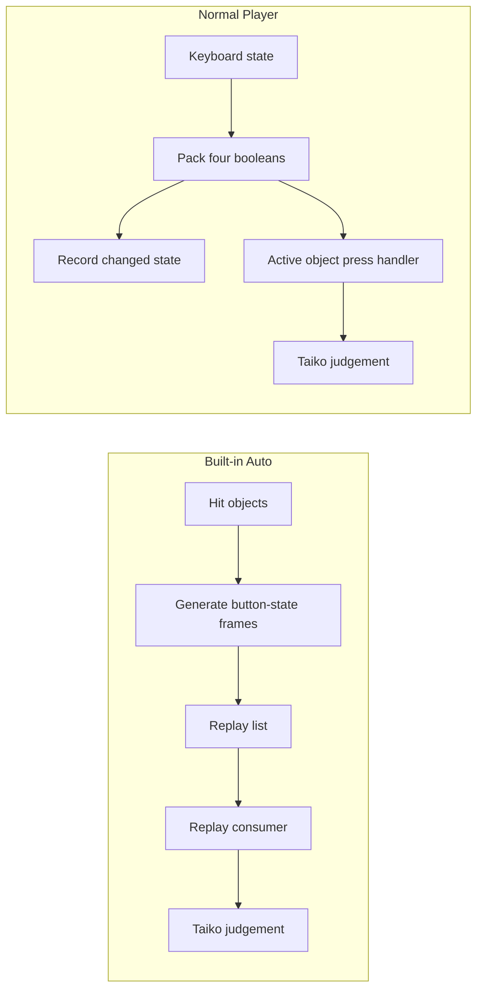
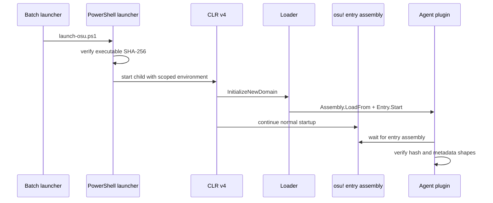
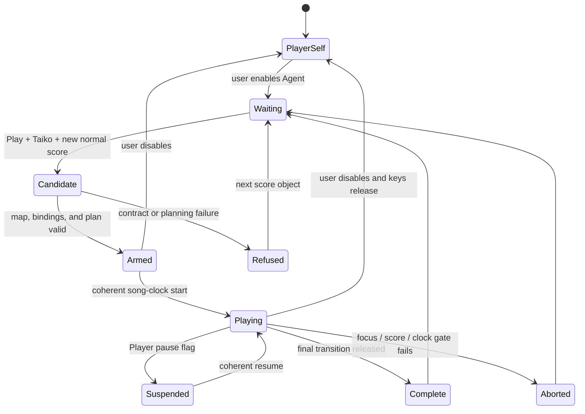
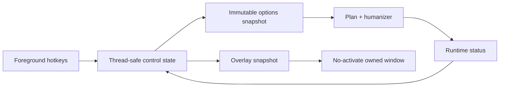
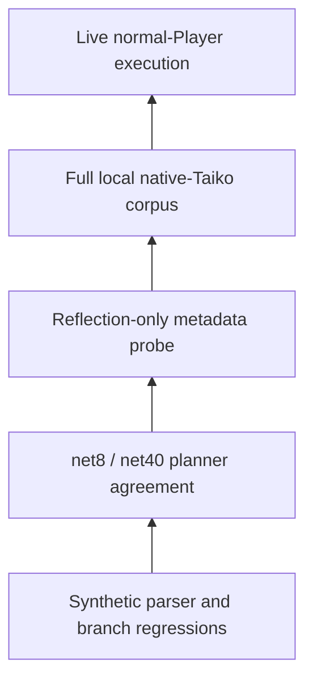

# Four Drums, No Replay: Reconstructing a Live osu!taiko Agent from Obfuscated IL

> *Auto writes the performance down. An agent still has to strike the drum.*

## Abstract

This article documents the reconstruction of osu!stable's native Taiko behavior and the design of
a live Player-mode input agent for one precisely fingerprinted managed build. The first useful
result was a semantic model of the built-in Auto implementation: Don and Kat hand selection,
two-hand strong notes, native drumroll cadence, spinner demand, and replay-frame state changes.
That model was an excellent oracle, but it was not the desired endpoint. Built-in Auto prepares a
replay list. The final experiment keeps the game in normal Player mode and delivers ordinary
scan-code key transitions through the same keyboard boundary used by a human player.

The target is heavily obfuscated, so private names were treated as disposable. Method identity was
instead built from the executable hash, metadata token, IL length, IL digest, call relationships,
constants, and runtime shape. A portable .NET 8 parser reproduces the recovered native `Mode:1`
rules. A separate .NET Framework 4 plugin enters the default CLR AppDomain, validates the target,
resolves the current beatmap and four configured Taiko bindings, builds a physical strike plan,
and executes it against the game's own song clock.

The agent is selectable at runtime and starts with the player in control. Its timing model uses a
correlated stochastic process, phrase-level early rushing, density-dependent 100 outcomes,
optional fatigue and delayed fingers, frame-cadence quantization, and a final miss-safe projection.
Strong notes receive a bounded second-hand split without crossing the recovered 30 ms completion
boundary. The result is not a replay disguised as input: each down/up event is observed by the
normal Player input path while the score is already in progress.

The interesting part is not that four keys can be pressed automatically. It is the evidence chain
connecting an opaque managed method to a beatmap equation, an equation to a legal key schedule,
and a schedule to a real-time process that can fail safely.

## 1. Scope, target, and research boundary

The subject is the legacy managed osu!stable client, not osu!lazer. Every runtime identity in this
article belongs to one executable:

| Property | Locked value |
|---|---|
| Product | osu!stable |
| Product version | `1.3.3.8` |
| Runtime | CLR v4 |
| Architecture | PE32 / x86 |
| MD5 | `0beb5a2f026f5a579c2046ab73fece16` |
| SHA-256 | `6e182c10d1813209d12753dbc70b3a5bba00fef4ecf64bc42051870e6dfe4b7d` |

The repository separates three products of the investigation:

1. a readable .NET 8 native Taiko parser and reference planner;
2. a .NET Framework 4 in-process Player-input agent;
3. compact reverse-engineering evidence and reproducible fingerprint scripts.

It does not contain osu! binaries, a complete decompiler tree, private beatmaps, user
configuration, scores, replays, account data, or runtime logs. The plugin does not patch
`osu!.exe` and does not implement networking or score submission. It also does not change the
client's score-validity flag or block the client's normal behavior. That last fact removes one
local veto; it does not guarantee that the client starts its submission worker or that a server
accepts a result. The intended research setting is anonymous local play; the software does not
enforce that operating condition, and automated plays are not intended for public leaderboards.

That distinction is worth stating plainly. A runtime experiment can be local in purpose without
pretending that the original client has ceased to be a networked program.

## 2. The result in one diagram

The recovered Auto implementation remains a behavioral oracle. It is not the runtime input source.



Planning the map in advance does not make the result a replay. The causal distinction is where
state enters gameplay:

- Auto manufactures timestamped replay frames and gives them to a replay consumer.
- The live agent waits for the score to exist, reads the current song clock on each critical tick,
  and changes physical key state only when a planned transition becomes due.

> **Engineering judgement.** Replay parity is a powerful proof of semantic understanding, but it
> is the wrong proof of agency. A replay answers “what state should exist at this timestamp?” A
> live agent must also answer “is the score still the same, is the clock coherent, is the game
> focused, and what state does the keyboard currently need to become?”

## 3. Managed obfuscation: recover a slice, not the universe

### 3.1 Why managed code was still opaque

The target is a managed PE, yet most private type, field, and method names are encoded identifiers.
Some members use Unicode-only names; others decompile into legal but awkward C#. Managed code
preserves metadata and structured IL, but it does not preserve intent.

Attempting to “deobfuscate osu!” as a whole would have produced a large, fragile naming project.
Taiko needs a much smaller behavioral slice. The investigation therefore followed narrow
producer/consumer chains:



The tools had deliberately different jobs:

| Tool | Productive role |
|---|---|
| ILSpy / `ilspycmd` | managed control flow, inheritance, enum use, and call relationships |
| reflection-only PowerShell | exact metadata resolution and raw method-body hashing |
| IDA | durable call neighborhoods and managed method ranges |
| portable parser | executable model of the recovered file-format rules |
| in-process probe | structural metadata checks against the exact assembly |
| live plugin | proof that the ordinary Player input path accepts the model |

IDA was useful, but native-style decompilation was not the main source of truth. Its managed loader
places IL bodies in synthetic address ranges, and Hex-Rays can behave poorly on those ranges.
ILSpy was the faster semantic reader; reflection and raw IL were the identity layer.

### 3.2 What obfuscation did not erase

The following evidence survived:

- public/shared enum names such as `PlayModes`, `Mods`, and `pButtonState`;
- framework signatures such as `Microsoft.Xna.Framework.Input.Keys`;
- exact metadata tokens inside the module;
- method signatures, inheritance, and virtual override structure;
- constants such as `1.4`, `1.65`, `30`, `60`, `120`, `6`, and `8`;
- replay-list construction and ordinary collection operations;
- producer/consumer agreement on the four button-state bits;
- `.osu` fields whose meaning can be checked independently.

A method name can be made meaningless. A method that belongs to a Taiko slider subclass, returns a
`double`, branches on format version 8, divides a beat length by six or eight, and folds the result
between 60 and 120 ms is much harder to disguise semantically.

### 3.3 Stable method identity

Each important method is represented as:

$$
M =
(\text{assembly SHA-256},
\text{metadata token},
\text{IL length},
\text{IL SHA-256}).
$$

The semantic name is our interpretation of that tuple, not part of its identity.

| Recovered role | Token | IDA managed range | IL bytes | IL SHA-256 prefix |
|---|---:|---:|---:|---|
| Taiko Auto replay generator | `0x06001ef7` | `0x000c24b0` | 896 | `27ed89e06ad7` |
| Player input-state recorder | `0x0600229b` | `0x000e1480` | 475 | `3c79f4c44539` |
| Four-button packer | `0x060011af` | `0x0006e900` | 41 | `fd53812b5d69` |
| Default binding initializer | `0x06002c55` | `0x00128d10` | 790 | `3ab15bd4570a` |
| Circle press acceptance | `0x060020e8` | `0x000d1c10` | 430 | `3984ef883e6f` |
| Circle judgement | `0x060020eb` | `0x000d1df0` | 688 | `3d7d99065011` |
| Difficulty interpolation | `0x060028b3` | `0x0010b7d0` | 111 | `2c52153e9611` |
| Native drumroll interval | `0x06004257` | `0x001ad7a0` | 376 | `9bbab29be6f9` |
| Taiko spinner constructor | `0x06001d6d` | `0x000b8930` | 418 | `9013079db21b` |

The full digests live in
[`reverse/artifacts/target-manifest.json`](reverse/artifacts/target-manifest.json). The extraction
script refuses a different executable hash before resolving any token.

IDA addresses in this table are navigation aids inside the matching `.i64` database. They are not
ordinary PE RVAs. Confusing a synthetic managed address with a portable module identity would make
the notes look precise while actually making them unusable.

## 4. Finding Auto, then proving it was not Player input

### 4.1 The Auto generator identified itself by output

The Auto method was located through shape rather than name. It allocates a replay-frame list,
seeds neutral state, iterates Taiko hit objects, and writes `pButtonState` values at object-relative
times.

Reduced to semantic pseudocode:

```csharp
bool preferLeft = true;
frames.Add(Neutral(longBeforeMap));

foreach (TaikoObject obj in objects)
{
    if (obj is Spinner)
        EmitFourKeyCycle(obj.RequiredHits + 1);
    else if (obj is DrumRoll roll)
        foreach (double tick in roll.NativeTicks)
        {
            Emit(tick, preferLeft ? InnerLeft : InnerRight);
            preferLeft = !preferLeft;
        }
    else
        EmitCircle(obj, preferLeft);

    frames.Add(Neutral(obj.EndTime + 1));
    preferLeft = !preferLeft;
}
```

The global hand flag is a small but revealing detail. Drumroll ticks mutate it, and the enclosing
object loop toggles it once more. An odd-length drumroll therefore changes the preferred hand of
the next circle differently from an even-length roll. A first planner implementation treated hand
choice too locally; a dedicated odd-roll regression now protects the recovered global behavior.

### 4.2 The normal Player path runs in the opposite direction

The Player route was recovered from input toward judgement. A compact method packs four live
booleans:

```csharp
pButtonState state = pButtonState.None;
if (innerLeft)  state |= pButtonState.Left1;   // 1
if (outerLeft)  state |= pButtonState.Right1;  // 2
if (innerRight) state |= pButtonState.Left2;   // 4
if (outerRight) state |= pButtonState.Right2;  // 8
return state;
```

A neighboring Player routine compares that state with the previous state and records a frame only
when it changes. The important point is the direction of causality:



Both paths can produce similar score screens and similar replay data. Only one begins at the live
keyboard boundary. The runtime plugin never calls the Auto generator and never supplies a replay
list. Any replay data produced during the experiment is the ordinary recorder observing Player
input after the fact.

## 5. Native Taiko beatmaps as an executable contract

Native Taiko uses `Mode: 1`. The file remains the familiar sectioned `.osu` text format, but Taiko
semantics are spread across hit-object type bits, hit-sound bits, timing points, slider settings,
and OverallDifficulty.

| Section | Fields required by the planner |
|---|---|
| header | `osu file format vN` |
| `[General]` | `Mode` |
| `[Metadata]` | artist, title, creator, difficulty name |
| `[Difficulty]` | `OverallDifficulty`, `SliderMultiplier`, `SliderTickRate` |
| `[TimingPoints]` | offset, beat length, inherited flag |
| `[HitObjects]` | object time/type/sound, slider repeat/length, spinner end |

The parser accepts only native Mode 1. Standard-to-Taiko conversion is runtime behavior with its own
rules; silently treating converted content as native would mix two contracts.

### 5.1 Object classification

The relevant object-type bits are:

$$
\operatorname{circle}(t) \iff (t \mathbin{\&} 1) \ne 0,
$$

$$
\operatorname{drumroll}(t) \iff (t \mathbin{\&} 2) \ne 0,
$$

$$
\operatorname{spinner}(t) \iff (t \mathbin{\&} 8) \ne 0.
$$

The parser rejects unsupported native objects rather than guessing. It also validates positive
slider length, repeat count, spinner duration, timing-point sign, and the presence of a base timing
point. This strictness matters because the final consumer is a physical input scheduler; malformed
input should fail before a key can move.

### 5.2 Don, Kat, and strong notes

Circle color and strength come from `hitSound`:

| Bit | Shared name | Native Taiko meaning |
|---:|---|---|
| `2` | Whistle | rim / Kat |
| `4` | Finish | strong / large note |
| `8` | Clap | rim / Kat |

For sound mask `h`:

$$
\operatorname{Kat}(h)
= ((h \mathbin{\&} (2\,|\,8)) \ne 0),
$$

$$
\operatorname{Strong}(h)
= ((h \mathbin{\&} 4) \ne 0).
$$

A normal Don uses either inner key. A normal Kat uses either outer key. A strong note uses both
hands of its color:

| Circle | Physical keys |
|---|---|
| Don | inner left **or** inner right |
| Kat | outer left **or** outer right |
| strong Don | inner left **and** inner right |
| strong Kat | outer left **and** outer right |

The recovered press handler also permits the two hands of a strong note to arrive separately, but
the second same-color hand must arrive in less than 30 ms. That boundary later becomes a hard
constraint on the humanizer.

The portable parser keeps the file rule compact:

```csharp
var colour = (hitSound & (HitSoundWhistle | HitSoundClap)) != 0
    ? TaikoColour.Kat
    : TaikoColour.Don;
var strong = (hitSound & HitSoundFinish) != 0;
```

Source: [`BeatmapParser.cs`](TaikoBeatmap/BeatmapParser.cs).

## 6. Timing points and the 1.4 drumroll trap

### 6.1 Active beat length and inherited velocity

An uninherited timing point supplies a positive beat length `B`. A negative inherited point
supplies slider velocity:

$$
SV = \operatorname{clamp}
\left(\frac{-100}{B_{\text{inherited}}}, 0.1, 10\right).
$$

A new uninherited point resets inherited velocity to one. When an object appears before the first
timing point, the parser uses the earliest positive uninherited beat length, matching the useful
runtime fallback instead of leaving the object undefined.

### 6.2 Drumroll duration

A Taiko drumroll is encoded as a slider, but the native Taiko manager applies a `1.4` length
conversion before duration calculation. Let:

- `L` be slider pixel length;
- `R` be repeat count;
- `B` be active beat length;
- `SM` be `SliderMultiplier`;
- `SV` be active inherited velocity.

The recovered end time is:

$$
t_{\text{end}}
= t_{\text{start}}
+ \left\lfloor
\frac{1.4\,L\,R\,B}{100\,SM\,SV}
\right\rfloor.
$$

The cast occurs before adding the integer object start. Algebraically similar expressions can
differ by one millisecond if truncation moves. The implementation therefore mirrors the observed
cast order:

```csharp
var spanDuration = pixelLength * 1.4 * timing.BeatLength
    / (sliderMultiplier * 100.0 * timing.VelocityMultiplier);
var endTime = startTime + (int)(spanDuration * repeatCount);
```

The first parser prototype used the ordinary slider formula and produced drumrolls 40% too short.
That error was plausible enough to survive visual inspection. Corpus-level strike counts exposed
it immediately.

> **Our interpretation.** The `1.4` multiplier is a good reminder that file formats do not fully
> specify ruleset semantics. The text file supplies ingredients; the active object manager still
> decides what those ingredients mean.

## 7. Native drumroll cadence

The recovered Player/Auto cadence begins with a subdivision:

$$
\Delta_0 =
\begin{cases}
\dfrac{B/SV}{8},
  & \text{format version}<8,\\[6pt]
\dfrac{B}{6},
  & \text{format version}\ge 8
    \land \text{SliderTickRate}\in\{1.5,3,6\},\\[6pt]
\dfrac{B}{8},
  & \text{otherwise}.
\end{cases}
$$

The interval is then octave-folded:

$$
\Delta \leftarrow 2\Delta
\quad \text{while } \Delta < 60,
$$

$$
\Delta \leftarrow \frac{\Delta}{2}
\quad \text{while } \Delta > 120.
$$

This produces a cadence between 60 and 120 ms while preserving rhythmic subdivision by powers of
two. The Auto method accumulates a `double` and truncates every emitted timestamp:

```csharp
for (double exact = start; exact < end; exact += interval)
{
    int time = (int)exact;
    if (time == previous)
        continue;
    Emit(time, preferLeft ? InnerLeft : InnerRight);
    preferLeft = !preferLeft;
    previous = time;
}
```

For a 62.5 ms interval this yields `2500, 2562, 2625, 2687, ...` rather than rounding every gap to
63 ms. Accumulating an already rounded integer would drift.

The format-version branch required its own regression. A premature implementation applied the
modern `/6` special case to a version 7 map with `SliderTickRate=1.5`. The local corpus happened not
to contain that combination. A synthetic v7 test established the correct folded interval:

$$
\frac{600/2}{8}=37.5
\xrightarrow{\times 2} 75\text{ ms},
$$

not 100 ms.

## 8. Spinner demand and cast order

The common spinner first interpolates a rate from effective OD:

$$
r(OD) = \operatorname{DifficultyRange}(OD,3,5,7.5).
$$

The Taiko constructor then computes:

$$
n_0 =
\left\lfloor
\frac{d_{\text{ms}}}{1000}r(OD)
\right\rfloor,
$$

$$
n =
\left\lfloor
\max(1,1.65n_0)
\right\rfloor.
$$

Easy halves OD; Hard Rock multiplies it by 1.4 and clamps at ten. Double Time multiplies the
required count by 0.75; Half Time multiplies it by 1.5. Integer truncation and a minimum of one are
applied in the same order as the managed constructor.

The independent implementation deliberately retains the single-precision conversion:

```csharp
double rate = DifficultyRange(difficulty, 3.0, 5.0, 7.5);
int baseRequired = (int)(((float)durationMilliseconds / 1000f) * rate);
int required = (int)Math.Max(1f, baseRequired * 1.65f);
if (doubleTime)
    required = Math.Max(1, (int)(required * 0.75f));
if (halfTime)
    required = Math.Max(1, (int)(required * 1.5f));
```

Auto emits `required + 1` strikes in a fixed cycle:

$$
\text{inner-left}
\rightarrow \text{outer-left}
\rightarrow \text{inner-right}
\rightarrow \text{outer-right}
\rightarrow \cdots
$$

The constructor determines demand; the Auto consumer independently reveals the extra strike and
key order. Agreement between producer and consumer is stronger than either observation alone.

## 9. Circle judgement is strict

For circle time `t_o` and current song time `t_s`:

$$
e = |t_s-t_o|.
$$

The native resolver has only three outcomes:

$$
J(e)=
\begin{cases}
300, & e < W_{300},\\
100, & e < W_{100},\\
\text{miss}, & e \ge W_{100}.
\end{cases}
$$

The comparisons are strict. An offset exactly equal to `W_{300}` is a 100, not a 300; an offset
equal to `W_{100}` is a miss.

The three-point interpolation helper is:

$$
\operatorname{DifficultyRange}(d,a,m,b)=
\begin{cases}
m + (b-m)\dfrac{d-5}{5}, & d>5,\\[8pt]
m - (m-a)\dfrac{5-d}{5}, & d\le5.
\end{cases}
$$

Therefore:

$$
W_{300}
= \left\lfloor
\operatorname{DifficultyRange}(OD,80,50,20)
\right\rfloor
= \left\lfloor 80-6OD \right\rfloor,
$$

$$
W_{100}
= \left\lfloor
\operatorname{DifficultyRange}(OD,140,100,60)
\right\rfloor
= \left\lfloor 140-8OD \right\rfloor.
$$

The broader press-acceptance region is
`DifficultyRange(OD, 200, 150, 100)`. Easy and Hard Rock adjust OD before interpolation:

$$
OD_{\mathrm{EZ}}=\max(0,OD/2),
\qquad
OD_{\mathrm{HR}}=\min(10,1.4OD).
$$

DT and HT are not applied a second time to the circle windows. The agent and judgement logic read
the same internal song clock, whose rate already reflects gameplay speed.

This differs sharply from mania's five-grade timing system. There is no native Taiko circle 200 to
target. A believable Taiko humanizer therefore controls 100s, not a 200/100 mixture copied from
another ruleset.

## 10. From semantic strikes to physical transitions

The reference planner first produces semantic strikes:

- one key for a normal circle;
- two same-color keys for a strong circle;
- alternating inner keys for drumroll ticks;
- the four-key cycle for spinner hits.

Only then does it produce physical down/up events. The portable planner accepts a map-clock pulse
directly. The live plugin starts from a physical key-hold duration and converts it once for the
selected clock rate:

$$
p_{map}=\left\lceil r\,p_{real}\right\rceil,
\qquad
r=\begin{cases}
1.5 & \text{DT or NC},\\
0.75 & \text{HT},\\
1 & \text{otherwise}.
\end{cases}
$$

With the runtime's `30 ms` physical default, the map-clock pulse is 30, 45, or 23 milliseconds.
Each key-down at `d_i` then wants a release:

$$
u_i=d_i+p_{map}.
$$

The next down on the same physical key at `d_{i+1}` imposes:

$$
u_i<d_{i+1}.
$$

The realized release is:

$$
u_i'=
\max\left(d_i+1,\min(d_i+p_{map},d_{i+1}-1)\right).
$$

Ups sort before downs at the same millisecond. Every per-key state stream is validated to alternate
legally and finish released.

```csharp
var release = checked(down.Time + tapMilliseconds);
if (index + 1 < keyDowns.Count && keyDowns[index + 1].Time <= release)
    release = keyDowns[index + 1].Time - 1;
if (release <= down.Time)
    release = checked(down.Time + 1);
```

Source: [`PlayerPlanBuilder.cs`](TaikoBeatmap/PlayerPlanBuilder.cs).

The in-process boundary makes the unit conversion explicit:

```csharp
double clockRate = InputTimingPolicy.ClockRate(selectedMods);
int mapTapMilliseconds = InputTimingPolicy.ToMapPulseMilliseconds(
    physicalTapMilliseconds,
    selectedMods);
```

This conversion belongs at the physical/runtime boundary. Circle errors and judgement windows are
already measured on the gameplay clock and must not be multiplied again.

The split between semantic strike and physical transition proved useful repeatedly. A strong circle
is one judgement event but two key-downs. A spinner hit is one bonus action with no combo
requirement. A collision can merge two physical downs while still needing the combo circle's
metadata for late recovery.

## 11. Two independent implementations

The portable model targets .NET 8 and favors readability. The in-process model targets the CLR v4
surface available in the game and avoids modern runtime dependencies. They intentionally implement
the same recovered rules in separate source files:

| Model | Runtime | Purpose |
|---|---|---|
| [`TaikoBeatmap/`](TaikoBeatmap/) | .NET 8 | analysis, JSON export, synthetic tests, corpus oracle |
| [`InProcess/Plugin/LivePlanBuilder.cs`](InProcess/Plugin/LivePlanBuilder.cs) | .NET Framework 4 | runtime parser and physical plan |

This is not perfect formal independence—the specifications are shared—but it catches accidental
use of unavailable APIs, integer/cast differences, and planner drift. Across the current 26-map
development corpus, the portable planner generated 19,616 semantic strikes. The humanized net40
plan retained 19,611 after its second post-variation drumroll acceptance guard; the five-strike
difference is the intended consequence of bonus timing variation, not parser drift.

The portable command surface is deliberately small:

```bash
dotnet run --project taiko/TaikoBeatmap -- self-test
dotnet run --project taiko/TaikoBeatmap -- analyze map.osu
dotnet run --project taiko/TaikoBeatmap -- plan map.osu --json
dotnet run --project taiko/TaikoBeatmap -- corpus /path/to/Songs
```

The synthetic map covers Don, Kat, both strong colors, one drumroll, and one spinner. Additional
regressions cover the pre-v8 cadence branch, the global hand state after an odd drumroll, and a
drumroll tick close enough to consume the first following circle.

## 12. Entering the process without patching the executable

### 12.1 CLR AppDomainManager bootstrap

The launcher starts a child process with four relevant CLR/plugin variables:

```text
APPDOMAIN_MANAGER_ASM=LocalTaikoAgent.Loader, Version=1.0.0.0, Culture=neutral, PublicKeyToken=null
APPDOMAIN_MANAGER_TYPE=LocalTaikoAgent.Loader.LocalTaikoAgentDomainManager
TAIKO_AGENT_PLUGIN=C:\Games\osu!\LocalTaikoAgent\LocalTaikoAgent.Plugin.dll
TAIKO_AGENT_LOG=C:\Games\osu!\LocalTaikoAgent\LocalTaikoAgent.log
```

CLR v4 instantiates the manager in the default AppDomain before ordinary managed startup. The
loader is intentionally tiny:

```csharp
if (!AppDomain.CurrentDomain.IsDefaultAppDomain())
    return;
if (Interlocked.Exchange(ref started, 1) != 0)
    return;

string pluginPath = Environment.GetEnvironmentVariable("TAIKO_AGENT_PLUGIN");
if (String.IsNullOrEmpty(pluginPath))
{
    pluginPath = Path.Combine(
        AppDomain.CurrentDomain.BaseDirectory,
        "LocalTaikoAgent",
        "LocalTaikoAgent.Plugin.dll");
}

Assembly plugin = Assembly.LoadFrom(Path.GetFullPath(pluginPath));
Type entry = plugin.GetType("LocalTaikoAgent.Plugin.Entry", true, false);
entry.GetMethod("Start", BindingFlags.Public | BindingFlags.Static)
    .Invoke(null, null);
```

Source:
[`LocalTaikoAgentDomainManager.cs`](InProcess/Loader/LocalTaikoAgentDomainManager.cs).

Bootstrap exceptions are logged and swallowed. A failed experiment must not prevent the original
program from starting.



The environment is restored in the launcher immediately after process creation. Starting
`osu!.exe` normally has no AppDomain manager variables and therefore remains the plugin-free path.

### 12.2 Why the loader is duplicated

The installer keeps a durable loader inside `LocalTaikoAgent\` and a root copy beside
`osu!.exe`. The launcher restores the root copy before every start and checks that both hashes
match. This handles game-directory cleanup without making the loader responsible for target logic.

The bootstrap knows only how to find and invoke the plugin. Beatmap parsing, metadata tokens, UI,
humanization, and input remain in the replaceable plugin assembly.

## 13. Metadata tokens as runtime assertions

The plugin verifies the complete executable SHA-256 before resolving game members. It then checks
static/instance shape, argument count, return type, enum identity, and relationships among score
and replay fields.

| Token | Required runtime shape | Use |
|---|---|---|
| `0x06002c63` | static zero-argument method | current beatmap |
| `0x06001bf0` | instance `string ()` | native beatmap path |
| `0x040013c3` | static score reference | current Player score |
| `0x0400136a` | static `bool` | Player pause state |
| `0x04002a7c` | static `bool` | replay-mode state |
| `0x04002a7f` | static score reference | replay source |
| `0x04002358` | static `int` | gameplay song clock |
| `0x04002c6d` | static `osu.OsuModes` | global screen mode |
| `0x04000cc6` | static `osu_common.Mods` | selected mods |
| `0x06002232` | static `PlayModes ()` | current ruleset |
| `0x06002c4f` | `Bindings -> Keys` | configured key lookup |

The binding getter receives extra scrutiny:

```csharp
ParameterInfo[] parameters = bindingGetter.GetParameters();
if (!bindingGetter.IsStatic
    || parameters.Length != 1
    || parameters[0].ParameterType.FullName != "osu.Input.Bindings"
    || bindingGetter.ReturnType.FullName
        != "Microsoft.Xna.Framework.Input.Keys")
{
    throw new InvalidOperationException(
        "configured-binding getter failed validation");
}
```

A token is not an API. It is an index into this exact module. Hash locking plus structural checks
turns it into a bounded assertion instead of an optimistic guess.

## 14. Dynamic bindings and the four physical drums

The default initializer reveals:

| Logical control | `pButtonState` | Default |
|---|---:|---|
| inner left | `Left1 = 1` | `X` |
| outer left | `Right1 = 2` | `Z` |
| inner right | `Left2 = 4` | `C` |
| outer right | `Right2 = 8` | `V` |

Hard-coding those defaults would fail as soon as a player rebinds Taiko. The recovered binding
getter maps enum values 6 through 9 to the current XNA `Keys` values. The agent resolves all four
for every new score, rejects zero or duplicate bindings, and converts each key to a hardware scan
code only at injection time.

```csharp
for (int index = 0; index < 4; index++)
{
    object binding = Enum.ToObject(bindingEnumType, 6 + index);
    object key = bindingGetter.Invoke(null, new object[] { binding });
    ushort virtualKey = checked((ushort)Convert.ToUInt32(key));
    if (virtualKey == 0)
        throw new InvalidOperationException("Taiko binding is unbound");
    if (!seen.Add(virtualKey))
        throw new InvalidOperationException("Taiko bindings contain a duplicate key");
    result.Add(new LiveTaikoKeySpec(labels[index] + ":" + key, virtualKey));
}
```

This was one of the places where runtime reflection was better than configuration-file parsing.
The game has already interpreted its configuration and exposes the active answer; the plugin asks
for that answer through a validated method.

## 15. A selectable Player-mode state machine

Loading the plugin does not grant it control. The default overlay state is `YOU PLAY`. The agent
must be explicitly enabled, and settings are snapshotted only when a new score is prepared.



The runtime requires:

- global `osu.OsuModes.Play`;
- `PlayModes.Taiko`;
- no Relax, Auto, Relax2, or Cinema;
- a normal current Player score;
- no replay mode and no replay source score;
- the osu! process owns foreground focus;
- a native Mode 1 map;
- four distinct configured keys;
- explicit Agent control.

These are input-correctness gates. They do not edit account state, networking, score validity, or
submission logic.

The score object is the session identity. Replacing it terminates the old plan. An agent-local
`handledScore` reference prevents repeated preparation attempts for the same refused or completed
score; despite its earlier internal name, it has nothing to do with score validity.

### 15.1 A valid score is not a submitted score

This distinction became concrete during the packaging audit. The shared score class exposes a
validity Boolean at field token `0x04001990`, but the Player finish path checks a wider conjunction:
normal Player context, eligible map state and mods, elapsed play, minimum score, parallel counter
agreement, and runtime consistency. Failure calls the eight-byte invalidator at `0x06002B5A`.

Even after that conjunction passes, the submission entry at `0x06002B5C` only schedules its worker
when the global logged-in predicate at `0x0600469B` is true. In pseudocode:

```csharp
if (GetSubmissionState() <= 0)
{
    SetSubmissionState(1);
    if (IsLoggedIn())
        StartBackgroundSubmitWorker();
}
```

The actual worker is virtualized, which puts server acceptance beyond what ordinary managed
decompilation can prove. An opt-in observer therefore records only validity, the logged-in Boolean,
and numeric state transitions. It is useful for a vanilla/manual versus loader/manual differential
test and does not modify the score or call submission code. The complete token table and evidence
matrix live in [Score validity is not submission](reverse/analysis/submission-path.md).

## 16. Crossing the actual input boundary

The executor uses Win32 `SendInput` with scan codes. Scan codes express physical key transitions
more directly than character input and work with the dynamically resolved bindings.

```csharp
uint mapped = MapVirtualKeyW(key.VirtualKey, MapVkToScanCodeEx);
if (mapped == 0)
    mapped = MapVirtualKeyW(key.VirtualKey, MapVkToScanCode);
if (mapped == 0)
    throw new Win32Exception("Could not map key to a scan code");

byte prefix = (byte)((mapped >> 8) & 0xFF);
uint flags = KeyEventScanCode;
if (keyUp)
    flags |= KeyEventKeyUp;
if (prefix == 0xE0 || prefix == 0xE1)
    flags |= KeyEventExtendedKey;
```

Same-time transitions are batched into one `SendInput` call. A partial return is an error, not a
successful prefix:

```csharp
uint sent = SendInput(
    (uint)array.Length,
    array,
    Marshal.SizeOf(typeof(NativeInput)));
if (sent != array.Length)
    throw new Win32Exception(
        Marshal.GetLastWin32Error(),
        "SendInput sent " + sent + "/" + array.Length);
```

The decisive runtime evidence is a normal Player score accompanied by the plugin's first physical
transition log. No Auto frames or replay list are created.

## 17. Tick execution: the score is already alive

The worker sleeps 20 ms while idle and 1 ms while a candidate or session is timing-critical.
`timeBeginPeriod(1)` is active only during those critical periods.

For planned batch `i` at time `t_i`, configured offset `o`, and current internal clock `c`:

$$
\operatorname{due}(i,c)
\iff t_i+o\le c.
$$

Every critical tick:

1. rechecks score identity and foreground ownership;
2. reads the Player pause flag;
3. reads the internal song clock;
4. detects backward motion or an unexplained stall;
5. releases any short rescue pulse that has expired;
6. emits all currently due batches;
7. stops and releases keys when the plan is complete.

```csharp
while (nextBatch < sessionPlan.Batches.Count)
{
    LiveTaikoTransitionBatch batch = sessionPlan.Batches[nextBatch];
    int due = checked(batch.Time + offsetMilliseconds);
    if (clock < due)
        break;

    int lateness = clock - due;
    if (lateness > maximumLatenessMilliseconds)
    {
        lateBatches++;
        lateRecoveryInputs += InjectLateBatch(batch, clock);
    }
    else
    {
        InjectBatch(batch);
    }

    batchesSent++;
    maximumObservedLateness =
        Math.Max(maximumObservedLateness, lateness);
    nextBatch++;
}
```

DT and HT need no wall-clock multiplier here. The agent and the game use the same gameplay clock.

### 17.1 Late recovery

Blindly replaying expired transitions can create contradictory bursts. The late path instead
distinguishes bonus events from combo circles.

A late required down may be rescued only if:

$$
|c-t_{\text{reference}}| < W_{\text{safe}},
$$

the key is not already down, and no rescue pulse is pending for that key. The rescue sends a short
real down and schedules a later real up. Expired drumroll and spinner bonuses can be skipped.

Per-late-batch file logging was intentionally removed from the timing path. One stressed test
showed why: synchronous log I/O extended a small scheduler delay, which produced more late
batches, which produced more log I/O. The useful design is to accumulate counters in memory and
write one summary when the session stops.

> **Engineering judgement.** Real-time recovery should minimize state damage, not maximize the
> number of historical events replayed. Once time has passed, the correct question is “what input
> can still be judged safely?” rather than “how do we send everything we missed?”

### 17.2 Cleanup invariant

Pause releases held keys and records the suspended clock. Focus loss, score replacement, gate
failure, clock incoherence, user disable, exception, and shutdown all converge on cleanup:

$$
\text{inactive session}
\Longrightarrow
\forall k,\ \operatorname{physicalDown}[k]=\mathrm{false}.
$$

The executor keeps its own four-key state and only emits a transition when the desired physical
state differs.

## 18. A control surface that never takes the drumsticks

Changing osu!'s obfuscated sprite hierarchy would add a large and brittle dependency. The control
surface is instead an owned WinForms window on its own STA thread. It follows the game client,
hides outside foreground play, and uses no-activate window styles:

```csharp
protected override bool ShowWithoutActivation
{
    get { return true; }
}

protected override CreateParams CreateParams
{
    get
    {
        CreateParams value = base.CreateParams;
        value.ExStyle |= ExtendedStyleToolWindow
            | ExtendedStyleTransparent
            | ExtendedStyleNoActivate;
        return value;
    }
}
```

The overlay is presentation-only. Foreground hotkeys are polled by the worker:

| Gesture | Action |
|---|---|
| `Ctrl+Alt+F7` | expand or collapse settings |
| `Ctrl+Alt+F8` | switch between `YOU PLAY` and `AGENT` |
| `Ctrl+Alt+Up/Down` | choose one of twelve rows |
| `Ctrl+Alt+Left/Right` | adjust the selected value |
| `Ctrl+Alt+Enter` | apply the forward adjustment |



The compact state says who controls the game before a score begins. That is more important than
decorative UI: loading a plugin and enabling an agent are separate user decisions.

## 19. Human timing is a process, not a jitter range

Independent uniform offsets have no memory, no phrase structure, and no relationship to density.
They also make it difficult to control the realized unstable rate. The Taiko model uses a staged
construction:

```mermaid
flowchart LR
    N["Combo circles"] --> D["Local density"]
    D --> AR["Time-decayed AR(1) core"]
    AR --> R["Persistent early rush runs"]
    R --> F["Optional fatigue"]
    F --> Z["Normalize to requested UR"]
    Z --> J["Rare delayed finger"]
    J --> Q["Frame quantization"]
    Q --> G["Controlled 100-band samples"]
    G --> P["Miss-safe order projection"]
    P --> S["Strong-note hand split"]
    S --> B["Rebuild physical batches"]
```



Drumroll and spinner hits receive a small bounded timing variation but do not participate in
circle-grade statistics. Combo circles are the calibrated population.

### 19.1 Unstable rate

For realized circle offsets `e_i`:

$$
\mu_e=\frac{1}{N}\sum_{i=1}^{N}e_i,
$$

$$
\sigma_e=
\sqrt{\frac{1}{N}\sum_{i=1}^{N}(e_i-\mu_e)^2},
$$

$$
UR=10\sigma_e.
$$

Raw structured errors `r_i` are standardized before scale and bias:

$$
e_i^{\text{core}}
= b + \frac{U}{10}
\frac{r_i-\mu_r}{\sigma_r},
$$

where `U` is requested base UR and `b` is timing bias. This calibrates the finite map directly
instead of assuming that several added noise sources will preserve a chosen standard deviation.

### 19.2 Correlated timing

For inter-circle interval `\Delta t_i` and correlation time constant `\tau`:

$$
\rho_i=\exp\left(-\frac{\Delta t_i}{\tau}\right),
$$

$$
x_i=\rho_i x_{i-1}
+\sqrt{1-\rho_i^2}\,\varepsilon_i,
\qquad
\varepsilon_i\sim\mathcal N(0,1).
$$

Long gaps reduce correlation naturally. Dense phrases retain a timing tendency. The raw model mixes
this state with density-scaled independent noise:

```csharp
double rho = Math.Exp(-delta / parameters.CorrelationMilliseconds);
arState = rho * arState
    + Math.Sqrt(Math.Max(0.0, 1.0 - rho * rho))
        * NextGaussian(random);

state.RawError = arState * 0.76
    + NextGaussian(random) * (0.40 + state.Density * 0.24)
    + rushShift
    + fatigue;
```

### 19.3 Early rushing as a local regime

Rushing is recognizable because it persists through a short phrase. The model starts a run
probabilistically, keeps it active for three to seven circles, and applies a negative shift whose
amplitude decays with the remaining run length:

$$
r_k=-A\left(0.72+0.28\frac{k}{7}\right).
$$

For requested occupancy `q` and an expected five-circle run, the start chance is:

$$
p_{\text{start}}
=\min\left(
0.65,
\frac{q}{5\max(0.05,1-q)}
\right).
$$

This is more expressive than a global negative bias. Bias represents calibration; a run represents
a player leaning forward into a phrase.

### 19.4 Density-sensitive 100s

Density counts combo circles in a centered one-second window:

$$
d_i=
\operatorname{clamp}_{[0,1]}
\left(
\frac{N_{[t_i-500,t_i+500]}-4}{14}
\right).
$$

For base 100 probability `p_0` and dense boost ratio `b_d`:

$$
p_{100,i}
=\min\left(
0.35,
p_0(1+b_d d_i)
\right).
$$

A selected 100 is sampled strictly inside:

$$
W_{300}\le|e_i|<W_{100}.
$$

Margins are kept from both strict boundaries. Frame quantization is applied, then the offset is
snapped back into the intended annulus. This is outcome-controlled variation, not an unbounded
Gaussian accidentally wandering out of the 300 region.

There is intentionally no Taiko 200 control. The recovered circle resolver does not have that
grade.

### 19.5 Frame cadence, fatigue, and delayed fingers

For frame period `T`, phase `\phi`, wander `w`, and desired time `t`:

$$
Q(t)
=(\phi+w)
+T\left\lceil
\frac{t-(\phi+w)-T/2}{T}
\right\rceil.
$$

The choices are native, 240 Hz, 120 Hz, and 60 Hz. Phase wander is correlated; rare style-dependent
hitches add one period.

Fatigue contributes a gradually increasing late term:

$$
f_i=A_f
\left(\frac{i}{N-1}\right)^2,
$$

rather than a fixed late bias from the first note. Finger trouble adds a sparse positive
displacement. Both are proposals; the final projection still decides whether the time is legal.

### 19.6 Strong-note hand split

Both hands share the same base timing. One randomly selected hand may be delayed by:

$$
1\le s\le
\min(20,\ s_{\text{UI}},\ t_{\text{next}}-t_i-2).
$$

The hard 20 ms implementation cap leaves margin below the recovered `<30 ms` completion rule. It
also protects the next combo circle.

### 19.7 Miss-safe projection

Let:

$$
W_{\text{safe}}
=W_{100}-g,
\qquad
g=\max\left(3,\left\lceil0.60T\right\rceil\right),
$$

with `T=0` for native cadence. Every proposed offset is first clamped:

$$
-W_{\text{safe}}\le e_i\le W_{\text{safe}}.
$$

Circle order imposes:

$$
t_i+e_i<t_{i+1}+e_{i+1}.
$$

The implementation computes latest legal times backward:

$$
U_i=
\min\left(
t_i+W_{\text{safe}},
U_{i+1}-1
\right),
$$

then clamps forward above the previous realized strike:

$$
L_i=
\max\left(
t_i-W_{\text{safe}},
d_{i-1}+1
\right).
$$

If `L_i>U_i`, no miss-safe physical schedule exists and preparation fails before runtime input.

> **Our interpretation.** The humanizer is a constrained stochastic scheduler. The probability
> model proposes character; the projection decides what can physically and statistically exist.
> Keeping those responsibilities separate made the model more interesting and less fragile.

## 20. Exact-time collisions and semantic metadata

Physical plans can contain two requests for the same key at the same millisecond—for example, a
drumroll bonus and a combo circle. Sending two identical downs is illegal, so the physical event
must be coalesced.

The subtle bug is that “same physical event” does not mean “same semantic importance.” If the
bonus event is inserted first and its metadata wins, late recovery may treat the merged down as
dispensable and skip a combo circle.

The corrected rule promotes combo metadata:

```csharp
if (seen.TryGetValue(identity, out existing))
{
    bool promoted =
        strike.RequiredForCombo && !existing.RequiredForCombo;
    if (promoted)
    {
        existing.SourceLine = strike.SourceLine;
        existing.ReferenceTime = strike.ReferenceTime;
        existing.Kind = strike.Kind;
        existing.RequiredForCombo = true;
    }
    continue;
}
```

A synthetic test creates an inner-left drumroll tick and an inner-left circle at exactly 1000 ms,
then asserts that the single emitted down retains the circle's combo flag, source line, and kind.

This is a small implementation detail with a broad lesson: event deduplication should merge
physical identity without erasing recovery semantics.

## 21. Profiles and operator control

Four profiles provide coherent starting points:

| Profile | UR | Bias | Rush | 100 | Dense boost | Strong split | Frame | Fatigue | Trouble |
|---|---:|---:|---:|---:|---:|---:|---|---|---:|
| CLEAN | 0 | 0 ms | 0% | 0% | 0% | 0 ms | native | off | 0% |
| HUMAN | 60 | -3 ms | 20% | 1.0% | 100% | 6 ms | 240 Hz | off | 1% |
| TIRED | 85 | +1 ms | 12% | 2.5% | 150% | 10 ms | 120 Hz | on | 3% |
| CHAOS | 110 | -4 ms | 30% | 5.5% | 225% | 15 ms | 60 Hz | on | 6% |

The labels describe performance character, not quality. CLEAN is a deterministic diagnostic
baseline. HUMAN is restrained. TIRED emphasizes gradual lateness and intermittent mechanical
delay. CHAOS is theatrical but remains inside the no-intentional-miss projection.

Each row remains adjustable after loading a profile. Repeatable variation derives an FNV-1a seed
from map identity, mods, and options. Fresh variation mixes process entropy for each play.

## 22. Verification as a ladder of semantic boundaries

The test strategy follows the architecture:



### 22.1 Portable self-test

The synthetic map asserts:

- six parsed objects;
- correct Don/Kat and strong flags;
- `1.4` drumroll duration;
- native fractional tick accumulation;
- spinner demand and four-key cycle;
- legal final key state;
- v7 cadence behavior;
- global hand state after an odd roll.

Representative output:

```text
TAIKO SELF-TEST: PASS
objects=6, strikes=19, transitions=42
```

### 22.2 In-process plan test

The net40 test covers the runtime parser, native strike count, spinner count, clean humanization,
zero predicted miss, the v7 branch, exact-input collision metadata, and the modified-OD guard
which makes drumroll bonuses yield to unresolved circles.

```text
TAIKO IN-PROCESS PLAN TEST: PASS
objects=6, strikes=21, batches=42, spinner-required=4
```

The different strike count is intentional: the portable invocation in the first line uses explicit
100 ms bonus intervals, while the in-process test exercises native bonus cadence.

### 22.3 Corpus

The expanded local corpus contained 26 native Taiko maps:

| Metric | Count |
|---|---:|
| hit objects | 18,073 |
| circles | 17,949 |
| Don circles | 10,063 |
| Kat circles | 7,886 |
| strong circles | 1,462 |
| drumrolls | 85 |
| spinners | 39 |
| standalone semantic strikes | 19,616 |
| standalone transitions | 42,120 |
| humanized net40 strikes | 19,611 |
| humanized net40 batches | 42,139 |
| predicted 100s in HUMAN profile | 216 |
| predicted misses | 0 |

These maps are not a proof over every historical `.osu` file. They are broad enough to catch
duration, timing-point, collision, and scheduling defects that a six-object fixture cannot.

### 22.4 Metadata probe

The reflection-only probe checks:

- exact executable SHA-256;
- current map/path method shapes;
- score, pause, replay, clock, mode, and mods field shapes;
- exact `Bindings -> Keys` getter signature.

It loads the target for reflection only and never starts the game.

### 22.5 Live observation

The final packaged binaries completed a 658-object Oni map in normal Player mode. One clean
instrumented run sent all 1,534 transition batches with `skipped=0` and 19 ms maximum observed
lateness. A later complete run also reported `skipped=0` with 28 ms maximum lateness. The first
physical input was logged only after the score armed and the planned timestamp became due.

The live result matters because it tests boundaries that static parity cannot:

- CLR bootstrap timing;
- target metadata resolution inside the real AppDomain;
- current beatmap and key binding lookup;
- foreground and score identity gates;
- internal song-clock behavior;
- x86 `INPUT` layout and actual scan-code injection;
- the game's normal Taiko object acceptance.

### 22.6 The eight-millisecond ghost

That first live result also hid a useful trap. Later CLEAN plays under HR/DT produced dozens of
misses even though the humanizer predicted none, the executor reported `skipped=0`, and scheduler
lateness remained inside the recovered 100 window. The tempting explanations—wrong OD scaling,
DT applied twice, or a bad global offset—did not survive contact with the replay.

The local `.osr` files are an unusually good oscilloscope for this boundary. They record the input
state which osu! actually observed. A privacy-safe parser discarded the player-name field and
aligned the four recorded replay bits with the same per-hand plan used by the plugin.

| CLEAN run | Score result | Planned downs | Recorded downs | Required edges unmatched |
|---|---:|---:|---:|---:|
| Inner Oni, no mods | 1412×300, 0 miss | 1576 | 1576 | 0 |
| Inner Oni, HR/DT family | 1364×300, 3×100, 45 miss | 1575 | 1554 | 47 |
| Time Dilation, HR/DT family | 829×300, 11×100, 74 miss | 1053 | 1004 | 70 |

The no-mod FC was exact: every planned physical down had a recorded counterpart. In the HR/DT
Inner Oni run, the surviving required edges were only `+7 ms` from their objects at the median.
Edges which vanished had a `21 ms` median delay to the next replay input frame. The frame-gap
distribution itself was `23 map-ms` at p50 and `30 map-ms` at p99.

The old pulse lasted eight milliseconds on the map clock:

$$
p_{real}=\frac{8}{1.5}\approx5.3\text{ ms under DT}.
$$

So `SendInput` could successfully accept both transitions while the game observed neither the
intermediate pressed state nor a new edge. `skipped=0` was true but weaker than we had treated it:
it proved executor delivery, not consumer sampling.

This is why the correction uses a rate-invariant `30 ms` physical pulse rather than widening the
hit window. The latter cannot judge an edge that never existed. The executor also remembers the
wall-clock tick of each actual down. If a delayed worker pass sees that down and its planned up as
simultaneously overdue, it defers the release for a sampling guard capped at 20 milliseconds and
at the pulse's intended physical duration. Dense pulses deliberately clipped by the planner stay
clipped.

The expanded corpus regression generated both ordinary HUMAN and CLEAN HRDT plans for 26 native
maps, 18,073 objects, and 19,611 post-arbitration strikes. Every key stream alternated legally and
ended released; HRDT predicted zero misses, with only one density-clipped pulse in the corpus.
Replaying the new
45-map-millisecond DT pulse against the historical frame grids reduced the sampling model's exposed
circles to zero on both failing maps. That is a strong counterfactual regression, while still being
careful not to call an offline model a live FC.

The reusable analyzer is
[`analyze-input-sampling.py`](reverse/scripts/analyze-input-sampling.py), and the compact evidence
chapter is [Physical input sampling under DT](reverse/analysis/input-sampling-and-clock-rate.md).

### 22.7 The yellow-bar ambush

The corrected physical pulse made the next failure unusually clean. A later HR/DT run on *Time
Dilation* still produced 13 misses, but the replay contained every required circle edge and every
matched edge was inside its judgement window. The first seven misses formed a perfect sequence
inside one yellow drumroll:

| Roll input | Upcoming circle | Lead | Recorded miss |
|---:|---:|---:|---:|
| 12,227 | 12,304 | 77 ms | 12,231 |
| 12,304 | 12,382 | 78 ms | 12,309 |
| 12,382 | 12,460 | 78 ms | 12,383 |
| 12,460 | 12,538 | 78 ms | 12,463 |
| 12,537 | 12,615 | 78 ms | 12,540 |
| 12,693 | 12,771 | 78 ms | 12,704 |
| 12,848 | 12,926 | 78 ms | 12,854 |

Those judgement timestamps came from the matching `.osg` score graph. Its header declared 932
fixed 29-byte snapshots; differencing the six cumulative judgement counters recovered the exact
map-clock time of each miss. This was a second observability lesson: `.osr` answered whether the
input existed, while `.osg` answered what that input judged.

The apparently harmless 78 ms lead is outside this HR map's 72 ms 100 window, but inside its
broader Player press-acceptance window:

$$
A(8.4)=\left\lfloor
\operatorname{DifficultyRange}(8.4,200,150,100)
\right\rfloor=116\text{ ms}.
$$

The roll's optional Don therefore reached the next ordinary circle first. Wrong colour failed a
Kat immediately; correct colour still arrived outside the 100 window. The later planned circle
edge was real, punctual, and useless because the object had already been consumed.

The fix is arbitration, not a title-specific offset. A roll strike `b` yields whenever an
unresolved circle `c` satisfies

$$
|b-r_c|\le A(OD')\quad\land\quad b\le d_c,
$$

where `r_c` is the object's reference time and `d_c` is its last planned physical down. An exact
same-key/same-time request remains safe because it coalesces into the circle transition. The guard
runs once on native strikes and again after bonus timing variation.

On the failing map this preserved the whole early roll cadence and the safe 12,771 ms coalescence,
while removing eight dangerous bonus strikes. The source plan changed from 964 to 956 semantic
strikes; it did not delete the yellow bar. Across the 26-map corpus, both ordinary and HRDT plans
retained legal alternating key streams with zero predicted circle misses.

The installed build then supplied the missing live check. With the HR/DT family enabled, native
planning suppressed the expected eight strikes and the post-humanization pass caught one more
tick which variation had moved across the 116 ms boundary. The run completed with `skipped=0`.
The old score graph's seven-event drumroll list became empty, while the new graph recorded 25
consecutive yellow-bar bonus increments from 10,291 through 12,153 ms and successful judgements
for every circle in and immediately after the roll.

The final result was `896x300 / 17x100 / 1xmiss`, not an FC. That lone miss was a strong Don more
than ninety seconds later: its two downs were planned at 104,166/104,170 ms and sampled at
104,237 ms during the run's isolated lateness peak. It is useful precisely because it keeps the
claim honest—the drumroll arbitration is live-validated; arbitrary runtime stalls are not solved
by it.

The reproducible binary decoder is
[`analyze-score-graph.py`](reverse/scripts/analyze-score-graph.py). The full record layout,
derivation, and generalized scheduler rule are in
[Drumroll arbitration near Taiko circles](reverse/analysis/drumroll-circle-arbitration.md).

## 23. Packaging without packaging the target

The public Taiko tree is intentionally small:

```text
taiko/
  TaikoBeatmap/                 readable net8 parser and planner
  InProcess/
    Loader/                     minimal CLR bootstrap
    Plugin/                     runtime planner, agent, UI, humanizer
    TestHost/                   plan, corpus, and metadata probes
    scripts/                    build, install, launch, uninstall
  artifacts/inprocess/net40/    two source-built DLLs + checksums
  reverse/
    analysis/                   curated findings
    artifacts/                  target method manifest
    scripts/                    fingerprint and optional IDA helpers
  docs/                         installation and operation manual
  BLOG.md                       this article
```

Ignored material includes:

- complete ILSpy output;
- raw reverse-engineering session notes;
- IDA databases;
- local process logs;
- private `Songs` directories and beatmaps;
- scores and replays;
- test executables and build trees;
- user-specific paths and account data.

The committed DLLs are built from the public source. `SHA256SUMS` records their exact digests. The
three test executables are reproducible build products but intentionally not distributed.

## 24. Installation model

Installation copies two original assemblies and two launcher files:

```text
osu!\
├── osu!.exe
├── LocalTaikoAgent.Loader.dll
├── Launch osu! with Taiko Agent.bat
└── LocalTaikoAgent\
    ├── LocalTaikoAgent.Loader.dll
    ├── LocalTaikoAgent.Plugin.dll
    └── launch-osu.ps1
```

No executable byte or osu! configuration file is modified. The convenient launch path is:

```text
Launch osu! with Taiko Agent.bat
```

The plugin starts disabled. `Ctrl+Alt+F8` chooses Agent; launching `osu!.exe` normally does not
load it. Complete build, hash-verification, installation, operation, troubleshooting, and removal
instructions are in
[`docs/INSTALLATION_AND_USAGE.md`](docs/INSTALLATION_AND_USAGE.md).

## 25. Limitations

The result is intentionally narrow:

- only the documented executable SHA-256 is supported;
- the runtime is x86 CLR v4 and not an osu!lazer plugin;
- only native `Mode:1` maps are parsed;
- converted-standard Taiko behavior is outside the model;
- the four binding enum values are pinned to this target;
- the overlay depends on ordinary Windows composition and is most reliable in windowed or
  borderless play;
- focus loss retires the score instead of attempting a risky cross-window resume;
- an unexplained clock stall aborts rather than guessing which game state occurred;
- drumroll and spinner planning follows the recovered Auto/Player cadence but does not model every
  bonus-scoring nuance;
- the humanizer predicts circle grades from recovered timing windows, not the entire score system;
- no intentional misses are generated, but operating-system or game starvation can still cause a
  physical miss;
- local corpus evidence supports this build and these rules; it does not make private metadata
  tokens a stable upstream interface.

## 26. What the investigation changed our understanding of

Four conclusions survived the implementation.

First, managed obfuscation is best approached through behavioral identity. Metadata tokens, raw IL,
constants, enum values, and producer/consumer relationships remain useful long after names stop
being honest. A small hash-locked semantic map is more reliable than a heroic global rename.

Second, Taiko's apparent simplicity hides ruleset-specific arithmetic. The `1.4` drumroll length
conversion, format-v7 cadence branch, folded fractional tick interval, spinner cast order, and
strict judgement boundaries are exactly the sort of details a generic `.osu` parser misses.

Third, Auto and agency are different architectures. Auto was invaluable because it revealed hand
selection and bonus cadence. It was still a replay generator. The live experiment became
meaningful only when normal Player mode observed physical key state while the score clock was
already advancing.

Fourth, believable imperfection needs constraints more than it needs noise. Correlation, rushing,
density, fatigue, and frame cadence make timing recognizable. The interval projection keeps that
character from collapsing into accidental misses or impossible key order.

The satisfying endpoint is therefore not the score screen. It is traceability: from a `hitSound`
bit to Don or Kat, from a negative timing point to slider velocity, from an opaque IL branch to a
75 ms legacy roll, from a requested UR to a bounded circle offset, and from a due song-clock tick
to a scan-code transition accepted by the normal Player path.

Four drums were enough. The replay was not.

## Further material

- [Taiko module overview](README.md)
- [Installation and operation manual](docs/INSTALLATION_AND_USAGE.md)
- [Reverse-engineering index](reverse/README.md)
- [Obfuscation and semantic recovery](reverse/analysis/obfuscation-and-recovery.md)
- [Native beatmap structure](reverse/analysis/beatmap-format.md)
- [Auto and Player runtime paths](reverse/analysis/runtime-paths.md)
- [Judgement mathematics and humanization](reverse/analysis/judgement-and-agent.md)
- [Physical input sampling under DT](reverse/analysis/input-sampling-and-clock-rate.md)
- [Drumroll arbitration near Taiko circles](reverse/analysis/drumroll-circle-arbitration.md)
