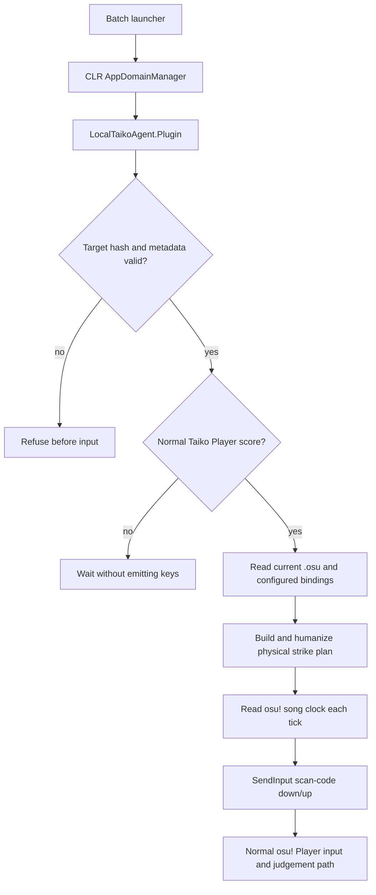

# LocalTaikoAgent: build, install, and operate

LocalTaikoAgent is an experimental loader and osu!taiko input agent for one fingerprinted
osu!stable executable. It is not built on osu!'s Auto mod and it does not construct a replay.
The game remains in normal `Player` mode while the agent sends ordinary key-down and key-up
transitions for the four currently configured Taiko bindings.

This is a research prototype, not an official osu! plugin API. Use it for anonymous, offline,
local play. The launcher does not enforce offline mode: it does not inspect account state, alter
the score-validity flag, block networking, or suppress the client's normal submission behavior.
That is not an upload guarantee: the client has separate finish, login, worker, network, and server
gates. Public submission of automated play is outside this experiment's scope.

For the complete clean-checkout workflow, artifact hashes, source-build path, pre-install probes,
controls, log interpretation, troubleshooting, update procedure, and uninstall checklist, use the
dedicated [installation and usage manual](../docs/INSTALLATION_AND_USAGE.md). The module's full
reverse-engineering narrative is [Four Drums, No Replay](../BLOG.md).

## Supported target

The loader intentionally accepts only this executable:

| Property | Value |
|---|---|
| Product | osu!stable `1.3.3.8` |
| Architecture | PE32 / x86 managed CLR executable |
| SHA-256 | `6e182c10d1813209d12753dbc70b3a5bba00fef4ecf64bc42051870e6dfe4b7d` |
| Beatmap mode | native `Mode: 1` osu!taiko |

The hash lock is important because the runtime uses managed metadata tokens recovered from this
specific obfuscated build. A game update can preserve behavior while moving every token.

Verify a candidate executable in PowerShell:

```powershell
(Get-FileHash 'C:\Games\osu!\osu!.exe' -Algorithm SHA256).Hash.ToLowerInvariant()
```

## What is installed

The installer copies the following files beside the game. It does not patch `osu!.exe` or edit
an osu! configuration file.

```text
osu!\
├── osu!.exe
├── LocalTaikoAgent.Loader.dll
├── Launch osu! with Taiko Agent.bat
└── LocalTaikoAgent\
    ├── LocalTaikoAgent.Loader.dll
    ├── LocalTaikoAgent.Plugin.dll
    ├── launch-osu.ps1
    └── LocalTaikoAgent.log          # created at runtime
```

`LocalTaikoAgent.Loader.dll` is an AppDomainManager. The batch launcher sets the manager only in
the child process environment, starts osu!, then restores its own environment. Launching
`osu!.exe` normally therefore remains the unmodified, plugin-free path.

## Build

The code targets .NET Framework 4 so that it can load into the analysed osu!stable CLR process.
The build script expects the 32-bit .NET Framework compiler supplied by Windows at:

```text
C:\Windows\Microsoft.NET\Framework\v4.0.30319\csc.exe
```

From WSL at the repository root:

```bash
taiko/InProcess/scripts/build-net40.sh
```

To use another compiler or output directory:

```bash
CSC_NET40='/mnt/c/path/to/csc.exe' \
  taiko/InProcess/scripts/build-net40.sh /tmp/taiko-net40
```

The default output is `taiko/artifacts/inprocess/net40/` and contains the loader, plugin, two
planner tests, and a metadata probe.

## Install

Close osu! normally before installing or updating the DLLs. From Windows PowerShell:

```powershell
powershell.exe -NoProfile -ExecutionPolicy Bypass `
  -File .\taiko\InProcess\scripts\install.ps1 `
  -OsuDirectory 'C:\Games\osu!'
```

From WSL, convert the script path while retaining a normal Windows game path:

```bash
repo_win="$(wslpath -w "$PWD")"
powershell.exe -NoProfile -ExecutionPolicy Bypass \
  -File "$repo_win\\taiko\\InProcess\\scripts\\install.ps1" \
  -OsuDirectory 'C:\Games\osu!'
```

Installation fails closed if the target hash differs or the build artifacts are absent.

## Launch and choose who plays

Double-click:

```text
Launch osu! with Taiko Agent.bat
```

The agent starts disabled. The compact overlay says `YOU PLAY`, so the user can select and play
maps normally. On a native Taiko map:

- `Ctrl+Alt+F8` toggles between `YOU PLAY` and `AGENT`.
- `Ctrl+Alt+F7` opens or closes the settings panel.
- While the panel is open, `Ctrl+Alt+Up/Down` selects a row.
- `Ctrl+Alt+Left/Right` changes the selected value.
- `Ctrl+Alt+Enter` applies the same forward adjustment as Right.

Settings are snapshotted when a score is armed. Changes made during a song apply to the next
play. Starting osu! directly, without the batch file, does not load the agent.

The PowerShell launcher can also start enabled:

```powershell
.\LocalTaikoAgent\launch-osu.ps1 `
  -OsuPath '.\osu!.exe' `
  -Enabled $true
```

`-TapMilliseconds` defaults to `30` and means wall-clock key-hold time. The plugin converts it to
the gameplay clock when the score is prepared: `30 map-ms` normally, `45 map-ms` under DT/NC, and
`23 map-ms` under HT. This rate adjustment is required for physical input; the former fixed
`8 map-ms` pulse could disappear entirely between two DT input frames.

For a read-only score-lifecycle trace, leave Agent disabled and add:

```powershell
  -SubmissionDiagnostics
```

The installed batch file accepts `--diagnostics` as its only optional argument. The trace records
score validity, a logged-in Boolean, and the numeric submission state; it does not log an account
value. Use the three-run differential procedure in
[the submission-path note](../reverse/analysis/submission-path.md) to distinguish a loader issue
from an ordinary client gate.

## Settings

The menu contains twelve rows. Every stochastic option is bounded by the recovered Taiko hit
windows, and the final projection deliberately avoids planned misses.

| Row | Range / choices | Meaning |
|---|---|---|
| Control | Player / Agent | Whether the plugin emits input at all |
| Style | Clean / Human / Tired / Chaos | Loads a coherent preset; later rows remain editable |
| Base UR | `0..180`, step `5` | Target timing spread, where `UR = 10 sigma` |
| Timing bias | `-30..+30 ms`, step `2` | Mean early/late preference; negative is early |
| Rush mix | `0..50%`, step `5%` | Fraction of notes likely to belong to short early bursts |
| 100 mix | `0..10%`, step `0.2%` | Base probability of deliberately safe 100-band timing |
| Dense boost | `0..300%`, step `25%` | Multiplier applied to the 100 probability in dense passages |
| Strong split | `0..20 ms`, step `1` | Maximum delay between the two hands of a strong note |
| Frame cadence | Native / 240 / 120 / 60 Hz | Quantizes planned times to a simulated polling cadence |
| Fatigue | Off / On | Adds a gradually increasing late drift near the end |
| Finger trouble | `0..10%`, step `1%` | Rare positive timing displacement; still projected miss-safe |
| Variation | Repeatable / New each play | Stable map-derived seed or a fresh random seed |

Preset defaults:

| Preset | UR | Bias | Rush | 100 | Dense | Frame | Fatigue | Finger trouble |
|---|---:|---:|---:|---:|---:|---:|---|---:|
| Clean | 0 | 0 ms | 0% | 0% | 0% | Native | Off | 0% |
| Human | 60 | -3 ms | 20% | 1.0% | 100% | 240 Hz | Off | 1% |
| Tired | 85 | +1 ms | 12% | 2.5% | 150% | 120 Hz | On | 3% |
| Chaos | 110 | -4 ms | 30% | 5.5% | 225% | 60 Hz | On | 6% |

## Runtime path



The runtime gates require all of the following:

- global game state is `osu.OsuModes.Play`;
- current ruleset is `PlayModes.Taiko`;
- the score object is a normal Player score, not a replay source;
- Relax, Auto, Relax2, and Cinema are absent;
- the osu! window owns foreground focus;
- all four configured Taiko bindings are distinct and non-zero;
- the current beatmap is a native `Mode: 1` file accepted by the parser.

Losing foreground focus immediately releases held keys and stops the agent for that score. This
is an input-safety gate, not a score restriction. Restart the map to create a new score object and
arm again. Pause is tracked separately: held keys are released, the song clock may remain still,
and the session resumes only if the clock remains coherent.

## Human timing model

For combo-relevant circles, the raw timing process is correlated rather than independent noise:

$$
x_i = \rho_i x_{i-1} + \sqrt{1-\rho_i^2}\,\varepsilon_i,
\qquad
\rho_i = e^{-\Delta t_i/\tau}.
$$

After normalization, the target spread is `sigma = UR / 10`. Density-sensitive noise, burst
rushing, optional fatigue, rare finger trouble, and frame quantization are then composed. The
configured base probability of a 100 becomes:

$$
p_{100,i} = \min\left(0.35,\;p_0\left(1 + b\,d_i\right)\right),
$$

where `d_i` is a local one-second density estimate in `[0,1]` and `b` is the dense-boost ratio.
Selected 100s are placed strictly between the recovered 300 and 100 boundaries. Finally, every
required offset is projected into a safe interval and chronological order is enforced:

$$
-W_{safe} \le e_i \le W_{safe},
\qquad
t_i + e_i < t_{i+1} + e_{i+1}.
$$

The model therefore varies 300/100 outcomes without intentionally generating a miss. Runtime
starvation can still cause a physical miss, so late-batch recovery checks the reference note and
the safe hit window before rescuing a delayed key-down.

## Logs and expected evidence

Runtime diagnostics are appended to:

```text
osu!\LocalTaikoAgent\LocalTaikoAgent.log
```

A successful run should contain this sequence:

```text
plugin started: LocalTaikoAgent.Plugin ...
live-agent targets validated ...
live Taiko plan prepared ...
humanization prepared ... predicted=.../miss:0 ...
live Taiko agent armed in normal Player mode ...
first real Taiko key transition sent through SendInput ...
live Taiko agent stopped: plan completed ... skipped=0 ...
```

The decisive distinction from built-in Auto is the `SendInput` line together with normal Player
mode and the explicit absence of an Auto frame/replay list.

Late recovery is summarized only in the final stop line as `late-batches` and
`late-recovery-inputs`. The timing thread never writes one log record per late batch: synchronous
file I/O in that hot path can turn a small scheduler delay into a self-amplifying stall.

## Verification

After building, run the synthetic planner test from WSL:

```bash
taiko/artifacts/inprocess/net40/LocalTaikoAgent.PlanTest.exe \
  taiko/TaikoBeatmap/TestData/minimal-taiko.osu
```

The Windows .NET test hosts need Windows paths for files on Windows drives:

```bash
taiko/artifacts/inprocess/net40/LocalTaikoAgent.CorpusTest.exe \
  'C:\Games\osu!\Songs'

taiko/artifacts/inprocess/net40/LocalTaikoAgent.MetadataProbe.exe \
  'C:\Games\osu!\osu!.exe'
```

The current development corpus result is:

```text
maps=26, objects=18073, strikes=19611, batches=42139,
predicted-100=216, predicted-miss=0, clipped-pulses=11,
hrdt-batches=39065, hrdt-clipped-pulses=1, hrdt-predicted-miss=0
```

The final installed build completed a 658-object Oni map with all 1,534 physical transitions and
`skipped=0`; the last two complete observations recorded `max-late=19..28ms`. Exact-time
bonus/circle collisions were coalesced while retaining combo-relevant recovery metadata.

Later replay correlation isolated a separate HR/DT problem which `skipped=0` could not reveal:
Windows had accepted short down/up pairs, but osu! had not sampled a pressed state. The corrected
rate-invariant pulse policy, replay evidence, and 26-map HRDT corpus regression are documented in
[Physical input sampling under DT](../reverse/analysis/input-sampling-and-clock-rate.md).

Long yellow drumrolls have one further Player-path constraint: an optional roll strike inside the
broader acceptance window of an unresolved circle can consume that circle before its required
key arrives. The planner suppresses only those unsafe roll strikes, including strikes just before
the roll end which can reach the first following circle. Safe exact same-key collisions remain
coalesced. The forensic `.osg` timeline and policy are documented in
[Drumroll arbitration near Taiko circles](../reverse/analysis/drumroll-circle-arbitration.md).

## Troubleshooting

`osu! is already running`

: Close it normally. The launcher intentionally does not terminate an existing process, and a
  process already started without the AppDomainManager cannot acquire it afterward.

`fingerprint differs from the analysed build`

: Do not bypass the check. Re-run the metadata/IL extraction against the new build and update the
  token manifest only after the recovered methods have been validated.

Overlay appears but the agent does not play

: Confirm `AGENT` is shown, select a native Taiko map, avoid replay/Auto/Relax/Cinema modes, and
  keep osu! in the foreground. Inspect the log for the exact gate that declined the score.

`Taiko ... is unbound` or `bindings contain a duplicate key`

: Assign four distinct Taiko keys in osu!'s input settings, then start a new play. Bindings are
  resolved dynamically for every armed score.

`song clock stalled without pause flag`

: The game clock stopped without its normal pause state, commonly during an abort or scene
  transition. The agent releases keys and retires that score; restart the map.

`osu! lost foreground focus`

: This is intentional. Returning focus does not resume the retired score; restart the map.

## Uninstall

Close osu! normally, then run:

```powershell
powershell.exe -NoProfile -ExecutionPolicy Bypass `
  -File .\taiko\InProcess\scripts\uninstall.ps1 `
  -OsuDirectory 'C:\Games\osu!'
```

The uninstaller removes only LocalTaikoAgent files and its launcher.
