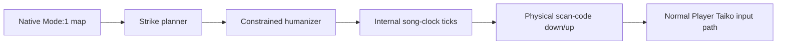
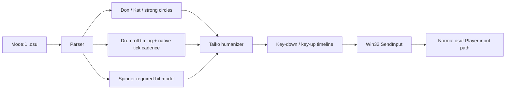

# osu!taiko reverse engineering

This module studies native `Mode:1` beatmaps and the corresponding osu!stable runtime. Its main
experiment is deliberately different from osu!'s built-in Auto mod: an in-process agent plans
drum strikes, then delivers ordinary keyboard down/up events while the game remains in normal
Player mode.

The analysed executable is pinned by SHA-256. Nothing here patches `osu!.exe`, logs into an
account, or implements score submission. The Player-mode agent also does not alter the score
validity flag, block networking, or suppress the client's normal behaviour. Leaving validity
unchanged is only one local prerequisite; it does not guarantee that the original client starts a
submission worker or that a server accepts a result. See
[Score validity is not submission](reverse/analysis/submission-path.md) for the recovered gates and
the opt-in read-only diagnostic.

## Layout

- [`TaikoBeatmap/`](TaikoBeatmap/) — portable .NET 8 parser, analyser, and physical-input planner.
- [`InProcess/`](InProcess/) — .NET Framework 4 loader, runtime agent, overlay, and tests.
- [`reverse/`](reverse/) — target fingerprints, repeatable extraction scripts, and analysis notes.
- [`docs/INSTALLATION_AND_USAGE.md`](docs/INSTALLATION_AND_USAGE.md) — clean-checkout build,
  verification, installation, controls, log interpretation, troubleshooting, and removal.
- [`BLOG.md`](BLOG.md) — the complete English research article with source excerpts, Mermaid
  diagrams, rendered mathematics, runtime evidence, and engineering conclusions.
- [`scripts/verify-corpus.sh`](scripts/verify-corpus.sh) — validates every native Taiko map in a
  local Songs directory.

## Fast checks

```bash
dotnet run --project taiko/TaikoBeatmap -- self-test
taiko/scripts/verify-corpus.sh /path/to/osu/Songs
taiko/InProcess/scripts/build-net40.sh
```

The standalone and .NET 4 planners intentionally share the recovered rules. The current local
corpus contains 26 native Taiko maps and 18,073 objects. Its readable planner produces 19,616
semantic strikes; the humanized net40 plan retains 19,611 after a second post-variation drumroll
acceptance guard.

## Runtime result

The packaged build was exercised inside the fingerprinted client on a 658-object Oni map. It
armed in normal Player mode, resolved the current four Taiko bindings, emitted every planned
scan-code transition through `SendInput`, and completed with `skipped=0`. The last two complete
observations recorded 19–28 ms maximum scheduler lateness.

A later HR/DT investigation found that scheduler counters alone were insufficient: a fixed
`8 map-ms` down/up pulse could be accepted by `SendInput` yet vanish between two osu! input frames.
The runtime now treats the default `30 ms` pulse as physical time and converts it by the selected
clock rate (`45 map-ms` in DT/NC). The read-only replay evidence and regression method are in
[Physical input sampling under DT](reverse/analysis/input-sampling-and-clock-rate.md).

A later yellow-drumroll failure had a different signature: all combo edges were present, but
optional roll strikes 77–78 ms before nearby circles reached the client's broader press-acceptance
window and consumed those circles first. The planner now arbitrates drumroll bonuses against
unresolved combo circles using the modified-OD acceptance window. The score-graph evidence and
general scheduling rule are in
[Drumroll arbitration near Taiko circles](reverse/analysis/drumroll-circle-arbitration.md).

This is the architectural distinction the module is built to preserve:



The built-in Auto replay generator remains a reverse-engineering oracle; it is not invoked by the
live plugin.

## Research map



Start with the [reverse-engineering index](reverse/README.md), then read the
research article [Four Drums, No Replay](BLOG.md). For operation, use the dedicated
[installation and usage manual](docs/INSTALLATION_AND_USAGE.md).
