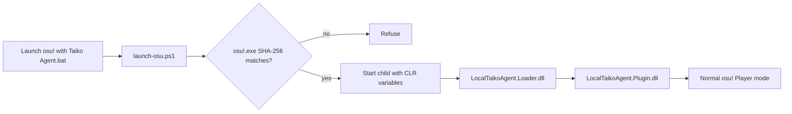
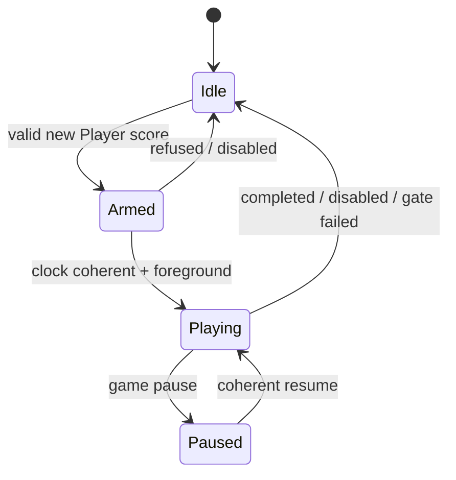

# Installing and Operating the osu!taiko Research Agent

This manual covers the complete path from a clean repository checkout to a controlled local
Player-mode Taiko session. It includes target verification, prebuilt and source-build paths,
standalone inspection, runtime probes, installation, controls, logs, troubleshooting, updates, and
removal.

LocalTaikoAgent is a research prototype for one fingerprinted osu!stable executable. It is not an
official plugin API. Read the target and behavior boundaries before copying files into a game
directory.

## 1. What the system contains

The active runtime has two original .NET Framework 4 assemblies:

| File | Purpose |
|---|---|
| `LocalTaikoAgent.Loader.dll` | minimal CLR v4 `AppDomainManager` bootstrap |
| `LocalTaikoAgent.Plugin.dll` | parser, planner, Player-mode executor, overlay, and humanizer |

The launcher supplies CLR variables only to the child osu! process:



Installation does not patch `osu!.exe` and does not edit `osu!.cfg`. Starting `osu!.exe` through
the ordinary shortcut has no AppDomain-manager environment and therefore remains the plugin-free
path.

The repository also contains a .NET 8 command-line parser and planner. It is useful for inspecting
native Taiko beatmaps and testing recovered behavior, but it is not required to launch the plugin.

## 2. Behavior boundary

The runtime plugin:

- starts disabled with the user in control;
- runs only in normal Taiko Player mode;
- rejects replay, Auto, Relax, Relax2, and Cinema paths;
- reads the active native `.osu` path and current four Taiko bindings;
- schedules physical down/up transitions against the internal song clock;
- emits Win32 `SendInput` scan-code events;
- releases tracked keys when control or runtime gates fail.

It does **not**:

- log in to an account;
- implement HTTP, Bancho, score submission, or replay upload;
- patch the game executable;
- edit the user's osu! configuration;
- change the current score-validity flag;
- block networking or suppress the original client's submission behavior.

Leaving the validity bit untouched is not a submission guarantee. The original client separately
checks finish eligibility, login state, transport state, and other consistency conditions, after
which the server remains the final authority. The intended use is anonymous local research. That
condition is not enforced by the plugin, so operate accordingly; automated play must not be used
as a public leaderboard submission.

## 3. Supported target

The current binaries accept exactly:

```text
Product:      osu!stable
Version:      1.3.3.8
Runtime:      CLR v4
Architecture: PE32 / x86
Beatmap mode: native Mode:1
SHA-256:      6e182c10d1813209d12753dbc70b3a5bba00fef4ecf64bc42051870e6dfe4b7d
```

The hash is the compatibility contract. A displayed version is insufficient because two
executables can report the same product version while carrying different metadata tables or method
bodies.

The installer, launcher, plugin, metadata probe, and reverse-extraction scripts all refuse an
unknown hash. Do not disable those checks to “try” another build. Supporting another executable is
a reverse-engineering task, not an installation option.

## 4. Prerequisites

### 4.1 Required for installation and use

- Windows capable of running the target x86 osu!stable client;
- Windows PowerShell 5.1 or newer;
- the exact supported `osu!.exe`, obtained independently;
- a checkout of this repository;
- four distinct Taiko key bindings configured in osu!.

### 4.2 Required for source builds and full verification

- WSL with access to the Windows filesystem;
- .NET 8 SDK;
- Windows .NET Framework 4 compiler, normally:

  `C:\Windows\Microsoft.NET\Framework\v4.0.30319\csc.exe`

- `git`, `bash`, `rg`, `sha256sum`, `wslpath`, and `powershell.exe` available
  from WSL.

Check the build environment:

```bash
dotnet --version
git --version
rg --version
test -x /mnt/c/Windows/Microsoft.NET/Framework/v4.0.30319/csc.exe
```

The final command is silent on success. If the compiler is elsewhere, set `CSC_NET40` when
building.

## 5. Obtain the repository

From Windows PowerShell:

```powershell
Set-Location 'C:\Research'
git clone https://github.com/N0zoM1z0/osu-reverse-engineering.git
Set-Location '.\osu-reverse-engineering'
```

Or from WSL:

```bash
mkdir -p ~/coding
cd ~/coding
git clone https://github.com/N0zoM1z0/osu-reverse-engineering.git
cd osu-reverse-engineering
```

The examples use `C:\Games\osu!` as a neutral game directory. Replace it with the actual path.

## 6. Verify the game executable first

In Windows PowerShell:

```powershell
$OsuPath = 'C:\Games\osu!\osu!.exe'
$Hash = (Get-FileHash -LiteralPath $OsuPath -Algorithm SHA256).Hash.ToLowerInvariant()
$Hash
```

Expected:

```text
6e182c10d1813209d12753dbc70b3a5bba00fef4ecf64bc42051870e6dfe4b7d
```

Stop if the value differs. Do not rename another build into place, replace a metadata manifest, or
copy tokens from this target into another executable.

## 7. Choose an artifact path

There are two supported paths:

| Path | Best for | Uses |
|---|---|---|
| published core artifacts | reproducing the published revision quickly | committed loader/plugin DLLs |
| build from source | auditing, modifying, or running all test hosts | locally compiled DLLs and probes |

Only the loader, plugin, and their checksum file are committed. Test executables are reproducible
local build products and are ignored by Git.

## 8. Path A: verify the published artifacts

The committed artifact directory is:

```text
taiko\artifacts\inprocess\net40
```

Published checksums:

```text
5eea4f382366c1299b5a702d4c6180c1aa442633cf4e7b2fdf5994c83297f00c  LocalTaikoAgent.Loader.dll
ea7b2b8a557ff2436121151a01fd586cdc247f9b104255eeea2842b66a734a65  LocalTaikoAgent.Plugin.dll
```

Verify from WSL:

```bash
cd taiko/artifacts/inprocess/net40
sha256sum -c SHA256SUMS
cd ../../../..
```

Expected:

```text
LocalTaikoAgent.Loader.dll: OK
LocalTaikoAgent.Plugin.dll: OK
```

Or verify from Windows PowerShell:

```powershell
Set-Location 'C:\Research\osu-reverse-engineering\taiko\artifacts\inprocess\net40'
Get-FileHash -Algorithm SHA256 -LiteralPath `
  '.\LocalTaikoAgent.Loader.dll', `
  '.\LocalTaikoAgent.Plugin.dll'
Get-Content '.\SHA256SUMS'
```

The values above apply to the published revision. A source rebuild may produce different bytes
because of compiler or path metadata while still passing all semantic tests.

## 9. Path B: build from source

### 9.1 Build and test the portable model

From the repository root in WSL:

```bash
dotnet restore taiko/TaikoBeatmap/TaikoBeatmap.csproj
dotnet build taiko/TaikoBeatmap/TaikoBeatmap.csproj -c Release
dotnet run --project taiko/TaikoBeatmap --configuration Release -- self-test
```

Expected:

```text
TAIKO SELF-TEST: PASS
objects=6, strikes=19, transitions=42
```

The test covers circle color/strength, Taiko drumroll duration, native fractional cadence, spinner
demand, the format-v7 cadence branch, global hand state, and released final key state.

### 9.2 Build the CLR v4 runtime

```bash
taiko/InProcess/scripts/build-net40.sh
```

If the .NET Framework compiler is installed elsewhere:

```bash
CSC_NET40='/mnt/c/path/to/Framework/v4.0.30319/csc.exe' \
  taiko/InProcess/scripts/build-net40.sh
```

The default output directory is:

```text
taiko/artifacts/inprocess/net40/
```

The source build creates:

```text
LocalTaikoAgent.Loader.dll
LocalTaikoAgent.Plugin.dll
LocalTaikoAgent.PlanTest.exe
LocalTaikoAgent.CorpusTest.exe
LocalTaikoAgent.MetadataProbe.exe
SHA256SUMS
```

The build script refreshes `SHA256SUMS` for the two runtime DLLs.

## 10. Inspect a beatmap without loading the plugin

The .NET 8 utility accepts only native `Mode:1` maps.

### 10.1 Analyze structure

```bash
dotnet run --project taiko/TaikoBeatmap -- \
  analyze '/path/to/native-taiko.osu'
```

JSON output:

```bash
dotnet run --project taiko/TaikoBeatmap -- \
  analyze '/path/to/native-taiko.osu' --json
```

The report includes:

- file format and OD;
- circle, Don, Kat, strong-note, drumroll, and spinner counts;
- inherited timing-point count;
- object time range;
- minimum circle gap and peak one-second circle density.

### 10.2 Generate a physical plan

```bash
dotnet run --project taiko/TaikoBeatmap -- \
  plan '/path/to/native-taiko.osu'
```

Optional planner controls:

```bash
dotnet run --project taiko/TaikoBeatmap -- \
  plan '/path/to/native-taiko.osu' \
  --tap-ms 8 \
  --roll-ms 0 \
  --spinner-ms 0 \
  --json
```

`--roll-ms 0` and `--spinner-ms 0` select the recovered native cadence. Nonzero overrides are
useful for controlled experiments. In this standalone data model, `--tap-ms` is expressed directly
in map time. The live plugin's launcher option is instead a physical duration and is adjusted for
DT/NC or HT.

This command generates data only. It does not start osu!, inject input, or access an account.

## 11. Run the pre-install probes

The following probes require a source build because the public tree does not commit test
executables.

### 11.1 Runtime planner and humanizer test

From WSL:

```bash
taiko/artifacts/inprocess/net40/LocalTaikoAgent.PlanTest.exe \
  "$(wslpath -w taiko/TaikoBeatmap/TestData/minimal-taiko.osu)"
```

Expected:

```text
TAIKO IN-PROCESS PLAN TEST: PASS
objects=6, strikes=21, batches=42, spinner-required=4
```

This test also verifies:

- zero predicted miss in CLEAN mode;
- pre-v8 `SliderTickRate=1.5` behavior;
- promotion of combo metadata when a bonus tick collides with a circle down;
- modified-OD arbitration when a drumroll tick can reach an unresolved circle.

### 11.2 Local Songs corpus

The portable corpus runner:

```bash
taiko/scripts/verify-corpus.sh '/mnt/c/Games/osu!/Songs'
```

The net40 corpus and humanizer runner needs a Windows path:

```bash
taiko/artifacts/inprocess/net40/LocalTaikoAgent.CorpusTest.exe \
  'C:\Games\osu!\Songs'
```

The current development corpus produced:

```text
maps=26, objects=18073, strikes=19611, batches=42139,
predicted-100=216, predicted-miss=0, clipped-pulses=11,
hrdt-batches=39065, hrdt-clipped-pulses=1, hrdt-predicted-miss=0
```

Your count will differ with another Songs directory. A failure is actionable: inspect the named
map and parser error instead of treating the corpus total as a required magic number.

### 11.3 Metadata probe

```bash
taiko/artifacts/inprocess/net40/LocalTaikoAgent.MetadataProbe.exe \
  'C:\Games\osu!\osu!.exe'
```

Expected final lines:

```text
TAIKO METADATA PROBE: PASS
sha256=6e182c10d1813209d12753dbc70b3a5bba00fef4ecf64bc42051870e6dfe4b7d
binding-getter=0x06002c4f osu.Input.Bindings -> Microsoft.Xna.Framework.Input.Keys
```

The probe loads the target reflection-only. It checks the exact hash and every runtime member shape
used by the active plugin without launching the game.

## 12. Install

Close osu! normally before installation. The installer does not terminate the process.

### 12.1 Windows PowerShell

From the repository root:

```powershell
powershell.exe -NoProfile -ExecutionPolicy Bypass `
  -File '.\taiko\InProcess\scripts\install.ps1' `
  -OsuDirectory 'C:\Games\osu!'
```

### 12.2 From WSL

```bash
repo_win="$(wslpath -w "$PWD")"
powershell.exe -NoProfile -ExecutionPolicy Bypass \
  -File "$repo_win\\taiko\\InProcess\\scripts\\install.ps1" \
  -OsuDirectory 'C:\Games\osu!'
```

Expected:

```text
Installed LocalTaikoAgent into C:\Games\osu!
No osu! executable or configuration file was modified.
Launch with: Launch osu! with Taiko Agent.bat
```

The installer fails before copying if:

- `osu!.exe` is missing;
- the executable hash differs;
- either runtime artifact is missing.

## 13. Installed layout

After installation:

```text
osu!\
├── osu!.exe
├── LocalTaikoAgent.Loader.dll
├── Launch osu! with Taiko Agent.bat
└── LocalTaikoAgent\
    ├── LocalTaikoAgent.Loader.dll
    ├── LocalTaikoAgent.Plugin.dll
    ├── launch-osu.ps1
    └── LocalTaikoAgent.log       # created after a plugin launch
```

The loader appears twice:

- the root copy is where CLR resolves the AppDomain manager;
- the subdirectory copy is the durable staged source restored by the launcher.

Verify the installed files:

```powershell
$Root = 'C:\Games\osu!'
Get-FileHash -Algorithm SHA256 -LiteralPath `
  "$Root\LocalTaikoAgent.Loader.dll", `
  "$Root\LocalTaikoAgent\LocalTaikoAgent.Loader.dll", `
  "$Root\LocalTaikoAgent\LocalTaikoAgent.Plugin.dll"
```

The two loader hashes must be identical. The plugin hash must match the artifact selected for
installation.

## 14. Launch paths

### 14.1 Agent-capable launch

Double-click:

```text
Launch osu! with Taiko Agent.bat
```

The plugin loads but begins disabled. The overlay displays `YOU PLAY`.

For an opt-in read-only score-lifecycle trace, launch from `cmd.exe` with:

```bat
"Launch osu! with Taiko Agent.bat" --diagnostics
```

### 14.2 Ordinary plugin-free launch

Start `osu!.exe` or the normal shortcut directly. No launcher environment is present, so the
AppDomain manager is not loaded.

### 14.3 PowerShell launch with explicit options

```powershell
Set-Location 'C:\Games\osu!'
.\LocalTaikoAgent\launch-osu.ps1 `
  -OsuPath '.\osu!.exe' `
  -Enabled $false `
  -TapMilliseconds 30 `
  -OffsetMilliseconds 0 `
  -MaximumLatenessMilliseconds 70 `
  -ClockStallMilliseconds 250 `
  -SubmissionDiagnostics
```

Omit `-SubmissionDiagnostics` for the normal quiet launch. Set `-Enabled $true` only when
intentionally starting with Agent control active.

The launcher refuses to start if any osu! process is already running. A process that has already
started without the AppDomain manager cannot acquire it afterward.

## 15. Configure Taiko keys

The plugin resolves the game's current four Taiko bindings for every new score:

| Logical input | Common default |
|---|---|
| inner left | `X` |
| inner right | `C` |
| outer left | `Z` |
| outer right | `V` |

Custom bindings are supported. Requirements:

- all four bindings must be nonzero;
- all four must be distinct;
- the selected keys must map to Windows scan codes.

No manual plugin key list is required. The runtime asks the game's validated binding getter for the
active values.

## 16. Choose who plays

The plugin intentionally separates loading from control:

- `YOU PLAY` / `PLAYER`: no agent input is emitted;
- `AGENT`: a valid new Taiko Player score may be planned and armed.

Controls:

| Gesture | Effect |
|---|---|
| `Ctrl+Alt+F7` | open or close the settings panel |
| `Ctrl+Alt+F8` | toggle Player/Agent |
| `Ctrl+Alt+Up/Down` | move through setting rows |
| `Ctrl+Alt+Left/Right` | decrease or increase the selected row |
| `Ctrl+Alt+Enter` | apply the same forward adjustment as Right |

Hotkeys are recognized only while a window belonging to the osu! process owns foreground focus.
Settings are snapshotted when a score is prepared. Changes made during a song affect the next
score.

## 17. Settings reference

| Row | Range / choices | Behavior |
|---|---|---|
| Control | Player / Agent | whether the plugin may emit input |
| Style | Clean / Human / Tired / Chaos | loads a coherent preset |
| Base UR | `0..180`, step `5` | target core spread, `UR=10σ` |
| Timing bias | `-30..+30 ms`, step `2` | negative early / positive late |
| Rush mix | `0..50%`, step `5%` | occupancy of correlated early runs |
| 100 mix | `0..10%`, step `0.2%` | base safe 100-band probability |
| Dense boost | `0..300%`, step `25%` | density multiplier on 100 probability |
| Strong split | `0..20 ms`, step `1` | maximum second-hand delay |
| Frame cadence | native / 240 / 120 / 60 Hz | timing-grid simulation |
| Fatigue | off / on | gradual late drift over the score |
| Finger trouble | `0..10%`, step `1%` | sparse delayed press |
| Variation | repeatable / new each play | deterministic or fresh seed |

### 17.1 Presets

| Preset | UR | Bias | Rush | 100 | Dense | Split | Frame | Fatigue | Trouble |
|---|---:|---:|---:|---:|---:|---:|---|---|---:|
| Clean | 0 | 0 ms | 0% | 0% | 0% | 0 ms | native | off | 0% |
| Human | 60 | -3 ms | 20% | 1.0% | 100% | 6 ms | 240 Hz | off | 1% |
| Tired | 85 | +1 ms | 12% | 2.5% | 150% | 10 ms | 120 Hz | on | 3% |
| Chaos | 110 | -4 ms | 30% | 5.5% | 225% | 15 ms | 60 Hz | on | 6% |

Loading a style resets all option rows to its defaults. Adjust individual rows afterward.

### 17.2 Why there is no 200 control

The recovered native Taiko circle resolver produces 300, 100, or miss. It has no circle 200 grade.
The 100 control samples offsets strictly between the recovered 300 and 100 boundaries.

### 17.3 No-intentional-miss behavior

The stochastic model is followed by a deterministic projection:

$$
-W_{\mathrm{safe}}\le e_i\le W_{\mathrm{safe}},
\qquad
t_i+e_i<t_{i+1}+e_{i+1}.
$$

No style intentionally targets a miss. Real-time starvation can still cause physical lateness, so
the executor has a bounded recovery path for combo circles.

## 18. Score lifecycle

The overlay runtime phases are:

| Phase | Meaning |
|---|---|
| `IDLE` | Agent off or waiting for a valid Taiko score |
| `ARMED` | map and plan prepared; waiting for a coherent clock start |
| `PLAYING` | due batches are being emitted |
| `PAUSED` | Player pause flag active; held keys released |

Preparation requires a new score object. If a score is refused or completed, restart the map to
create another score identity.



Foreground loss stops the score instead of resuming later. Return to the game and restart the map.

## 19. Read the runtime log

The log is:

```text
C:\Games\osu!\LocalTaikoAgent\LocalTaikoAgent.log
```

A successful startup/play should contain:

```text
InitializeNewDomain ...
plugin started ...
target=... sha256=...
live-agent targets validated ...
ready; ... architecture=normal Taiko Player input
ui: agent=on
live Taiko plan prepared ...
humanization prepared ...
live Taiko agent armed in normal Player mode ...
first real Taiko key transition sent through SendInput ...
live Taiko agent stopped: plan completed ... skipped=0 ...
```

The decisive architecture evidence is the combination of:

- normal Player-mode arming;
- no Auto frame or replay list;
- the first real `SendInput` transition.

The plan line also reports `mods`, `clock-rate`, and a pulse such as
`30ms-real/45ms-map`. Under DT/NC the two numbers should differ by `1.5x`; under HT the map pulse
is `0.75x` the requested physical duration, rounded upward.

### 19.1 Humanizer summary

Example fields:

| Field | Interpretation |
|---|---|
| `actual-UR` | realized population `10σ` for combo circles |
| `mean` | average early/late displacement |
| `early` | percentage of negative offsets |
| `windows` | strict recovered `<300/<100` boundaries |
| `predicted` | circle grade prediction from final planned offsets |
| `rush-notes` | circles inside generated early runs |
| `jams` | delayed-finger proposals |
| `strong-splits` | two-hand notes with nonzero split |
| `realized-offset` | minimum and maximum final offsets |

### 19.2 Stop summary

| Field | Interpretation |
|---|---|
| `batches` | planned timestamps processed |
| `transitions` | physical inputs actually sent |
| `skipped` | expired or redundant transitions not sent |
| `max-late` | largest observed scheduler lateness |
| `sampling-guard-deferrals` | releases delayed so a late down survives a real input sample |
| `late-batches` | batches beyond the configured normal threshold |
| `late-recovery-inputs` | physical inputs sent by bounded recovery |

Late counters are written only in the stop summary. The timing thread does not perform one file
write per late batch because that can amplify scheduler pressure.

## 20. Runtime tuning parameters

The PowerShell launcher maps options to child-process environment variables:

| PowerShell option | Environment | Default | Purpose |
|---|---|---:|---|
| `-Enabled` | `TAIKO_AGENT_ENABLED` | false | initial control state |
| `-TapMilliseconds` | `TAIKO_AGENT_TAP_MS` | 30 | physical key-hold duration |
| `-OffsetMilliseconds` | `TAIKO_AGENT_OFFSET_MS` | 0 | global schedule offset |
| `-MaximumLatenessMilliseconds` | `TAIKO_AGENT_MAX_LATE_MS` | 70 | recovery threshold |
| `-ClockStallMilliseconds` | `TAIKO_AGENT_CLOCK_STALL_MS` | 250 | unexplained stall timeout |
| `-SubmissionDiagnostics` | `TAIKO_SUBMISSION_DIAGNOSTICS` | absent/false | read-only validity/login-Boolean/submission-state transitions |

These are diagnostic controls. The overlay's timing bias is the preferred musical early/late
control; launcher offset shifts the entire executor schedule and is mainly useful for measuring a
systematic environment delay.

The live planner converts the physical pulse once:

$$
p_{map}=\left\lceil p_{real}\,r\right\rceil,
\qquad r\in\{0.75,1,1.5\}.
$$

Do not reduce pulse width to one millisecond simply because built-in Auto uses tightly spaced
replay states. A replay consumer observes timestamped state directly; a physical key poll can miss
an extremely short pulse between updates. The historical fixed `8 map-ms` pulse became only
`5.3 ms` in DT and was confirmed to lose complete key edges between replay input frames. See
[Physical input sampling under DT](../reverse/analysis/input-sampling-and-clock-rate.md).

## 21. Troubleshooting

### `osu! is already running`

Close it normally. The launcher intentionally does not terminate an existing process.

### `fingerprint differs from the analysed build`

The executable is unsupported. Do not bypass the check. Repeat the metadata and IL recovery for
the new binary before changing the manifest or runtime tokens.

### CLEAN or HR/DT play has many unexplained misses

Confirm the startup log says `tap=30ms-real` and each plan line reports the expected rate-adjusted
pulse (`45ms-map` for DT/NC). An old installed `launch-osu.ps1` can still pass the former eight
millisecond default even when the DLL was rebuilt. Reinstall both the plugin and launcher, then
compare `required-edges-missing` with the local replay analyzer documented in
[Physical input sampling under DT](../reverse/analysis/input-sampling-and-clock-rate.md).

### A score remains local or shows no online result

Do not infer that the plugin changed validity. Enable diagnostics while Agent remains off:

```bat
"Launch osu! with Taiko Agent.bat" --diagnostics
```

Complete a manual Taiko play and inspect only lines beginning with `submission diag`. The first
line reports `validity`, a `logged-in` Boolean, and numeric `state`. The useful distinctions are:

| Trace | Interpretation |
|---|---|
| `logged-in=False` | the original submission worker cannot start |
| `validity True->False`, state `0` | a client-local invalidation path fired |
| validity true, state remains `0` | the Player finish path did not call submission entry |
| state `0->1`, login false | entry ran; its explicit login gate skipped the worker |
| state reaches `2` | a terminal worker response was processed, not necessarily accepted online |

Compare a normal launch, a loader launch with `YOU PLAY`, and a local Agent run. The complete
evidence matrix, tokens, and limitations are in
[Score validity is not submission](../reverse/analysis/submission-path.md). The diagnostic is
read-only; do not turn a client or server integrity rejection into a bypass target.

### No overlay appears

Check:

1. the game was started through `Launch osu! with Taiko Agent.bat`;
2. `LocalTaikoAgent.log` exists;
3. the loader reports `InitializeNewDomain`;
4. the plugin path exists;
5. the target hash matches.

A normal shortcut launch intentionally has no overlay.

### Overlay appears but the agent does not play

Confirm:

- `AGENT` is displayed;
- the selected map is native `Mode:1`;
- gameplay is a new normal Player score;
- Auto, Relax, Relax2, and Cinema are disabled;
- osu! remains foreground;
- all four Taiko bindings are distinct.

Read the latest `score refused`, `candidate cancelled`, or stop line for the exact gate.

### `Taiko ... is unbound`

Assign that logical Taiko control in osu!'s input settings and start a new play.

### `bindings contain a duplicate key`

Assign four distinct keys. One physical key cannot represent two independent Taiko controls in the
agent's state model.

### `song clock did not reset`

The candidate appeared after the internal clock had already passed the first safe transition. Start
the score again.

### `song clock stalled without pause flag`

The gameplay clock stopped without the recovered Player pause state. The agent released keys and
retired the score. Restart the map.

### `song clock moved backwards`

A seek, restart, or scene transition occurred after the session was active. The old plan is no
longer aligned with the score. Restart the map to create a new session.

### `osu! lost foreground focus`

This is intentional. The executor releases keys and stops rather than sending input to an
unfocused application. Returning focus does not revive that score; restart it.

### Predicted miss is nonzero

The candidate should be refused before input. Preserve the log and reproduce the map with the
standalone and net40 corpus tools. This indicates a parser/planner constraint defect, not a setting
to ignore.

### A runtime miss occurs with `predicted-miss=0`

Prediction covers planned circle offsets. Compare `max-late`, `late-batches`, and `skipped` in the
stop summary. Operating-system scheduling or a game stall can delay otherwise safe input.

### Overlay in exclusive fullscreen

The owned WinForms overlay depends on Windows composition. Windowed or borderless mode is the most
predictable environment.

## 22. Update or reinstall

1. close osu! normally;
2. update the repository;
3. rerun tests;
4. rebuild if using source artifacts;
5. run `install.ps1` again;
6. verify installed hashes;
7. launch a short native Taiko map with CLEAN before using stochastic profiles.

```bash
git pull --ff-only
dotnet run --project taiko/TaikoBeatmap --configuration Release -- self-test
taiko/InProcess/scripts/build-net40.sh
```

Then repeat the installation command.

Do not replace a loaded DLL while osu! is running.

## 23. Uninstall

Close osu! normally, then:

```powershell
powershell.exe -NoProfile -ExecutionPolicy Bypass `
  -File '.\taiko\InProcess\scripts\uninstall.ps1' `
  -OsuDirectory 'C:\Games\osu!'
```

The uninstaller removes:

- root `LocalTaikoAgent.Loader.dll`;
- `Launch osu! with Taiko Agent.bat`;
- the `LocalTaikoAgent\` subdirectory.

It does not remove or modify `osu!.exe`, `osu!.cfg`, Songs, scores, or unrelated files.

## 24. Optional reverse-engineering reproduction

The runtime does not require ILSpy, IDA, or decompiler output. To reproduce the evidence:

### 24.1 Decompile locally

```bash
taiko/reverse/scripts/decompile-osu.sh '/mnt/c/Games/osu!/osu!.exe'
```

The output directory is ignored and must remain local.

### 24.2 Extract method fingerprints

From PowerShell:

```powershell
.\taiko\reverse\scripts\extract-taiko-il.ps1 'C:\Games\osu!\osu!.exe'
```

Compare token, IL length, and IL SHA-256 with
`taiko/reverse/artifacts/target-manifest.json`.

### 24.3 Inspect an obfuscated type

```powershell
.\taiko\reverse\scripts\inspect-managed-type.ps1 `
  'C:\Games\osu!\osu!.exe' `
  '#=z...=='
```

### 24.4 Optional IDA annotations

Open the matching IDA database and run:

```text
File -> Script file -> taiko/reverse/scripts/annotate-taiko-ida.py
```

The script verifies the input SHA-256 and writes direct names/disassembly comments. It avoids the
MCP comment route that can invoke Hex-Rays on synthetic managed IL ranges.

IDA annotation is optional. The portable method identities are the assembly hash, metadata token,
IL length, and IL digest.

## 25. Reproducibility checklist

Before calling a local setup verified:

- [ ] repository checkout is on the intended revision;
- [ ] `osu!.exe` SHA-256 matches exactly;
- [ ] published or rebuilt DLL checksums are recorded;
- [ ] portable self-test passes;
- [ ] net40 plan test passes;
- [ ] metadata probe passes;
- [ ] local native-Taiko corpus passes, if available;
- [ ] installed loader copies have equal hashes;
- [ ] plugin starts disabled and ordinary launch stays plugin-free;
- [ ] CLEAN mode completes a short local score;
- [ ] final log reports normal Player mode, physical `SendInput`, and released completion state.

For the design rationale and recovered equations, read
[Four Drums, No Replay](../BLOG.md).
