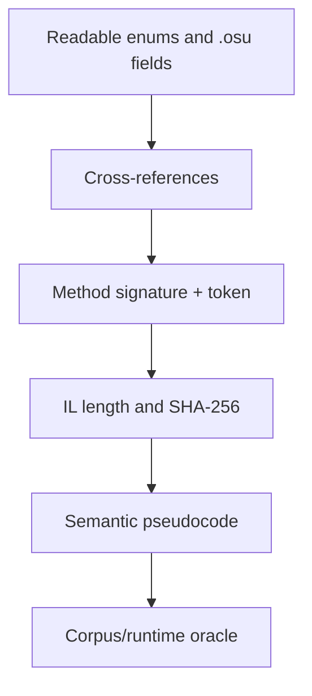

# Taiko reverse-engineering notebook

This directory records the evidence needed to reproduce the Taiko analysis without committing a
decompiled copy of the proprietary game assembly.

## Pinned target

| Property | Value |
| --- | --- |
| Product version | `1.3.3.8` |
| Architecture | PE32 / x86 / CLR |
| MD5 | `0beb5a2f026f5a579c2046ab73fece16` |
| SHA-256 | `6e182c10d1813209d12753dbc70b3a5bba00fef4ecf64bc42051870e6dfe4b7d` |

The complete token/address/IL-hash table is in
[`artifacts/target-manifest.json`](artifacts/target-manifest.json). IDA's addresses for managed
methods are synthetic IL ranges; they are useful inside that database, but they are not PE RVAs.
Metadata tokens and IL hashes are the portable identities.

## Repeatable workflow

1. Decompile the pinned executable locally:

   ```bash
   taiko/reverse/scripts/decompile-osu.sh /path/to/osu!.exe
   ```

2. Extract fingerprints for the methods used by the analysis:

   ```powershell
   .\extract-taiko-il.ps1 C:\path\to\osu!.exe
   ```

3. Inventory an obfuscated managed type when a token's neighbours matter:

   ```powershell
   .\inspect-managed-type.ps1 C:\path\to\osu!.exe '#=z...=='
   ```

4. Apply the recovered semantic names to the matching IDA database with
   [`annotate-taiko-ida.py`](scripts/annotate-taiko-ida.py) through **File → Script file**.
   The script verifies the input hash and uses direct IDA naming/comment APIs, avoiding a
   Hex-Rays pass over synthetic managed-IL ranges.

Every script refuses an executable whose SHA-256 differs from the pinned target. Decompiled source
is written under an ignored directory and is never required at runtime.

## Recovered anchors

| Meaning | Metadata token | IDA managed address |
| --- | ---: | ---: |
| Taiko Auto frame generator | `0x06001ef7` | `0x000c24b0` |
| Normal Player input recorder | `0x0600229b` | `0x000e1480` |
| Four-button state packer | `0x060011af` | `0x0006e900` |
| Configured binding getter | `0x06002c4f` | see local IDA database |
| Taiko circle press acceptance | `0x060020e8` | `0x000d1c10` |
| Taiko circle judgement | `0x060020eb` | `0x000d1df0` |
| Difficulty range | `0x060028b3` | `0x0010b7d0` |
| Drumroll native interval | `0x06004257` | `0x001ad7a0` |
| Taiko spinner constructor | `0x06001d6d` | `0x000b8930` |

The score lifecycle is shared across rulesets. Its compact token and IL evidence is documented in
[Score validity is not submission](analysis/submission-path.md); the extraction script fingerprints
those methods even though they are not part of the Taiko-specific IDA annotation set.

Obfuscation changes names, not metadata relationships. The useful route was therefore:



## Analysis chapters

- [Obfuscation and method recovery](analysis/obfuscation-and-recovery.md)
- [Native Taiko beatmap structure](analysis/beatmap-format.md)
- [Auto, Player input, and runtime objects](analysis/runtime-paths.md)
- [Judgement mathematics and the live agent](analysis/judgement-and-agent.md)
- [Physical input sampling under DT](analysis/input-sampling-and-clock-rate.md)
- [Drumroll arbitration near Taiko circles](analysis/drumroll-circle-arbitration.md)
- [Score validity, submission gates, and read-only diagnostics](analysis/submission-path.md)

The local `notes/` directory is ignored. It is intended for raw session notes, logs, screenshots,
and temporary symbol inventories; only distilled evidence belongs in the tracked analysis.
