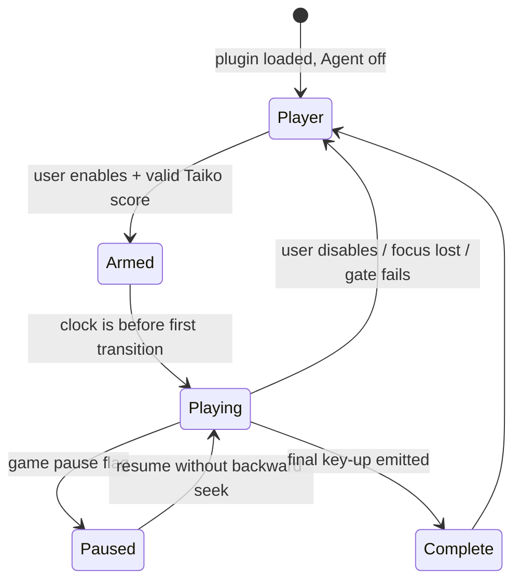

# Judgement mathematics and the Player-mode agent

## Circle windows

The recovered circle resolver computes

$$
e = \left|t_{song} - t_{object}\right|.
$$

It has three outcomes, with strict comparisons:

$$
J(e)=
\begin{cases}
300, & e < W_{300},\\
100, & e < W_{100},\\
miss, & \text{otherwise}.
\end{cases}
$$

For unmodified OD,

$$
W_{300}=\left\lfloor80-6OD\right\rfloor,
\qquad
W_{100}=\left\lfloor140-8OD\right\rfloor.
$$

The broader press-acceptance window is `DifficultyRange(OD, 200, 150, 100)`. Easy first halves OD;
Hard Rock first multiplies OD by `1.4` and clamps it to ten. DT/HT are already expressed through
the runtime song clock and are not applied a second time to these Taiko circle windows.

## Human timing model

The plan is generated once per score, but execution remains reactive: every worker tick reads the
current internal song clock and emits only transitions which have become due.

For successive combo circles separated by `Δt`, the core timing process is AR(1):

$$
\rho = e^{-\Delta t/\tau},
\qquad
x_i = \rho x_{i-1} + \sqrt{1-\rho^2}\,\epsilon_i,
\qquad
\epsilon_i \sim \mathcal N(0,1).
$$

The raw process also includes density-scaled independent noise, correlated early rush bursts, and
an optional fatigue drift. It is standardized over the map and scaled to

$$
\sigma_{target}=UR_{base}/10.
$$

This follows the conventional population definition `UR = 10σ` while avoiding the common mistake
of adding several independent noises and assuming the requested UR survived their convolution.

## Controlled 100s without intentional misses

A requested 100 is sampled strictly inside its legal annulus:

$$
W_{300} \le |e| < W_{100}.
$$

The sampler keeps margins from both boundaries, then applies frame quantization and snaps the
result back into the intended band. Dense sections multiply the configured 100 probability, but
the final probability is capped.

All ordinary samples pass through a final projection:

$$
e \leftarrow \operatorname{clamp}(e,-W_{safe},W_{safe}),
\qquad
W_{safe}=W_{100}-g,
$$

where `g` includes a frame-cadence guard. A forward/backward feasibility pass preserves circle
order while keeping every planned press inside that safe interval. There is no intentional miss
option.

## Frame cadence and strong notes

Optional 240/120/60 Hz modes quantize a desired event to a drifting frame phase:

$$
q(t)=\phi+\left\lceil\frac{t-\phi-T/2}{T}\right\rceil T.
$$

The phase wanders slowly and rare style-dependent hitches add one frame. Strong notes share the
same base error, then one hand receives a random delay bounded by both the UI setting and the next
circle. This retains the recovered `<30 ms` strong-note invariant.

## Execution loop

If a scheduler stall makes a circle late, the agent may rescue it only while the current song
clock remains inside `W_safe`; the rescued key is held for a small real input pulse. Expired bonus
ticks are skipped, and an expired combo circle is reported rather than disguised. Every stop path
releases all keys known to the agent.
