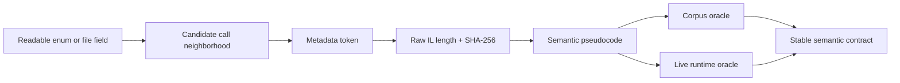

# Recovering Taiko semantics from an obfuscated managed client

The analysed osu!stable executable is managed code, but that does not make it self-documenting.
Most internal type, method, and field names have been replaced by encoded identifiers; several
members use Unicode-only names; control flow is legal IL but often unpleasant C#. A useful
recovery process therefore needs identities stronger than a decompiler's temporary variable
names.

The central judgement in this work was to avoid “deobfuscating osu!” as a whole. Taiko only needs
a small behavioral slice. Recovering that slice with multiple independent anchors is both faster
and easier to audit.

## Division of labour

Each tool answered a different question:

| Tool | Best use in this target |
|---|---|
| ILSpy | Reconstruct managed control flow, inheritance, enum uses, and calls |
| Reflection-only PowerShell | Resolve exact metadata tokens and hash raw IL bodies |
| IDA | Preserve cross-references, method ranges, call neighborhoods, and semantic labels |
| Corpus parser | Test recovered `.osu` rules over real native Taiko maps |
| Runtime plugin | Prove that the inferred Player path behaves inside the actual client |



ILSpy was more productive than treating managed IL as native machine code. IDA remained valuable,
but primarily as a durable graph and annotation database. This division avoids asking either tool
to solve the problem it is weakest at.

## What survives obfuscation

The private identifiers are mostly destroyed, but several high-value structures remain:

- public framework and game-shared enum names such as `pButtonState`, `Mods`, and `PlayModes`;
- external signatures such as `Microsoft.Xna.Framework.Input.Keys`;
- metadata tokens, which are exact within one assembly build;
- inheritance and method signatures;
- constants such as `1.4`, `1.65`, `30`, `60`, `120`, `6`, and `8`;
- recognizable container operations, especially replay-frame list construction;
- `.osu` fields whose semantics are independently known from the file itself.

An encoded method name may be useless to a human, but a method that returns `double`, belongs to a
Taiko slider subclass, tests format version 8, divides by 6 or 8, and folds a value between 60 and
120 ms has a remarkably specific behavioral identity.

## Stable method identity

For this build, every recovered method is tracked as a tuple:

$$
M = (\text{assembly SHA-256},\;\text{metadata token},\;\text{IL length},\;\text{IL SHA-256}).
$$

The semantic label is deliberately not part of identity; it is our interpretation of the tuple.
The principal anchors are:

| Semantic label | Token | IL bytes | IL SHA-256 prefix |
|---|---:|---:|---|
| Taiko Auto generator | `0x06001ef7` | 896 | `27ed89e06ad7` |
| Player input recorder | `0x0600229b` | 475 | `3c79f4c44539` |
| Four-button packer | `0x060011af` | 41 | `fd53812b5d69` |
| Default binding initializer | `0x06002c55` | 790 | `3ab15bd4570a` |
| Circle press acceptance | `0x060020e8` | 430 | `3984ef883e6f` |
| Circle judgement | `0x060020eb` | 688 | `3d7d99065011` |
| Difficulty interpolation | `0x060028b3` | 111 | `2c52153e9611` |
| Drumroll interval | `0x06004257` | 376 | `9bbab29be6f9` |
| Spinner constructor | `0x06001d6d` | 418 | `9013079db21b` |

The complete values are machine-readable in `reverse/artifacts/target-manifest.json` and can be
reproduced with `extract-taiko-il.ps1`.

## Finding the Auto path

The Auto generator was identified by its output shape before any private name was interpreted. It
allocates the replay frame list, seeds neutral state, walks every active hit object, and writes
`pButtonState` values at object-relative times.

Reduced to semantic pseudocode:

```csharp
bool left = true;
frames.Add(Neutral(longBeforeMap));

foreach (HitObject obj in taikoObjects)
{
    if (obj is Spinner)
        EmitFourKeyCycle(requiredHits + 1);
    else if (obj is DrumRoll roll)
        foreach (double tick in roll.NativeTicks)
        {
            Emit(tick, left ? InnerLeft : InnerRight);
            left = !left;
        }
    else
        EmitCircle(obj, left);

    frames.Add(Neutral(obj.EndTime + 1));
    left = !left;
}
```

Three details matter here. The hand flag is global, drumroll ticks mutate it, and every object
toggles it once more at the end. The standalone planner has regression coverage for the otherwise
easy-to-miss case of an odd-length drumroll followed by a circle.

This method also settles the architectural question: built-in Auto creates replay frames. It is
not a hidden physical keyboard agent.

## Separating normal Player input

The normal Player recorder was located through the opposite data flow. A compact four-boolean
method packs new presses into `pButtonState`; a neighboring routine compares that packed state to
the previous one and appends a state-change frame only when it differs.

The recovered packer is equivalent to:

```csharp
pButtonState state = pButtonState.None;
if (innerLeft)  state |= pButtonState.Left1;   // 1
if (outerLeft)  state |= pButtonState.Right1;  // 2
if (innerRight) state |= pButtonState.Left2;   // 4
if (outerRight) state |= pButtonState.Right2;  // 8
return state;
```

The Player recorder and Auto generator may ultimately feed similar frame structures, but their
causes differ: one records live state transitions, while the other manufactures the list. The
runtime experiment preserves this distinction by sending real scan-code transitions and never
calling the Auto generator.

## Recovering dynamic bindings

The binding initializer contains readable XNA key enum values even though its own name is
obfuscated. The Taiko defaults appear as inner `X/C` and outer `Z/V`. Hard-coding those values
would still be wrong: users can rebind them.

Cross-references from the initializer lead to token `0x06002c4f`, whose structural signature is:

```text
static Microsoft.Xna.Framework.Input.Keys
    Method(osu.Input.Bindings binding)
```

The runtime plugin resolves enum values 6 through 9 through this getter for every new score, then
maps each virtual key to a scan code. The metadata probe asserts the signature before any input is
possible.

## Recovering circle judgement

The Taiko circle subclass is recognizable from three converging signals:

1. it receives the four-button state and distinguishes inner from outer presses;
2. it tests Whistle/Clap color and Finish strength;
3. it writes only the Taiko circle outcomes 300, 100, and miss.

The acceptance method first asks whether the press is new and color-compatible. For a strong
circle, the second same-color hand must arrive in less than 30 ms. The judgement method then uses
strict timing comparisons, not inclusive boundaries.

Its window helper calls the same three-point interpolation method with `(80,50,20)` and
`(140,100,60)`. That call relationship is stronger evidence than recognizing the resulting
linear equations in isolation.

## Recovering drumroll cadence

The drumroll interval method is a good example of why constants and branches outperform names.
Its semantic form is:

```csharp
if (formatVersion < 8)
    interval = (beatLength / inheritedVelocity) / 8;
else if (sliderTickRate is 1.5 or 3 or 6)
    interval = beatLength / 6;
else
    interval = beatLength / 8;

while (interval < 60)  interval *= 2;
while (interval > 120) interval /= 2;
```

The version branch is important. A first implementation accidentally allowed the modern `/6`
special case to affect pre-v8 maps. The local corpus contained no counterexample, so a synthetic
v7 map with `SliderTickRate=1.5` was added as a regression vector; the correct folded interval is
75 ms, not 100 ms.

The slider-to-drumroll object constructor supplies a separate rule: pixel length is multiplied by
1.4 before duration conversion. Standard slider duration alone is therefore insufficient for a
native Taiko parser.

## Recovering spinner demand

The spinner constructor calls difficulty interpolation with `(3,5,7.5)`, converts duration to
seconds using single-precision order, multiplies the base by `1.65`, then applies DT/HT integer
scaling. Preserving cast order mattered more than simplifying the expression algebraically.

Auto provides a second oracle: it emits `required + 1` hits in a fixed
inner-left/outer-left/inner-right/outer-right cycle. Matching both the constructor and the Auto
consumer made the resulting count substantially more credible than either observation alone.

## IDA addresses are not PE RVAs

IDA's managed loader presents method bodies in synthetic address ranges. For example, the Auto
method appears at `0xC24B0`, even though that value is not a normal executable RVA that another
tool can resolve in the PE image.

Consequently:

- IDA addresses are useful for labels and navigation inside this exact `.i64` database;
- metadata tokens identify members inside this exact assembly;
- IL hashes detect accidental token reuse or a changed method body;
- the executable SHA-256 binds all of those facts to one target.

Treating the IDA address alone as a portable symbol would be a category error.

## Annotation failure and recovery

The MCP `set_comment` implementation first writes a disassembly comment, then attempts a Hex-Rays
decompilation so it can place a pseudocode comment. That second step can stall indefinitely on
these synthetic managed ranges and, because the HTTP server is single-threaded, blocks later MCP
requests as well.

`annotate-taiko-ida.py` avoids that path. It verifies the input SHA-256, checks that a function
starts at each expected address, writes the semantic name, and sets only the ordinary IDA comment.
No decompiler call is involved.

## Confidence model

No single decompiler view was treated as ground truth. A recovered rule graduates into the agent
only after passing progressively stronger checks:

1. **Structural:** token resolves and signature/inheritance are coherent.
2. **Byte identity:** IL length and SHA-256 match the pinned manifest.
3. **Semantic:** constants, branches, enum values, and callers tell one consistent story.
4. **Corpus:** the parser/planner succeeds across all local native Taiko maps.
5. **Runtime:** the real client accepts the resulting physical input in normal Player mode.

That final rung is what turned the work from plausible decompilation into a functioning behavioral
model: the final installed build completed all 1,534 physical transitions of a live Oni play with
no skipped input. The last two complete observations recorded maximum scheduling lateness of
19–28 ms.
