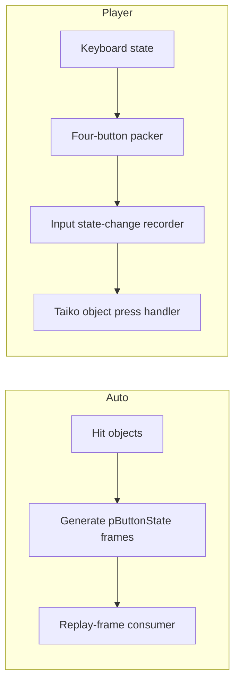

# Auto, Player input, and runtime objects

The most important architectural result is that osu!stable has two distinct paths which can look
similar on screen but are not equivalent.



The built-in Auto method at token `0x06001ef7` allocates a replay-frame list in advance. It is a
valuable oracle for hand choice and bonus-object cadence, but it does not prove that any physical
key travelled through Player input.

The live agent instead calls Win32 `SendInput`. osu! observes those scan-code events through its
normal keyboard path, updates four live booleans, packs them, and presents the new press to the
active Taiko object. No replay list is created or consumed by the plugin.

## Four-button mapping

The state packer and the Taiko key flow establish the mapping:

| Runtime control | `pButtonState` | Default key |
| --- | --- | --- |
| Inner left | `Left1` (`1`) | `X` |
| Outer left | `Right1` (`2`) | `Z` |
| Inner right | `Left2` (`4`) | `C` |
| Outer right | `Right2` (`8`) | `V` |

The plugin does not hard-code those defaults. Token `0x06002c4f` maps the four `osu.Input.Bindings`
values to the currently configured XNA `Keys` value, and the agent converts that virtual key to a
hardware scan code immediately before injection.

## Auto oracle

Recovered Auto behaviour can be summarized as follows:

```text
hand = left
for object in hit_objects:
    if spinner:
        emit required_hits + 1 in IL, OL, IR, OR cycle
    else if drumroll:
        emit native tick list, alternating inner hands
        toggle hand after each tick
    else:
        colour = kat if Whistle or Clap, otherwise don
        emit chosen hand, or both same-colour hands for Finish
    emit neutral state at object_end + 1
    toggle hand
```

The implementation also inserts neutral frames in long gaps. Those neutral frames matter to a
replay stream; the Player agent represents the same state changes as explicit key-up events.

## Circle acceptance

The circle press handler distinguishes a new press from a held key, then checks colour:

- a Don accepts a newly pressed inner key;
- a Kat accepts a newly pressed outer key;
- Relax temporarily remaps the active colour, which is why the live agent refuses Relax/Auto-like
  mods rather than mixing two automation paths;
- a strong note accepts both same-colour hands together, or a second hand less than 30 ms after the
  first.

This is also why strong-note humanization uses a bounded 0–20 ms hand split. It is visibly less
mechanical without approaching the actual completion boundary.

## Runtime safety gates

The in-process agent runs only when all of these are true:

1. the executable SHA-256 matches the analysed build;
2. metadata tokens pass structural validation;
3. the global screen is `Play` and the ruleset is `Taiko`;
4. a normal Player score exists;
5. no replay source or built-in automation mod is active;
6. osu!'s game window owns foreground focus;
7. the user has explicitly selected Agent in the overlay.

Any failed gate releases every tracked key. These gates protect input correctness; they do not
change account state, networking, score validity, or the game's submission logic.

Leaving score validity untouched is only one fact about the score object; it is not a promise that
the client will start a submission worker or that a server will accept the result. The separate
[submission-path analysis](submission-path.md) records the client-side predicates and the opt-in,
read-only observer used to distinguish them.
