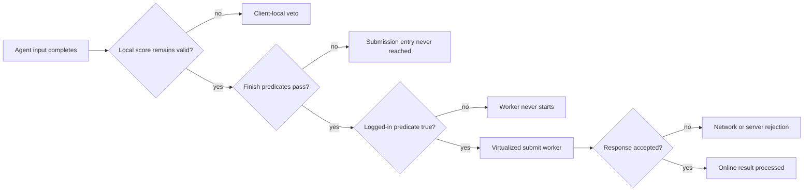

# Score validity is not submission

The Mania and Taiko agents share osu!stable's normal score object and therefore share the same
post-play lifecycle. This note isolates that lifecycle from the ruleset-specific input work. Its
central result is deliberately narrow:

> Preserving the score-validity bit removes one local veto. It does not, by itself, start a network
> request or make a score acceptable to the server.

The analysis is pinned to the executable whose SHA-256 is
`6e182c10d1813209d12753dbc70b3a5bba00fef4ecf64bc42051870e6dfe4b7d`. Names in the original
assembly are obfuscated, so each identity below is expressed as a metadata token, signature, and
raw-IL hash.

This is diagnostic research, not an anti-cheat bypass. The observer described below only reads
three scalar values. It does not call the submission entry point, modify a score, retrieve or log
an account value or credential, redirect traffic, or suppress client/server checks.

For the wider architecture around these gates—including executable trust, protected code,
multi-clock consistency, integrity-signal serialization, rendering/window checks, process
observation, and the VM/server boundary—see
[Client integrity and anti-cheat architecture](../../../reverse/analysis/client-integrity-and-anti-cheat.md).

## 1. Four independent layers

"The score was not uploaded" can describe failures at four different layers:



The plugin controls only its own behavior. The original client owns layers B through E, and the
server owns the final acceptance decision. Conflating those layers caused the earlier, overly broad
claim that leaving validity unchanged made submission "possible." It makes one prerequisite true;
nothing more can be inferred without observing the remaining transitions.

## 2. Recovered score anchors

| Semantic identity | Token | Signature / shape | IL SHA-256 |
|---|---:|---|---|
| current score field | `0x040013C3` | static field whose type is the score class | n/a |
| validity field | `0x04001990` | instance `bool`, defaults true | n/a |
| submission-state getter | `0x06002B4D` | instance enum getter, 7 IL bytes | `43438d30ce6d3fb3022e7f7f569e61d5a54c14844fece05327831e9e46cbad97` |
| score invalidator | `0x06002B5A` | instance `void ()`, 8 IL bytes | `8617be66cf52ecd2bfe9ff53bfab749a9d29e201c7ee5709e8e03816d815509b` |
| submission entry | `0x06002B5C` | instance `void ()`, 90 IL bytes | `32af1f783f746dc5b08ac1a8d6f7a9bc270b35d62620bff0934f1dba8d5a20d5` |
| submission worker | `0x06002B6C` | instance `void (object, DoWorkEventArgs)` | `33dfacb7e88e774b93f082edea7ae69009a2eb202442fb6232f9bcfcaf95b49e` |
| logged-in predicate | `0x0600469B` | static `bool ()`, 28 IL bytes | `d193a6b48e7bddf082e001de89728ee56505257294127af54694bbefc8fe8ca2` |

The invalidator is unusually friendly to exact validation. Its complete body is equivalent to:

```il
ldarg.0
ldc.i4.0
stfld 0x04001990
ret
```

There is no transport behavior hidden in that method. It clears one Boolean.

## 3. The login gate is before the worker

The decompiled submission entry reduces to the following pseudocode:

```csharp
void BeginSubmission()
{
    if (GetSubmissionState() <= 0)
    {
        if (legacyScoreComponent != null)
            mods |= Mods.ScoreV2;

        SetSubmissionState(1);

        if (IsLoggedIn())
        {
            var worker = new BackgroundWorker();
            worker.DoWork += SubmitWorker;
            worker.RunWorkerAsync();
        }
    }
}
```

The recovered `IsLoggedIn()` predicate checks that the client's user object exists and that its
username string is non-empty. An anonymous client therefore cannot start `SubmitWorker`, even when
the score remains valid and reaches `BeginSubmission`. This is original-client behavior, not a
restriction implemented by either plugin or launcher.

The worker itself is protected by a virtualized dispatcher. The visible wrapper constructs an
argument array and invokes VM entry key ``q\"aciK`1oM``. Consequently, ordinary IL decompilation can
prove that the worker was (or was not) scheduled, but it cannot faithfully recover every request
field or server response branch. Claims beyond that boundary require runtime observation.

## 4. The client can invalidate the score again

The Player class contains multiple calls to token `0x06002B5A`. The important categories are:

| Category | Recovered condition |
|---|---|
| non-normal play | replay/spectator/editor and related non-Player score construction |
| finish predicate | the combined normal-mode, map-status, mod, validity, and consistency predicate fails |
| integrity consistency | selected mods or score-derived values disagree with the runtime's parallel state |
| long update stall | the main gameplay update interval exceeds roughly 6–8 seconds in the guarded path |
| clock divergence | scaled gameplay time and the independent application clock differ by more than 60 ms repeatedly |
| score calculation | redundant score-calculation observations disagree |

The finish path is especially important. In simplified form:

```text
if normal-player
and hitobject-manager-eligible
and map-status-eligible
and mods-eligible
and score.valid
and runtime-consistency-flag
and elapsed-play > 8 seconds
and score > 10,000
and internal counters are non-zero and equal:
    begin score submission lifecycle
else:
    score.valid = false
```

Several clauses have special-case branches for multiplayer, editor, replay, and legacy score
modes, so the pseudocode is a normal solo Player summary rather than a source-level replacement.
It is enough to explain why directly changing or preserving `score.valid` cannot force the finish
path to pass.

## 5. What was not found

The managed decompiler tree was searched for the loader environment names, assembly enumeration,
injected-input metadata, and common low-level keyboard-hook flags.

- No reference to `APPDOMAIN_MANAGER_ASM` or `APPDOMAIN_MANAGER_TYPE` was found in the game code.
- The visible `AppDomain.GetAssemblies()` uses are type/serialization helpers, not an obvious
  gameplay validity check.
- No visible `GetMessageExtraInfo`, `LLKHF_INJECTED`, or equivalent check of the plugin's
  `SendInput.dwExtraInfo` marker was found.
- The launchers do not patch `osu!.exe`, set an offline switch, block networking, or alter account
  configuration.

These are negative findings, not proof of absence. The submit worker is virtualized, the process
contains native dependencies, and the server is outside the executable. A server-side or hidden
client-side integrity decision therefore cannot be ruled out from static managed IL.

## 6. Read-only submission telemetry

Both agents now have an opt-in observer:

| Ruleset | Launcher option | Child environment variable |
|---|---|---|
| Mania | `-SubmissionDiagnostics` | `MANIA_SUBMISSION_DIAGNOSTICS=1` |
| Taiko | `-SubmissionDiagnostics` | `TAIKO_SUBMISSION_DIAGNOSTICS=1` |

The Taiko batch launcher accepts `--diagnostics`. The local Mania convenience launcher has the same
switch. Diagnostics may be used while Agent control is disabled, which makes a loader-only manual
play a useful control experiment.

For each score object, the observer records only:

- validity (`true` or `false`);
- the logged-in predicate (`true` or `false`), never the identity;
- the numeric submission state;
- transitions among those values and attachment/detachment of the global current-score field.

Observation continues for up to 120 seconds after the current-score field detaches, because the
ranking transition may outlive the Player screen. The observer holds an object reference but never
writes through it.

Typical output is deliberately compact:

```text
submission diag attached: validity=True, logged-in=False, state=0; no account value was logged
submission diag changed: state 0->1; song-clock=123456ms
submission diag: current-score field detached; continuing read-only observation for up to 120 seconds
```

The obfuscated state enum has no reliable symbolic names in the decompiler. Numeric states are the
evidence. UI cross-references indicate that `0` is the untouched state, `1` is pending, and `2` is
the response-complete state, but diagnostics intentionally logs the integer rather than inventing
stronger semantics.

## 7. A three-run differential test

The safest useful experiment does not require an automated score to reach a public service:

1. **Vanilla control:** launch `osu!.exe` normally and complete a manual play.
2. **Loader control:** launch with the plugin and diagnostics, leave the overlay on `YOU PLAY`, and
   complete a manual play.
3. **Local agent run:** enable Agent on a local test map and inspect the same state transitions
   without using the result as a public leaderboard submission.

This separates the hypotheses:

| Observation | Strongest supported conclusion |
|---|---|
| attached with `logged-in=False` | anonymous gate is present; the worker cannot start |
| `validity True->False`, state remains `0` | a plugin or original-client invalidation path fired before submission entry |
| validity stays true, state remains `0` | Player finish predicates never called the score submission entry |
| state `0->1`, `logged-in=False` | submission entry ran, then the explicit login gate skipped the worker |
| state `0->1`, logged-in true, no later transition | worker started or was expected to start; inspect client UI/log/network health without changing gates |
| state reaches `2` | client processed a terminal worker response; this alone does not prove leaderboard acceptance |
| vanilla passes, loader control fails | investigate loader/runtime compatibility before discussing Agent behavior |
| both manual controls pass, only Agent differs | the loader itself is not the common cause; client/server integrity policy remains a live hypothesis |

For a legitimate manual score that reaches the worker but is not accepted, the appropriate next
step is ordinary client troubleshooting or official support. Defeating integrity checks is neither
necessary for this research nor an acceptable interpretation of the result.

## 8. The stale Mania artifact

One concrete packaging defect was found during this audit. The previously committed Mania plugin
artifact has SHA-256
`74667d198e1a4098813f747b19ec52f2c6025998c637d3536f361dd762b9e353` and contains the messages
`score invalidation did not clear the validity flag` and `score marked local/ineligible`. The
standard installer copies that artifact, so a second machine using it receives the older safety
build that deliberately calls token `0x06002B5A`.

The locally rebuilt Mania DLL used for this diagnostic audit leaves the bit unchanged, but that
local policy change is intentionally not part of the Taiko publication. This distinction explains
why two people can use similarly named launch scripts and observe different Mania behavior. Always
compare the installed DLL hash before reasoning from source code.

Taiko has no corresponding explicit invalidation call in its plugin. A Taiko failure therefore
cannot be explained by the stale Mania DLL and must be classified with the telemetry above.

## 9. Practical resolution boundaries

The observed failure classes have different resolutions:

- **stale artifact:** rebuild the intended source and install that exact hash;
- **anonymous client:** no submission worker is expected; local testing remains valid;
- **ordinary client predicate:** use a normal Player map/run and inspect which local transition
  changed, without forcing it back;
- **loader compatibility:** reproduce with Agent disabled and keep the executable hash lock;
- **network or legitimate manual-score failure:** use normal client diagnostics and official
  support;
- **anti-cheat or server policy:** do not bypass it; validate transport code against a mock/local
  endpoint instead.

That last option preserves the engineering question—can the complete serialization and response
state machine be exercised?—without turning a local input experiment into a public leaderboard
submission system.
